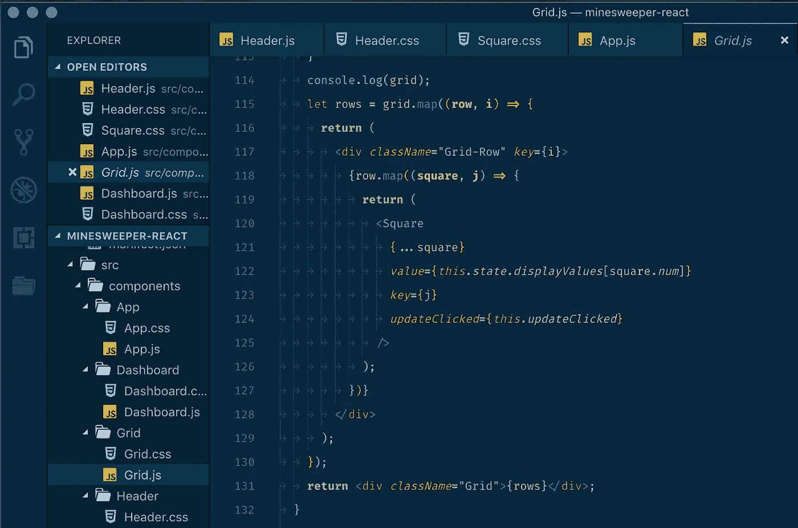

# 我如何充分利用我的编码训练营

> 原文：<https://medium.com/swlh/coding-bootcamp-value-3aaa65f20922>

## **物有所值**

**TL；dr:** 仅仅参加一个编码训练营不会让你成为一名软件工程师，但是如果你有时间和金钱，这是一个不错的开始方式。

去年年底，我意识到我对自己选择的职业道路不再满意。我和伟大的人们一起工作，支持伟大的事业，我去过各种各样的酷地方(利比里亚！秘鲁！莫桑比克！波兰！).尽管如此，我还是忍不住觉得我没有足够的影响力，没有赚到足够的钱，也没有足够的个人发展来证明我的工作时间是值得的。

Me (as a full-stack software engineer with three months of experience)

经过深思熟虑，我决定辞去工作，参加为期 12 周的软件工程沉浸式项目或“编码训练营”。转行不是一个容易的决定。我相信我过去在项目管理和沟通方面的经验是相关的，并将很好地为我服务，但这取决于我未来的雇主是否分享这种观点。否则我只是一个有三个月相关编码经验的 bootcamp 毕业生。

尽管我很焦虑，我的存款也在迅速减少，但我很高兴地告诉大家，这是我一生中最好的决定。在此之前，我从未经历过如此快的个人成长速度，也从未发现过像编程一样让我喜欢学习和锻炼的技能。另外，这是一个快速变化的领域，所以总会有更多的东西需要学习。尽管如此，我知道不是所有的同学都和我一样兴奋。对于未来的参与者，我想分享一些关于如何让你的训练营投资物有所值的建议。

***重要声明:*** *我单身，没有孩子，我的朋友和家人一直支持和理解我这几个月的时间有限，我也没有其他重大责任争夺我的注意力。我认为即使没有这些事情，你仍然可以有一个很好的训练营经历，但这绝对让我在这个项目中占了上风。*

## **话不多说，我从编码训练营学到的最重要的东西:**

## 不要把你的训练营当成工作

Busy-ness !== (does not equal) business

仅仅因为你从 9 点到 5 点去一个地方，坐在电脑前，并不意味着你在工作。你不是因为提供商品或服务而获得报酬的；你付钱给别人来加速你的学习。

> 你是客户。

你最大的责任是从你的投资中获得最大回报，无论这意味着获得额外的帮助，还是决定你的时间更好地用于个人项目或写这个博客。你决定如何度过你的时间，所以让它有用。不要成为体验的被动参与者。

***如果有问题，请提供反馈！你的导师也不想浪费你的时间或金钱，所以请(友好地、建设性地)分享你在余下的课程中以及未来同一项目中可以改进的地方。***

## 不要把自己局限在课堂上学习

尽一切努力满足你的毕业要求，获得毕业后的职业支持(如果你的训练营提供的话——这是应该的),但要对你自己的学习道路负责。

如果你想更多或更好地练习，网上有无穷无尽的资源。我和我的同学们已经从柯尔特·斯蒂尔在 Udemy 上的课程中获益匪浅，但是网上有很多免费的、负担得起的资源来获得更多的练习。

训练营的学习曲线将是周期性的，但是如果你觉得在某个时候你没有受到挑战，试着用你额外的时间和精力去学习新的技能。尤其是如果您是从 JavaScript 开始的话，有无数的库和框架可供您学习，以在您的项目中发掘新的可能性，其中大多数都有很棒的教程和文档来帮助新用户入门。试着自学:

*   [React](https://reactjs.org/) —我们实际上在课堂上学过这个，但我抢先一步，提前一周用 React 做了一个迷你项目，这让下一个单元对我来说容易多了，也给了我一些探索其他主题的灵活性。React 的文档非常棒，教程提供了使用关键概念如状态、道具和组件生命周期的良好实践。
*   [谷歌地图 API](https://developers.google.com/maps/documentation/) 、 [Mapbox](https://www.mapbox.com/) ，或者[传单](https://leafletjs.com/)——地图很酷。
*   [电子](https://electronjs.org/)——JavaScript 不再仅仅用于 web 开发。我听到一些开发者抱怨它很慢，但是现在你可以使用 JavaScript 来构建桌面应用程序，这是非常酷的。再加上 Slack 这样的大公司都在把它用在自己成功的产品上，所以绝对值得学习。
*   [React Native](https://facebook.github.io/react-native/) —想用 JavaScript 为 iOS 和 Android 构建移动应用？你也可以这样做。我建议先学习 React，但是从 React 到 React Native 的学习曲线似乎非常容易管理。我只做过一些基础教程，但我肯定想进一步探索这一点。
*   [D3.js](https://d3js.org/) ，[chart . js](https://www.chartjs.org/)——如果你对数据可视化感兴趣，D3 肯定有一个学习曲线，但是你可以用它构建的东西非常棒。我听说如果你正在寻找一个更容易的入口点，chart.js 更容易访问，但是我还没有深入研究过。

学习其中的任何一项——并能够展示这方面的知识——将(交叉手指)帮助你在潜在雇主面前脱颖而出，这是一个更好的指标，表明你在正式教学结束后在这个快节奏的领域继续学习的能力。

## 学习编程之外的东西

很容易把所有的注意力都集中在学习一门新的语言或框架上。在那里，你会感觉到自己的能力增长最快，也可能是最令人满意的。尽管如此，学习开发人员用于日常协作的工具、思维模式和工作流也同样重要。最终，你需要学习雇主规定的任何系统，但是粗略地了解以下内容仍然很重要:

*   导航命令行
*   Git/GitHub，包括[通用工作流](https://www.atlassian.com/git/tutorials/comparing-workflows)
*   易接近
*   测试和测试驱动的开发
*   BEM 或其他一些用于组件标准化命名的方法
*   VSCode(或您首选的低级文本编辑器)

## 构建个人项目

Sorry, Jigglypuff

看，你可能不想通过查询 [PokeAPI](http://www.pokeapi.co) 来炫耀你构建的 Pokedex(没什么丢人的，我仍在试图抓住它们)，但这是可转移的知识。利用你所学的知识，建立一些与你未来职业和兴趣更相关的东西。这是一个很好的实践，通过探索一个新的 API，您几乎肯定会学到一些新东西。或者更好的是，一旦你对后端编程有了更多的了解，就创建你自己的 API。即使你没有把它放在你的文件夹里，它也可以放在你的 GitHub 上，展示你的技能范围。

你应该从任何一个训练营中带着一些你作为项目课程的一部分建立的主要项目出来。这些通常是很好的展示项目，但是当你毕业的时候，你可能不会有超过三四个。如果你有空闲时间，试着给你的项目添加更多的修饰和功能，但是也要有一两个副业项目添加到收藏中。你会得到更多的实践，雇主也会看到你在课外不断学习和成长的动力。

You’ve already decided to be a programmer, so write programs.

## 那么值得吗？

对我来说，答案是肯定的。在入学之前，我曾试图自学编程，但当我还在一个不同的行业有一份(不止)全职工作时，不知道从哪里开始并持续投入所需的时间太难了。通过参加训练营，我获得了开始职业生涯新阶段所需的时间、课程、网络和支持，而不会感到完全没有准备。

尽管如此，还是要考虑很多。在学费和错过的薪水之间，这是一个昂贵的选择，尤其是如果你有其他责任的话。如果你有上进心，并且有编程的诀窍，你可能会自学得很好，但是在你进入职场感到舒适之前，可能需要更长的时间。

无论您选择什么，都要尝试参与您所在地区更广泛的开发社区(假设存在)。我在 Meetups 上与更有经验的开发人员进行了几次交谈，他们都很乐意与有抱负的初级开发人员分享他们的专业知识和指导。

如果你想做出改变，并且喜欢运用自己的创造力和逻辑来解决问题，编程似乎是一条很好的职业道路。如果你有时间和金钱，参加训练营是许多开始的方式之一。只要确保你能有效地利用这段时间，希望你能像我一样珍惜这段经历。