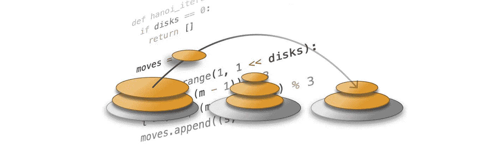

# 编码问题:我为什么喜欢它们？解决汉诺塔难题

> 原文：<https://medium.com/swlh/coding-problems-why-do-i-like-them-solving-tower-of-hanoi-puzzle-d1bd71f85982>

如果你曾经尝试过在大公司找工作或者参加过编程比赛，你就知道什么是编码问题(或者编码挑战)。一个典型的例子是“使用两个堆栈实现一个队列”许多人讨厌把它们作为面试的一部分，因为编码问题不能证明你有能力写出好的代码。