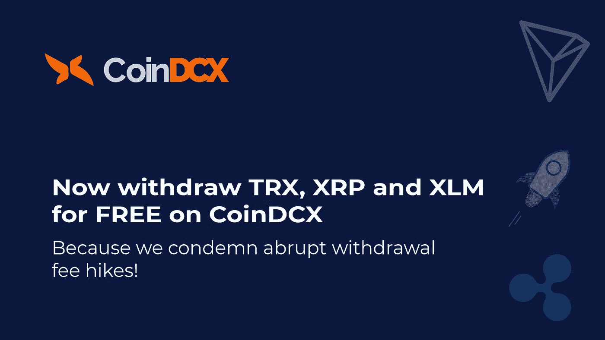
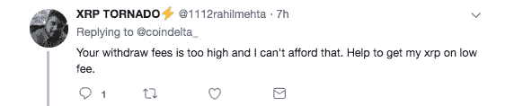
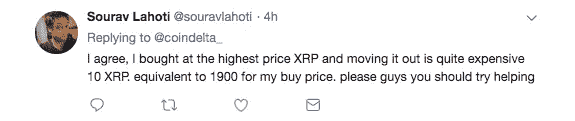
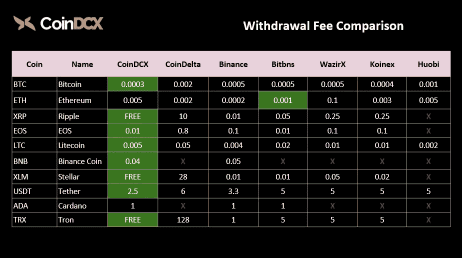
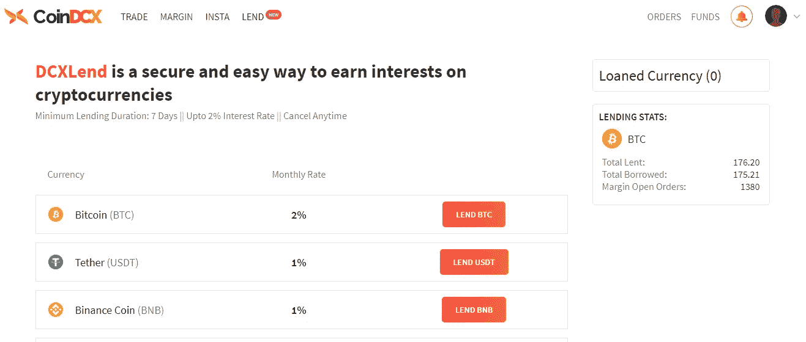

# CoinDCX 谴责 CoinDelta 的退出策略！

> 原文：<https://medium.com/swlh/coindcx-condemns-coindeltas-exit-strategy-991d1581e430>

## 作为回应，将 Ripple (XRP)、Tron (TRX)和 Stellar (XLM)的提款费削减 100%,以恢复市场信心

*声明:内容来源于* [*CoinDCX*](https://coindcx.com/trade/home?utm_source=tronbttaltcoin&utm_medium=tronbttaltcoin&utm_campaign=tronbttaltcoin) *。CoinDCX 不提升/降级任何公司/ICO。本信息或其他媒体中的观点、陈述、估计和预测仅属于作者个人。*

在宣布停止运营后不久， [CoinDelta](https://coindelta.com/) 突然将存储在其交易所的所有加密资产的提现费提高了 3-5 倍。

这次关闭是在印度最高法院推迟了对加密案的听证后宣布的。这一延迟给了怀疑论者一个关键的机会来联合努力，质疑加密货币资产的价值。

虽然加密市场似乎正在从 2018 年的熊市中复苏，但比特币和以太坊和 Ripple 等其他领先的加密货币显然在经历了长达一年的加密冬天后迎来了春天。

在这个加密之春， [CoinDCX](https://coindcx.com/lend?utm_source=deltastartup&utm_medium=deltastartup&utm_campaign=deltastartup) 打算重振印度加密交易商的信任和交易体验，并再次向其用户保证，CoinDCX 绝不会容忍这种不良做法来应对加密交易商在社交媒体上的愤怒。

## 对愤怒的回应！

印度最大的加密交易所 CoinDCX 谴责了 CoinDelta 的退出策略，并大幅降低了所有加密资产的交易费用，以增强和恢复用户对加密空间的信心。

> 由于 XRP、XLM 和 TRX 是印度最受欢迎的硬币，CoinDCX 宣布整个下一季度绝对 0 XRP、0 XLM 和 0 TRX 提款费！

Trading fee comparison ( CoinDCX vs All other major crypto exchanges)

[查看 coinDCX 上所有加密货币的完整费用结构](https://coindcx.com/fees?utm_source=dcxstatement&utm_medium=dcxstatement&utm_campaign=dcxstatement)

[CoinDCX](https://coindcx.com) 的首席执行官 Sumit Gupta 表示，加密货币仍处于萌芽阶段，让更多公平的货币在市场上流通能够增强像印度这样的发展中国家的经济实力。

他进一步解释说，加密货币自其发展以来已经走过了漫长的道路，印度市场刚刚开始意识到与采用加密货币相关的潜力，但尚未想到对它们有吸引力。

印度政府一直在反复强调加密市场中安全和责任问题的重要性，而另一方面，监管机构在设计印度加密市场的监管框架时一直采用迟缓的方法。

[**CoinDCX**](https://coindcx.com/lend?utm_source=deltastartup&utm_medium=deltastartup&utm_campaign=deltastartup) **了解市场监督迫在眉睫的需要，这就是为什么交易所选择以完全透明的方式运营，以建立同业间的信任。**

Sumit Gupta 在概述在这个领域建立信任的重要性时说道:

> “在这个艰难的时期，能够真正走得更远，满足加密社区的需求，这是我们 CoinDCX 引以为豪的事情”！

# 为什么要信任 CoinDCX？

尽管印度的加密领域仍不受监管，但投资者保护至关重要。

由著名风险投资公司[贝恩资本风险投资](https://www.baincapitalventures.com/)和天使投资人支持，包括[桑杰·梅塔](https://www.linkedin.com/in/mehta-sanjay/?originalSubdomain=in) ( [梅塔风险投资](https://mehtaventures.co/))、[桑·崔浩](https://www.linkedin.com/in/choisungh)(创始人、[富博电视台](https://www.fubo.tv/))、卡恩·纳帕尔(区块链投资人)、贾丁·阿内哈(印度领先律师事务所合伙人)、拉斐尔·乌戈利尼(区块链投资人)和[乌特萨维·索马尼](https://www.linkedin.com/in/utsavsomani)(合伙人、[安杰利斯特【天使投资人】](https://angel.co/)

第一种加密货币比特币的诞生是 2008 年金融危机爆发后中本聪对传统中央银行系统和法定货币失去信任的直接结果。

> 具有讽刺意味的是，加密货币最初的目标是解决金融生态系统中的信任问题，现在却成了同样的牺牲品！

凭借其强大的后盾，CoinDCX 在加密领域处于领先地位，推出了一个新平台 [DCX 贷款](https://coindcx.com/lend)来解决该领域的流动性问题。虽然有趣的是，DCX 贷款的仪表板给出了贷款统计的完整图片，以增强用户之间的信任。

[Lending stats from DCX Lend dashboard](https://coindcx.com/lend?utm_source=deltastartup&utm_medium=deltastartup&utm_campaign=deltastartup)

> 最困难的事情是决定采取行动，其余的仅仅是坚韧不拔！

## 这篇文章发表在[《创业](https://medium.com/swlh)》上，这是 Medium 最大的创业刊物，有+440，678 人关注。

## 在这里订阅接收[我们的头条新闻](https://growthsupply.com/the-startup-newsletter/)。

