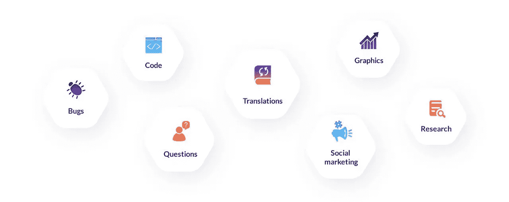

# 协作 2.0:开放市场推动全球发展

> 原文：<https://medium.com/swlh/collaboration-2-0-open-marketplaces-to-power-global-development-a3278c6221bb>

*bounts Network 正在使用以太坊在全球范围内增强个人和社区的能力。*

移动和互联网技术使得世界各地的人们可以轻松地成功完成项目并获得报酬，而不受时区、货币和地点的限制。对许多人来说，自由职业是限制性的、受办公室限制的、朝九晚五的工作模式的一个有吸引力的替代选择，而且[朝向灵活的、地域自主的工作的宏观趋势正在加速。“工作的未来”肯定就在我们面前。](https://mashable.com/2016/03/09/age-of-the-freelancer/#BA9CtBilwZqL)

但这种越来越灵活的就业模式使得对更好制度的需求变得更加迫切。我们目前的 1.0 系统已经多年没有创新了:它们的特点是高费用和停滞不前的功能，它们延续了市场对自由职业性质的更大误解。是时候我们创建一个生态系统，将需要高质量工作的人与等待实现的全球人才基础联系起来。

# 现状:现有平台及其缺点

自由职业者和项目市场并不缺乏。自从人们开始渴望在零工经济盛宴中占有一席之地以来，我们见证了过去几年的繁荣。Fiverr、Upwork、Elance 和 Freelancer 是一些在全球范围内运营的最受欢迎的网站。这些平台上的工作多种多样，从理论上来说，持续完成高质量工作的自由职业者可以赢得良好的声誉，并收取有竞争力的费用。

Fiverr 目前是世界上最大的数字服务在线市场之一，它的受欢迎程度很大程度上归功于其最初的价值主张——“花 5 英镑就能完成任何工作。”尽管价格点已经发生了变化，Fiverr 早期的口号抓住了自由职业者的一个更大的文化概念，即低工资/低质量的细分市场，为国际或“刚从学校毕业”的工人保留。这种误解使得客户和自由职业者之间的互动变得复杂，让有才华的自由职业者很难找到可靠、高薪和令人满意的工作。

对于自由职业者来说，诈骗是另一个反复出现的问题。没有支付保护或有效监管的平台，很难单独评估和区分真正的客户/自由职业者和骗子。安全感伴随着巨大的代价。在目前的自由职业平台上，佣金从 5%到高达 20%不等。市场竞争也迫使自由职业者为他们的工作提供低得离谱的报酬。当平台抽走他们的佣金时，手里的钱已经远远低于交付的工作的价值和投入项目的时间。此外，尽管这些平台收取高额佣金，但它们往往无法保证自由职业者最终会获得报酬。未解决的纠纷几乎总是让自由职业者的工作无所作为。

客户也可能遭受损失。一些诈骗自由职业者会要求预付款项，从来没有交付工作。其他人会推迟项目，并要求在同意的费用之外支付额外的费用来发布工作。客户最终会血本无归，但仍然渴望可交付成果。由于这些平台上不完善的信誉系统，用户在接触潜在的问题用户之前无法识别他们。用户在一个网站上建立的评级或声誉也不会转移到其他网站。连环骗子可以在多个平台上不被发现，努力工作并建立了良好声誉的用户在加入新市场时必须从头开始。

# 区块链之路

基础知识:区块链是一个分布式账本，对网络中的每个参与者都是可见的。区块链就像任何人都可以访问的电子表格。每个参与者都有一份副本，只有超过一半的参与者同意这是一个合法的改变，它才能被编辑。这是一种简化，但它表明区块链并没有远离大多数人已经知道并参与的日常技术。

区块链的使用案例现在非常丰富:关于个人身份、银行交易记录和版权许可的信息都可以存储在区块链上。区块链被设计成对任何拥有电脑的人开放。**没有一个中央权力机构拥有决策和执行规则的权力。**

至于为自由职业者寻找新项目和工作，区块链使自由职业者能够直接和安全地与需要产品和服务的人联系。这可以是任何东西，从设计到文案，到慈善活动，再到定制摩托车。区块链解决方案通过以下方式消除障碍并降低成本:

*   **永久记录。对于自由职业者和他们的客户来说，协议成为永久记录的一部分，这意味着它们不会被篡改，几乎不可能被违反。**
*   **身份&工作证明。**自由职业者可以在区块链上存储所有身份和投资组合数据。所有作品都可以清晰追溯到它的所有者，版权纠纷或虚假评论不再是瓶颈问题。通过可搜索的安全记录和仲裁，解决争议变得简单。
*   **跨平台可操作性。**任务可以发布一次，然后轻松地分布在多个平台上。这立即解决了不同站点之间的信息隔离。
*   **费用便宜。**汇款是一项大生意。根据世界银行集团的数据，目前全球交易费用平均约为 45%。仅仅降低 5%的利率就能带来 160 亿美元的额外收入。加密货币支付甚至可以完全免除费用。

考虑到这一点，使用区块链解决方案来创建和处理任务和项目的直接好处是显而易见的:**无诈骗、无费用、无欺诈、**以及显著提高的用户保护和安全性。

一个实际的例子是 Bounties Network，它使用基于以太坊的智能合约来保护客户和创作者的利益。出现的任何争议都通过德尔福[解决。一个*质疑者*提供必要的证据来支持他们的主张，就可以很容易地提交主张。然后，一批仲裁员对索赔进行评估并做出决定。根据每个索赔的严重程度和结果，使用令牌来解决问题。](https://staking.network)

# 全球自由职业经济

自由职业经济正在崛起，但仍面临一些挑战。灵活性的价值、工作与生活平衡的改善以及对全球人才的即时接触是推动其崛起的原因。过高的费用和高水平的欺诈不应该阻碍它的上升。区块链是我们为未来的全球经济做准备所需的解决方案。它不仅解决了当前的瓶颈挑战，还提供了高级别的安全性、[零佣金率、](https://bounties.network/)和巨大的投资机会，使其超越了当前的解决方案。

此外，对加密货币越来越多的接受和信任使许多自由职业者能够接受代币支付他们的工作。你可以选择伟大的项目来工作，完成你所在领域或慈善组织的任务，并在几秒钟内获得工作报酬。区块链技术的应用和可能性是巨大的，任何人都可以开始探索他们的行业和专业领域的未来。

[bounts 网络](https://bounties.network/)允许成员通过完成各种各样的任务来获得 ETH，而不用担心身体或地理限制。网络是开始测试和玩真实世界的区块链应用程序的最简单的方式，并在这个过程中赢得您的第一个(许多)令牌。

工作的性质正在发生变化。区块链将成为确保这一变革成功和可持续的关键结构。

加入我们的[**bounts Slack 社区**](https://join.slack.com/t/bountiesnetwork/shared_invite/enQtMzA2Mjk3MzAzODQwLTZjN2UxMmU5MWYxZTVmMmM4OGNjZDRiMDgwYTVhOTIwYmQ4MjVlMjNkZjYzOTE4MWI4OTFhOWE4ZTUzN2MyNWY …) **，** [**在 Twitter 上关注我们**](https://twitter.com/ethbounties) 并关注更新！

## 这篇文章发表在 [The Startup](https://medium.com/swlh) 上，这是 Medium 最大的创业刊物，拥有+420，678 名读者。

## 在此订阅接收[我们的头条新闻](https://growthsupply.com/the-startup-newsletter/)。

