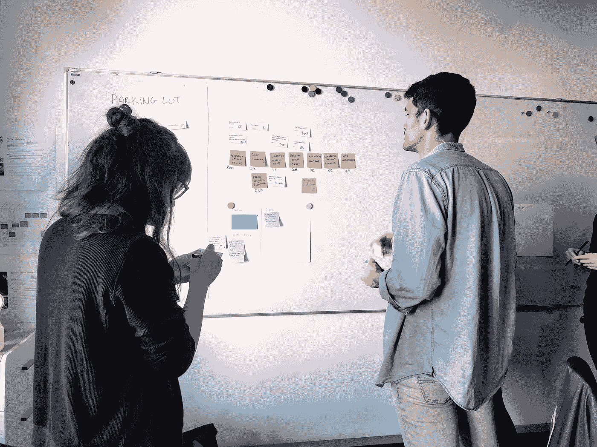
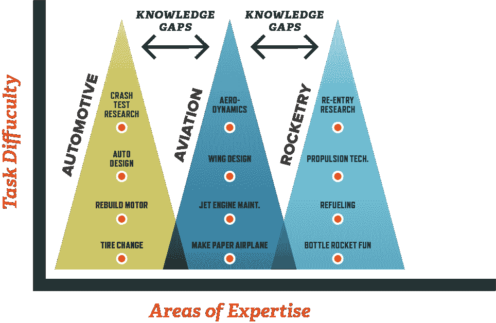
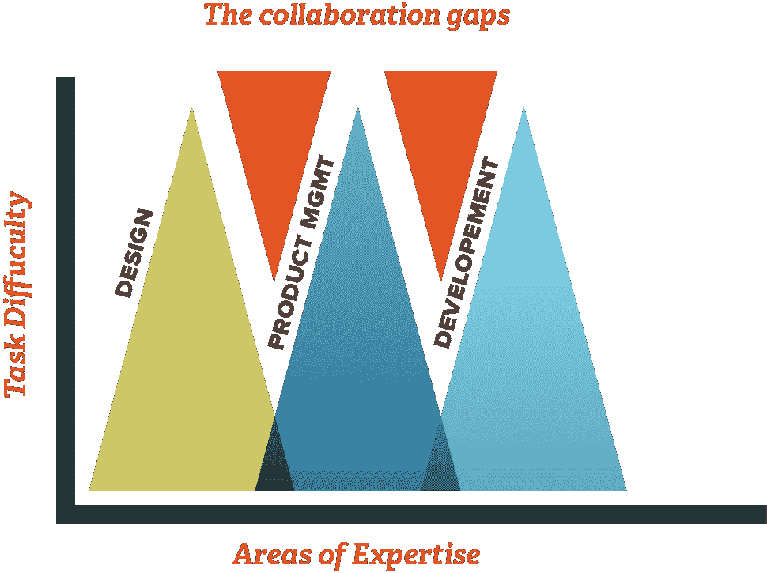

# 协作—操作指南

> 原文：<https://medium.com/swlh/collaboration-a-how-to-guide-39259cfd6f5b>

*Photo by* [*Julia Rosich*](https://www.twenty20.com/rosich.julia/photos) *on* [*Twenty20*](https://www.twenty20.com/)

在我二十多岁的大部分时间里，我以取笑他人为生。在洛杉矶最大的主题公园之一做漫画艺术家非常有趣，我不怕承认我非常擅长这个。对我来说幸运的是，以幽默的方式夸张和获得巨大相似的能力是天生的。我只需要担心我的画桌另一边的一两张脸，以及偶尔比我画得更好的同事。然后我决定把一切都搞砸，成为一名设计师。

对我来说一点也不容易。我曾经能够对一个人做出快速判断，在不到十分钟的时间内画出并喷涂他们的脸，很少得到回报。转行做设计工作涉及到这么多我没有预料到的外界因素。这是完美的，对不对？你的意思是我必须做出改变？等等，我不会重新开始…再一次。

所以，我要坦白。

协作让我很不舒服。由于我过去的经历和个性，关于协作的一切对我来说都感觉不自然——从与他人合作以实现共同目标，到分享所有成功的荣耀。在整个过程中不得不与人交谈也会引起轻微的焦虑。说到设计，我是一个独立的工作者，也是一个控制狂——我更喜欢让事情看起来和我想象的一模一样。

但是你猜怎么着？商业世界不是这样运作的。在我 15 年的设计师生涯中，我从来都无法逃避协作。事实上，当我主动回避它时，我会让*更多的*为我自己工作。作为设计师，为了尽可能高效地完成工作，我们必须经常依靠协作。

它已经成为许多公司的流行语，主要用作“一起工作”或仅仅是团队合作的同义词。然而，我相信它比一起工作的共同努力要深刻得多。当我在供应链软件解决方案公司 [SupplyPike](https://www.supplypike.com) 工作的时候，我们有一个空闲的渠道，当同事们超越自我时，我们会鼓励他们的努力。它充满了积极的涉及合作行为的呼喊。但是协作部分实际上是如何发生的呢？这是我一直听到的一个问题。这个神秘的东西是如何工作的，最好的方法是什么？

# 首先是为什么

你说协作有什么必要？这一点非常重要，足以成为 SupplyPike 和许多其他公司文化准则的永久组成部分。学者和研究人员经常引用它作为比独自完成任务更好的方法。但是为什么它最近受到如此多的关注，成为如此流行的流行语呢？

**塌陷缺口**

随着某些任务难度的增加，对专业化程度的要求也在增加。这一点在上文中通过缩小每个专业技能三角形来说明。结果呢？其他领域更广泛的知识变得更加困难。考虑一个神经外科医生，他花了 12 到 14 年来学习他们的专业。他们可能很难回答一个典型的全科医生会立即知道答案的问题。神经外科医生知道什么技术最能减少大脑肿胀，但如果你向他们询问缓解慢性胃灼热的药物建议，他们可能不会给你答案。

*Photo by* [*Michael Bonert*](https://commons.wikimedia.org/wiki/User:Nephron) *on* [*Wikimedia Commons*](https://commons.wikimedia.org/wiki/File:Mayo_MN_Gonda_3884cp.jpg)

为了解决这个问题以及医疗行业内的其他问题，非营利学术医疗中心梅奥诊所开发了一种独特的[患者护理协作方法](https://www.mayoclinic.org/medical-professionals/psychiatry-psychology/news/collaborative-care-model-significantly-improves-patient-outcomes/mac-20429626)。精神、身体和物质滥用综合征护理(COMPASS)模式借鉴了有效协作护理方法的最佳实践，以便同时解决精神和身体疾病。患者不再是一次看一个具有个性化和专业知识的医生，而是有一个技能各异的医生团队——一名护理协调员、一名咨询精神病医生和一名初级保健医生——作为一个小组来解决问题和解决方案。这种方法在历史上带来了更好的病人护理和更快的问题解决。简而言之，许多大脑比一个高度专业化的大脑更强大、更高效。

集体大脑是真正合作的关键，对设计思维方法来说是非常有价值的东西。在另一篇文章中会有更多的介绍。

# 那么从哪里开始呢？

第一个重要的技能是沟通。毫无疑问，开始合作的最佳方式是面对面。网上或电话交流总比什么都没有好，但在你面前有一张脸是我们人类的互动方式。你可以观察肢体语言、面部特征和语调。此外，我们如何彼此交谈往往是混乱的，有很多来回，中断和方向的变化。混沌是人类传递信息的最快方式。你无法通过电子邮件、Slack 甚至 Skype 电话接收或综合这些细微差别。同样值得注意的是，并不是每个人都有很强的面对面交流技巧，所以认识到这一点将有助于保持稳固健康的对话。给你试图合作的任何人时间来表达他们的想法，并灵活地进行电子跟进，他们可能会更舒服地表达他们的想法。

**付出少，收获多**

妥协的能力是下一个需要具备的重要技能。没有它，你还不如只和自己说话。我曾经相信“所有的设计都是一种妥协”。这是一种消极的观点，认为典型的设计师是一个输出他人想法的容器，永远不能随心所欲。然而，我的想法已经发展到认为所有好的设计都是必要妥协的结果，是有效合作的结果。是的，你甚至可以称之为谈判。换句话说，为了获得可能的最佳结果，必须考虑一些外部因素。在一个盒子里做设计决策，或者任何工作决策都是低效的，甚至是危险的。

> “…抱着你可能已经知道答案或结果的态度来参加协作会议，意味着你要么是入错了行，要么是完全没有抓住重点。”

如果你是在合作解决分歧，那么请记住，并不是每场战斗都需要打。更重要的是，没有什么战斗值得为一个有毒的工作环境火上浇油。类似地，带着你可能已经知道答案或结果的态度去参加协作会议意味着你要么是入错了行，要么是完全没有抓住重点。

**视角决定一切**

宽容和接受他人的观点是伟大合作的另一个基石。SupplyPike 非常幸运，公司内部有许多不同的团队成员:来自世界各地的人，有着不同的信仰、文化和观点。每个人都有不同的工作背景和生活经历。利用这一点，探索每个视角给协作过程带来的好处。多样性等于无数的观点，所以带着所有观点都以自己的方式有效的信念来进行讨论有助于最好的合作解决方案。

**停留在目标上**

最后，从一开始就确定一个共同的目标，然后作为一个团队努力实现它。这听起来可能有点俗气，但是如果你们不是都在为一个最终目标而努力，那么合作首先是没有用的。团队合作意味着共享资源，并肩工作，而不仅仅是发号施令。

# 有步骤可循吗？

Uno，定义你的利益相关者。你最不希望看到的就是迟到的利益相关者的意见。范围蔓延的最大原因之一是没有尽早让合适的人参与进来。在一个项目接近尾声时，一个突然出现的利益相关者感觉被忽略了，并有大量的投入，这可能会完全打乱你的过程。那么谁是你的利益相关者？这些人对项目的成功有既得利益。例如，一名销售人员需要向潜在客户分发传单，或者一名产品负责人最了解某个产品目前可以做什么，该产品的管道中有什么，以及该产品的未来发展方向是什么。如果你不确定你选择的利益相关者需要是谁，问问别人。另一方面:如果你碰巧是一个利益相关者，努力成为一个积极的参与者，而不是在一旁等待，直到为时已晚。

> "这种角色的清晰和尊重应该延伸到*参与其中的每个人*"

接下来，一个清晰的决策者需要被所有相关方理解。即使在协作环境中，也需要有人指挥项目，发号施令。这个角色可能会落到项目经理、部门主管，甚至是第一个完成项目的人身上。没有这个角色，就会出现混乱、停滞和项目失败。反之亦然:厨房里太多的厨师会导致冲突和流程中断。这种角色的清晰和尊重应该延伸到*参与其中的每个人*。我不能强调这有多重要。集体尊重谁拥有什么，不回避或忽视合作伙伴是合作行为的基础。由此，当出现问题或需要快速做出决定时，应该不存在该去找谁的问题。

南非的传统依赖于一种叫做 [Ubuntu](https://youtu.be/SMSqZckROfA) 的哲学概念，这种思维方式大致可以解释为相信一种连接全人类的共享的普遍纽带。在定义 Ubuntu 的含义时，纳尔逊·曼德拉说“……如果我们此生要有所成就，也同样要归功于他人的工作和成就。”将这种哲学应用于协作并不意味着尊重糟糕的工作；是不是意味着尊重工作的人。这意味着在礼貌地提供有助于推进项目的建议的同时，保持你的专业技能。

这就引出了下一步。除了决策者之外，其他角色应该有权控制项目的哪些方面属于他们的工作范围，并且对其他方面也有共同的理解。例如，如果一个开发人员正在帮助构建一个登录页面，那么他们应该作为技术决策的权威。如果信息有问题，那么市场营销应该有最终的发言权。同样，销售人员将负责定义价值主张的参数。

*The gaps within roles of expertise is where the magic of collaboration happens.*

继续前进，每个人都需要理解最终的目标是什么。此外，像截止日期、可以访问哪些资源以及许多其他问题都需要有答案。我们为什么要这么做？我们有多少时间？谁在做什么工作，除了人-小时之外，还有额外的成本考虑吗？如果这些不能提前回答，最好重新考虑项目。

现在是时候集思广益了——这是合作中真正有趣的部分。不要害怕集体讨论。就我个人而言，我喜欢成为坏主意的传递者，这样它们会立刻消失，没有人会在它们身上浪费时间。即使你认为你有一个很棒的想法，也要记住它永远不会是最好的。事实证明，有组织的头脑风暴比一起跳进房间互相交流想法更有成效和效率。允许 10 分钟的独立想法产生，然后提出所说的想法有助于让每个人都参与进来，并解释了那些通常会被房间里更有发言权的老板淹没的不太健谈的想法。

另一个需要考虑的步骤是:尝试在一个新的地方合作。没有什么比一个新的环境更能培养创造力了，所以作为一个团队走出办公室。如果你倾向于一次又一次地与同一个团队合作，这一点尤其正确。如果这是不可能的，或者你在某个时候被困住了，试着去散步。[事实证明](https://news.stanford.edu/2014/04/24/walking-vs-sitting-042414/)一个想法或解决方案会从你的脚下产生。

最后但肯定是最重要的一步，创造反馈回路。把反馈回路看作是防止在错误的方向上走得太远的保护措施。如果你觉得卡住了，是时候和小组沟通了。如果你认为你已经完成了项目，是时候和你的利益相关者交流了。如果看起来你已经独自工作了很长时间，那么是时候回头向你的同事征求意见了。尝试从你典型的合作者圈子之外的人那里获得反馈，甚至是一个陌生人。他们对项目的不熟悉可以提供独特的观点。他们可能有一个更好的主意，或者变出一些通常的嫌疑人永远不会想到的东西。最终，记住你不可能取悦所有人。其他人的意见总是非常有价值的，但是需要经过利益相关者和决策者的过滤，尤其是当反馈过多或不合时宜的时候。

有时候，不管出于什么原因，合作就是行不通。这是正常的，也是这个过程中较难把握的部分之一。总的来说，尽最大努力坚持以上几点应该会为你节省一些时间和很多麻烦。它们当然对我有用，尽管有时我更喜欢整天画有趣的脸。