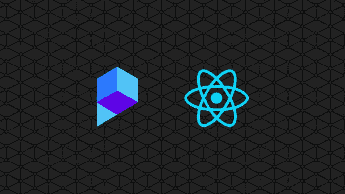
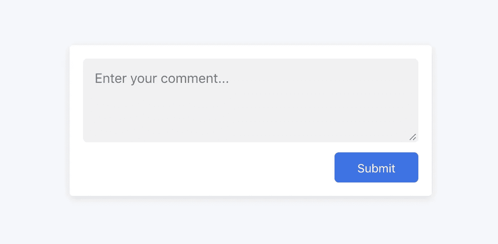

# 使用 Perspective API 和 React 在线对抗毒性

> 原文：<https://medium.com/swlh/combat-toxicity-online-with-the-perspective-api-and-react-f090f1727374>



不可否认，互联网拉近了数百万人的距离，但它也成为有毒和虐待行为的滋生地。本文将带您构建一个 React 应用程序，该应用程序尝试使用 Perspective API 来防止带有恶意的评论被发送。

# 什么是透视 API？

[Perspective API](https://www.perspectiveapi.com/#/home) 是一种使用机器学习的服务，试图确定评论或其他短文本片段的意图。它可以用于任何数量的用例，以帮助对抗毒性、滥用和其他不良行为。它支持许多类别，并报告用户的意图与该标准匹配的概率。

# 我们将要建造的

为了探索透视图 API 是如何工作的，我们将使用 React 构建一个简单的注释表单。当用户提交评论时，在允许提交之前，它将首先使用透视图 API 检查意图。

该应用程序将允许您指定您想要验证意图的阈值和类别-您可以尽可能严格！

我们将利用一些工具来帮助我们构建项目:

*   [创建 React 应用](https://github.com/facebook/create-react-app)(引导应用)
*   [axios](https://github.com/axios/axios) (HTTP 请求)

你可以查看一个完成项目的[演示](https://tsnolan23.github.io/comment-toxicity-filter/)，它与我们将要构建的项目相似。我们开始吧！

# 要求:

*   对 React 有一些基本的了解
*   已安装节点和 NPM
*   通过谷歌云平台的透视 API 的 API 键

我不打算介绍如何通过 GCP 生成 API 密匙，因为这不是本文的主题，但是，有很多其他的在线资源可以提供。比如[这个通过 Google](https://support.google.com/googleapi/answer/6158841?hl=en) ，第四步，你要启用的 API 叫做 Perspective。

# 第 1 部分:引导应用程序

首先，让我们通过用`creat-react-app`创建一个新项目来启动并运行我们的应用程序。如果您以前没有使用过`create-react-app`，您可以通过运行以下命令来安装它:

```
npm install -g create-react-app
```

否则，您可以初始化一个新项目，进入目录并添加我们将需要的依赖项:

```
create-react-app comment-form-perspectivecd comment-form-perspectiveyarn add axios
```

然后，您可以通过运行`yarn start`来启动开发环境。

# 第 2 部分:创建表单

现在我们的应用程序已经启动并运行，我们可以开始构建表单了。让我们首先删除当前在`src`目录中的所有文件(但是保留`src`文件夹！).

一旦这个文件夹被清空，在`src`目录中创建一个`index.js`和`style.css`。然后在`src`中创建一个名为`components`的新目录，并在其中放置一个`App.js`和`CommentForm.js`文件。当所有这些都完成后，您应该有以下文件夹结构:

```
.
└── src
    ├── index.js
    ├── style.css
    └── components
        ├── App.js
        └── CommentForm.js
```

深入研究`src/components/CommentForm.js`，我们将创建用户将输入文本的实际评论表单。该表单将:

1.  利用`useState`钩子将我们的注释保存在状态中，并给我们一个方法来更新它的值
2.  包含一个`form`,它将使用一个通过`prop`提供的回调函数将我们的注释发送到父节点，我们稍后将在那里使用它
3.  包含一个`textarea`,它将是我们注释状态的受控输入
4.  包含一个`button`提交表单

现在我们已经构建好了表单，让我们转到`src/components/App.js`，我们希望:

1.  呈现我们刚刚构建的`CommentForm`组件
2.  处理表单提交和`console.log`我们的评论
3.  创建一个占位符，我们将在后面的教程中使用透视执行毒性检查

很好，现在让我们使用`src/index.js`文件在页面上实际初始化和呈现我们的应用程序。

这就完成了表单本身的功能，但是在我们继续之前，让我们通过向`src/style.css`文件添加一些 CSS 来使一切看起来更好一点。

就是这样！这就完成了第一部分。此时，您应该有一个如下所示的表单，当您单击 submit 时，您会在控制台中看到您的评论值！



# 第 3 部分:验证用户的意图

现在我们有了一个向父组件提交评论的表单。我们实际上可以利用透视图 API 来验证用户的意图。所以，让我们从修改`src/components/App.js`文件开始，实际发出这个请求。我们需要:

*   导入`axios`库来发出 http 请求
*   向透视图 API 发出一个`POST`请求，将注释作为有效负载
*   利用我们的 API 密钥(替换下面第 9 行的`YOUR_API_KEY`)
*   指定我们想要验证的任何意图

因此，在上面的代码片段中，我们使用`axios`向透视图 API 发出一个`POST`请求。在那个请求中，我们传递了`comment`以及一组`requestedAttributes`。那些`requestedAttributes`是我们想要检查的意图。有几个比我定义的更多，所以你可以尝试不同的组合。

如果您查看我们`console.log`的响应，您会注意到，对于我们请求的每个意图，我们都会得到以下内容:

```
{  
   **"TOXICITY"**:{  
      **"spanScores"**:[  
         {  
            **"begin"**:0,
            **"end"**:14,
            **"score"**:{  
               **"value"**:0.018322915,
               **"type"**:"PROBABILITY"
            }
         }
      ],
      **"summaryScore"**:{  
         **"value"**:0.018322915,
         **"type"**:"PROBABILITY"
      }
   }
}
```

有了这个响应，我们可以映射出我们所要求的意图的概率，并将它们与我们认为合适的阈值进行比较。如果概率低于该阈值，您可以保存评论，但如果不是，您可以向用户提供反馈，说明应该进行调整！

所以，现在，一旦对透视图的请求完成，我们检查我们请求的每一个意图，如果它们中的任何一个超过了概率`0.75`，我们将注释标记为无效。您可以将阈值修改为您想要任何值！

在函数的`then`部分，您可以随心所欲地使用结果。您可以为每个类别设置单独的阈值，将数据发送到服务器，可能性是无限的！

# 摘要

这是一个相当人为的例子，因为它只是记录意图是否有效，但是这个概念可以用于任何数量的用例，从前端验证到授权审核工具。

您还会注意到，一些查询的意图概率可能与您的预期不符。记住它用的是机器学习，所以随着时间的推移会越来越好！

如果你有任何允许用户评论的网站，并且正在与一些有害行为作斗争，你可能会考虑实现类似的东西！

在这里你可以再次看到这个[的工作演示。](https://github.com/tsnolan23/comment-toxicity-filter)