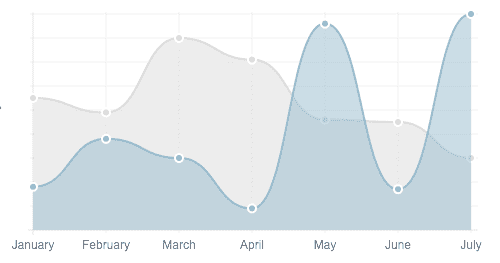
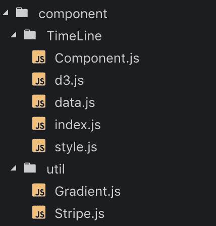
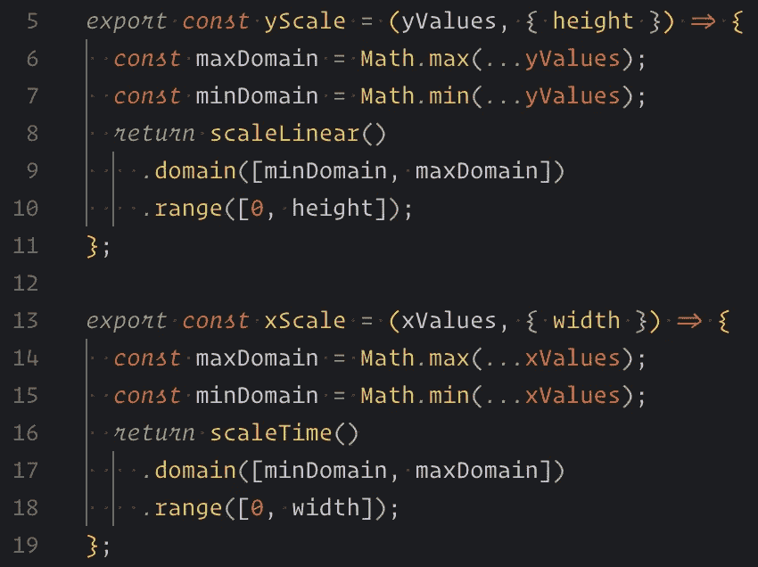
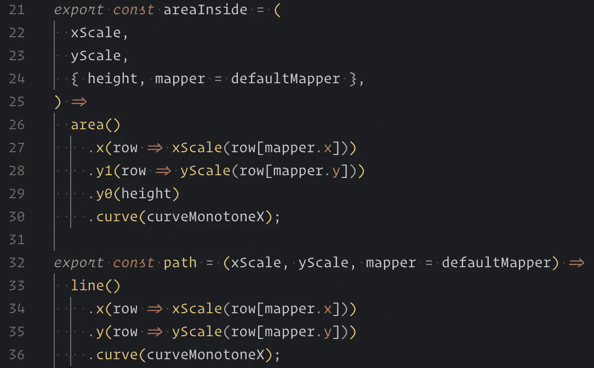
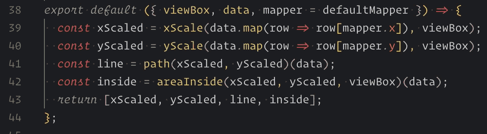
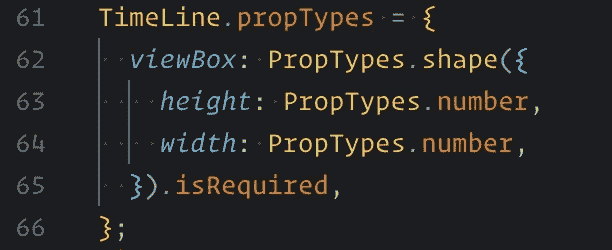
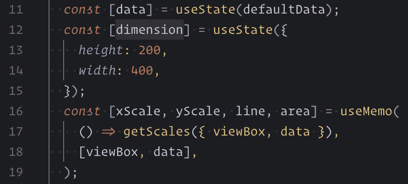
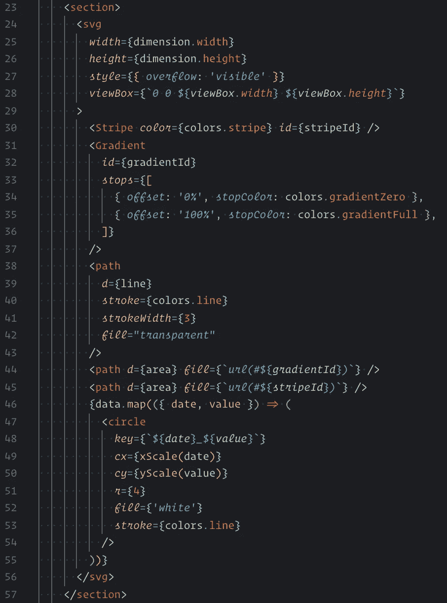
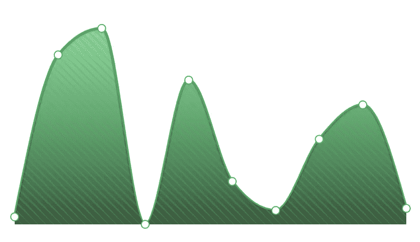

# React 和 D3 的组合

> 原文：<https://medium.com/swlh/combination-of-react-and-d3-1fb07b00fb55>

## 天作之合

目录:

*   [为什么是](/p/1fb07b00fb55#c156)
*   [如何](/p/1fb07b00fb55#5e39)
*   [什么](/p/1fb07b00fb55#ac32)

# 介绍

> 这是一系列关于结合`*React and D3*`的文章。在整个系列中，我们将利用这两种技术的优点构建一个应用程序。在某些时候，将它们结合起来可能会很困难，为了达到最佳效果，你需要对其进行平衡。所以我们要创造一些平衡魔法。
> *注意—* 有些部分可能会觉得自以为是:是的就是！

# 问题

React 非常适合渲染视图。D3 是构建数据驱动应用程序的最丰富的框架。从历史上看，D3 提供了一种直接访问 DOM 的强制性方法。你可能会在[https://bl.ocks.org/](https://bl.ocks.org/)上看到很多很棒的例子，但是并没有真正联系到操作视图的反应方式。 ***怎样才能优雅地将它们结合起来？***

# React —视图，D3 —数学

在 [Captify](https://www.captify.co.uk/) 中，我们知道向用户展示数据有多重要。洞察力可以驱动你的选择，帮助你更好地理解你的业务。我们使用 React 和 D3 来实现这一点。

首先，我们定义了什么对我们真正重要。
我们要实现的主要目标是:

*   一致的视图管理方式
*   用 D3 提供的工具操作数据。
*   最佳开发人员体验
*   元素的详细控制

在对概念进行多次证明后，我们概述了关于这个问题的三种流行观点:

*   React —视图，D3 —数学
*   react——SVG 作为根，D3——在生命周期中使用真实 DOM
*   React —渲染假 DOM，D3 —使用假 DOM

在[的文章](/@tibotiber/react-d3-js-balancing-performance-developer-experience-4da35f912484)中， [@tibotibe](http://twitter.com/tibotiber) r 很好地描述了提到的方法。

受到 [@sxywu](http://twitter.com/sxywu) 的一点启发，我们决定坚持使用 ***React — View，D3 — math。这种方法给了我们想要的一切。能够用 React 管理 View all。用 D3 函数进行数据操作。SVG 将作为常规组件呈现，这给了我们对每个元素的详细控制和充分的开发者体验。***

# 为什么不 react-d3 lib X？

对于使用 react 和 d3 以及现有组件构建图表，有很多可用的解决方案。伟大的名单提供[这里](https://www.smashingmagazine.com/2018/02/react-d3-ecosystem/)。它们肯定可以帮助你构建不需要很大的样式或渲染灵活性的演示或应用程序。
但是如果你有一个独特的风格需求或者一组组件与默认解决方案不相似，你可能需要自己构建一些东西。

# 代码从何而来？

给你。
让我们构建一个简单的静态时间线图表。类似下面的例子，但是图表后面没有轴和网格。

example

向前跳，你可以在这里找到所有相关的代码。
或者快速演示一下[这里部署的](https://react-d3.icrosil.now.sh)。

自举之后，我们有了全新的 CRA 驱动的应用程序`d3`和`dayjs`。出于开发目的，我们添加了完整的`d3`库，但实际上，我们并不需要所有这些。如果你需要`d3`的某些确切功能，像`d3-scale`那样只安装它们会好得多。如果你不知道你的项目会增长多少，只要确保你启用了树摇动。

# 时间表

我们的图表将由两个基本部分`D3 calculations`和`Component`组成。

Structure

这里我们定义了一个带有少量`util`组件的`TimeLine`组件。

## D3

会给我们提供任何我们想要的计算。
在我们的例子中，它们是 5 个函数:

scales

*yScale + xScale* —定义数据集边界大小的函数，每次数据改变时都要重新计算。

path and area

*path+area inside*——用于将我们的数据塑造成可视化的形式。`path`用于线条，而`areaInside`用于同一线条，但带有内部部分，用于漂亮的填充样式。

interface

接口是一个在渲染前使用的函数。我们可以将它用作悬挂或挂钩。对于我们的图表，我们使用挂钩方法。这就是为什么我们在数组中返回计算的数据和函数。

`Export default vs named`。命名导出让我们能够仔细地对精确的函数进行单元测试，默认导出让我们能够很好地使用组合——这正是我们在单个图表中所需要的。

`Parameter passing`。您可能会注意到传递参数的不同风格，对于这一点，我只有一个建议，将 scales 作为单独的参数，其他的都可以作为聚集的 options 对象中的最后一个参数。

`defaultMapper`是一件有益的事情。有时你想使用相同的比例，但不同形状的数据，在这种情况下，你可以通过不同的映射和重用旧的比例函数。

## 成分

View props

*道具。我们只有一个属性`viewBox`，它描述了我们要寻找的比率和初始大小。*

hooks

*挂钩。*数据是我们想要表示的任何数据集。维度不同于属性视图框。Dimension 声明了渲染所在的 SVG 的实际大小。视图框将按尺寸缩放。

出于渲染的目的，我们将 d3 计算封装到`useMemo`中。当视图框和数据不变时，钩子将节省我们重新计算 d3 函数的时间。

render

*逐个渲染* —带所有子节点的 SVG。SVG 中样式的定义。绘制线条和区域的路径。画实际点的圆。

就是这样。我们刚刚用 React 元素和 D3 计算构建了一个自定义图表。让我们看看最后是什么样子。

chart

# 下一步是什么

我们讨论了基本的集成，但没有提到现实世界中的问题，如*工具提示*、*轴*、*地图*或*动画*。这些问题实现起来非常有趣，值得为它们编写单独的故事。

# 关于这个话题的更多信息

**只是一个图表库**:
-[https://www . smashingmagazine . com/2018/02/react-D3-ecosystem/](https://www.smashingmagazine.com/2018/02/react-d3-ecosystem/)

**D3 第一**:
-[https://blog . log rocket . com/data-visualization-in-react-using-react-D3-c 35835 af 16d 0](https://blog.logrocket.com/data-visualization-in-react-using-react-d3-c35835af16d0)-[https://medium . com/@ Elijah _ Meeks/interactive-applications-with-react-D3-f 76 f 7 B3 ebc 71](/@Elijah_Meeks/interactive-applications-with-react-d3-f76f7b3ebc71)

**Faux first**:
-[https://blog . si cara . com/a-starting-point-on-using-D3-with-react-869 fdf 3d faf](https://blog.sicara.com/a-starting-point-on-using-d3-with-react-869fdf3dfaf)-[https://medium . com/@ tibo Tiber/react-D3-js-balancing-performance-developer-experience-4 da 35 f 912484](/@tibotiber/react-d3-js-balancing-performance-developer-experience-4da35f912484)