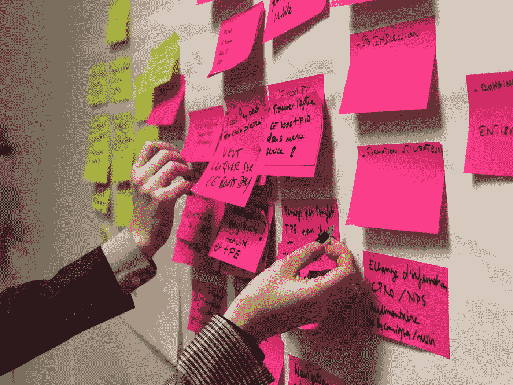

# 基于承诺的计划:拯救你冲刺的 5 个步骤

> 原文：<https://medium.com/swlh/commitment-based-planning-5-steps-to-save-your-sprint-d4b260e3ccab>

## 冲刺计划是敏捷项目的一个重要方面，只需要 5 个步骤就可以完成。

Photo by [bonneval sebastien](https://unsplash.com/photos/yBzg2SHzddM?utm_source=unsplash&utm_medium=referral&utm_content=creditCopyText) on [Unsplash](https://unsplash.com/search/photos/sprint-agile?utm_source=unsplash&utm_medium=referral&utm_content=creditCopyText)

在敏捷项目中，计划冲刺是至关重要的，但是根据产品所有者的需求和开发团队的能力来定制交付总是一个挑战。研究证实，冲刺规划阶段…