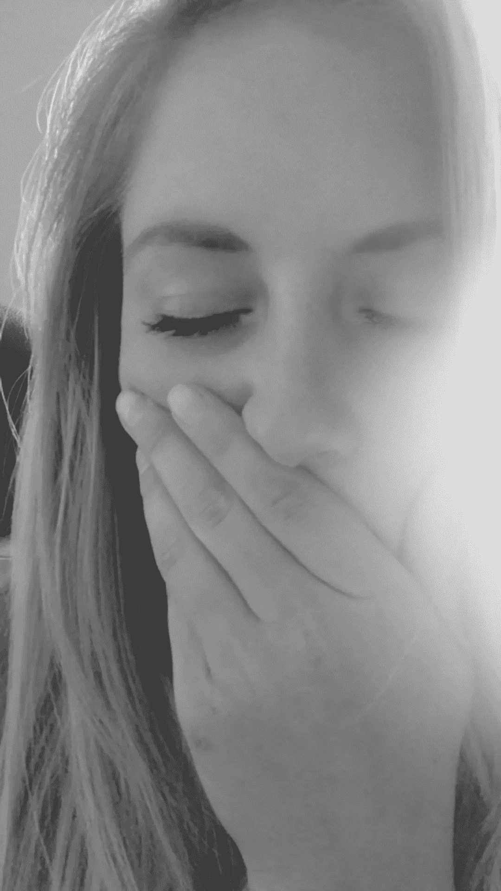

# 家庭虐待者的共性

> 原文：<https://medium.com/swlh/commonalities-of-domestic-abusers-67c2e347934a>

我最近听了一个播客，来自*成为她的*，由蒙大拿州波兹曼的一个名为*的非营利组织主持，我们是她的*。(我强烈建议查看播客！).我听的那首歌叫做《T4 遇见贝拉》。

播客是对一名年轻的波兹曼当地妇女的采访，讲述了她的家庭虐待经历以及她如何学习应对创伤。