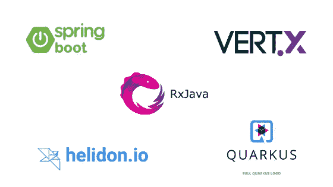
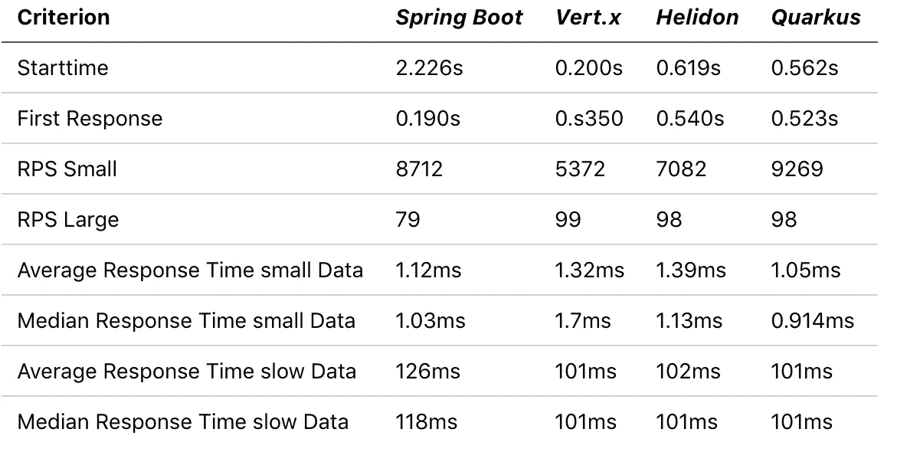
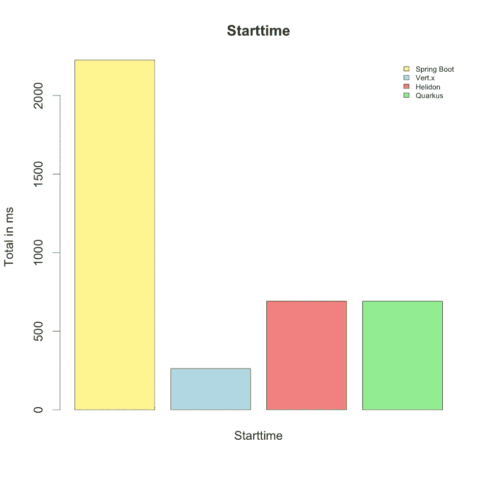
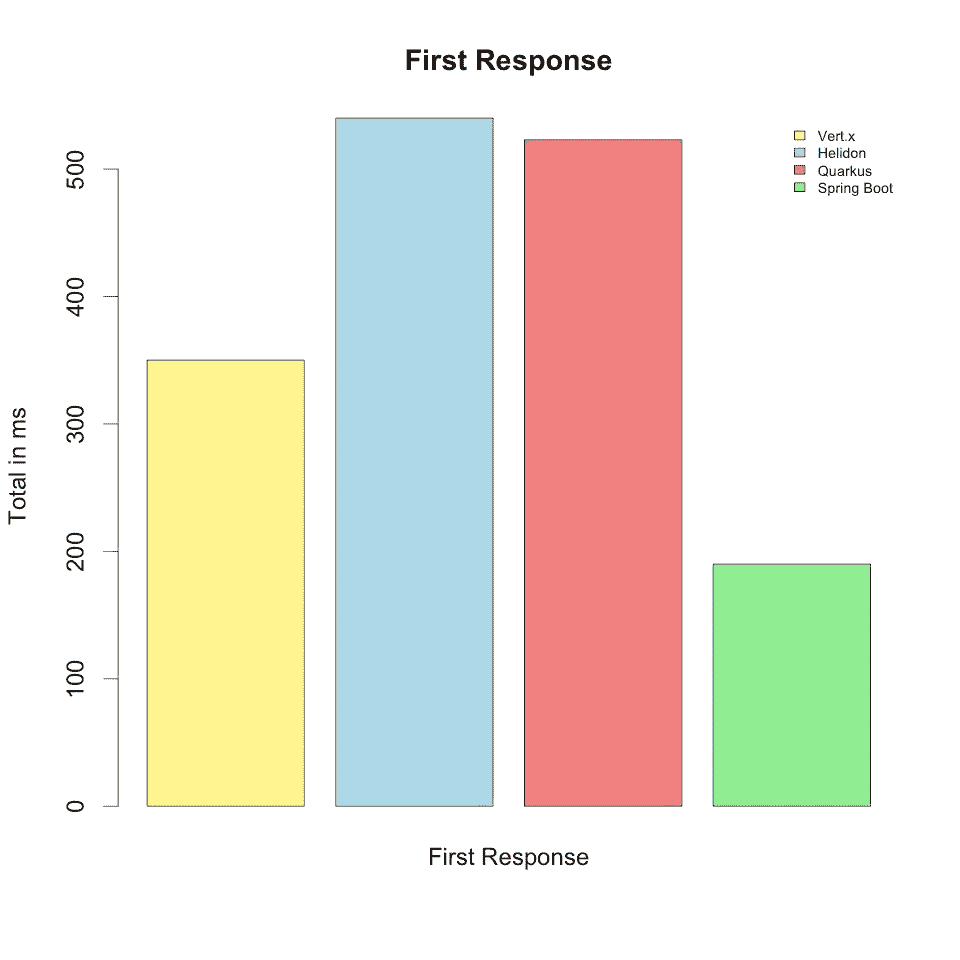
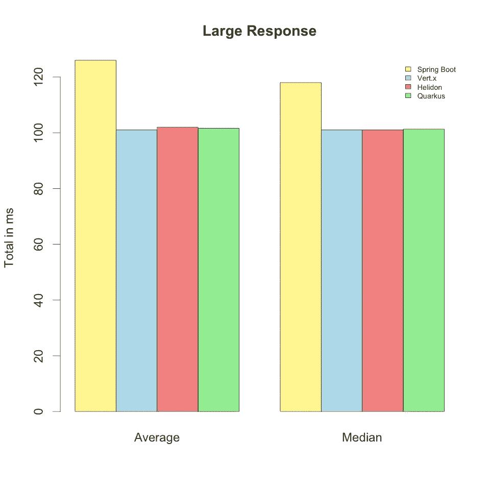
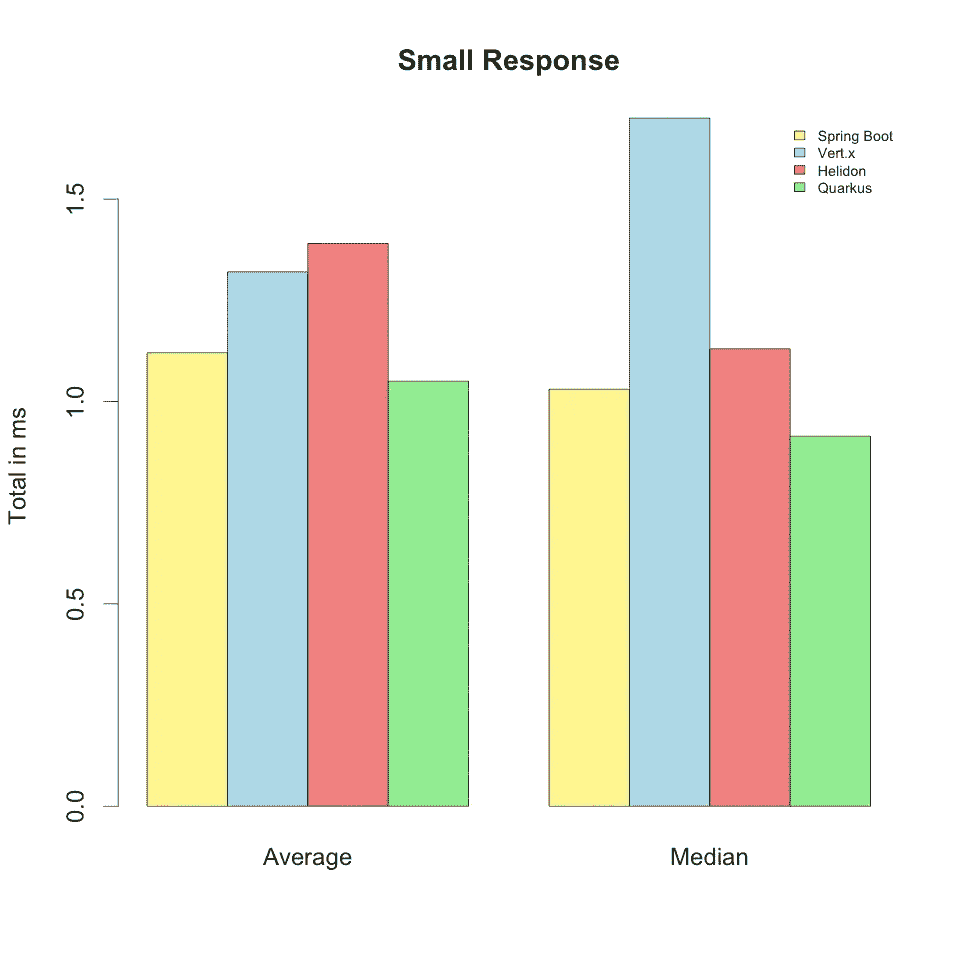
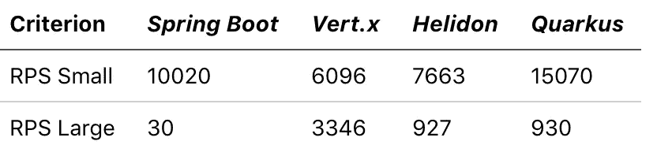
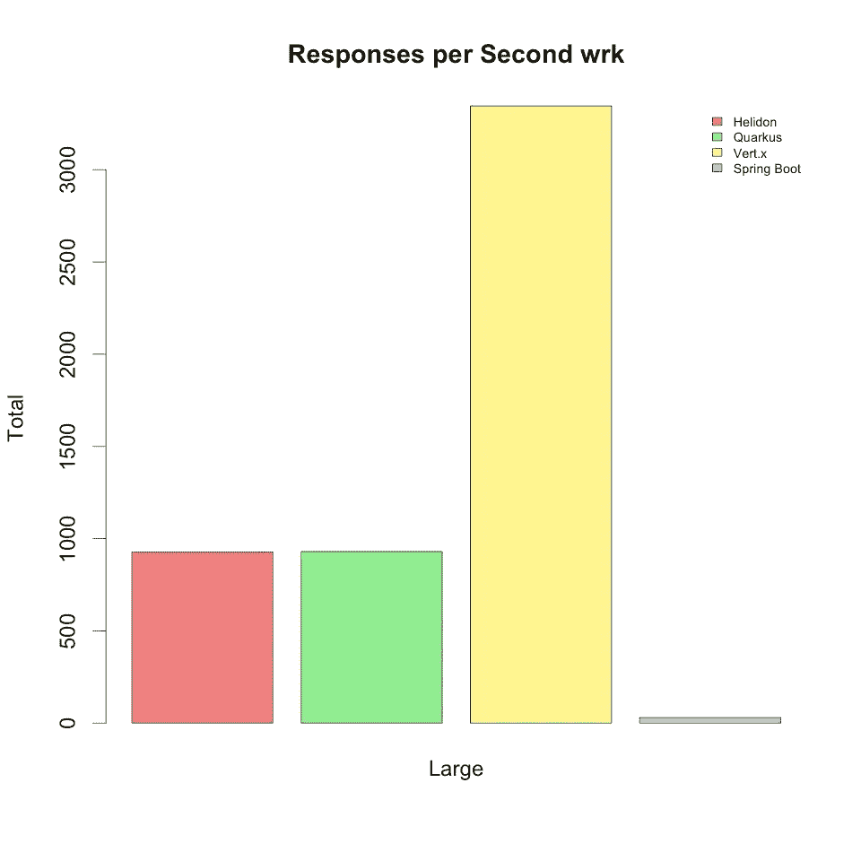
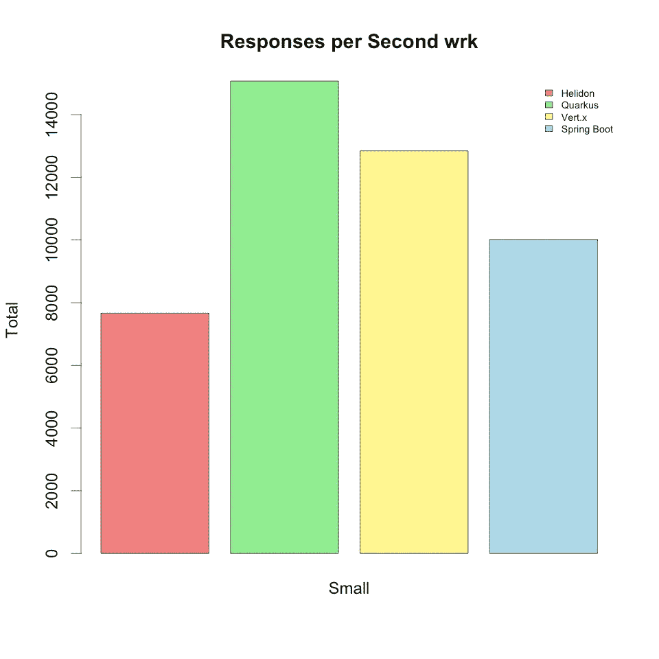

# 微服务框架与流示例的比较

> 原文：<https://medium.com/swlh/comparison-of-microservice-frameworks-with-a-streaming-example-6bfe284a66a>

在我的[上一篇文章](/@aengel/how-to-reactive-stream-with-spring-boot-and-rxjava-26cda0045f4c)中，我展示了一些用 RxJava 进行反应式编程的有趣应用，以及何时/为什么应该使用它。

这些服务可以根据负载增加或减少。如果一个服务负载很重，负载平衡器现在可以简单地启动其他服务，重定向负载，从而减轻一个服务的负载，并再次减少响应时间。如果服务负载很小，可以停止它们，从而为其他服务释放性能，或者在使用云服务的情况下节省成本。

服务很少没有负载峰值，如果其他单元的启动和停止很快，并且这些新启动的实例对请求反应很快，以便保持所有请求的响应时间很低，这将是有利的。

因此，在本文中，我将考察各种微服务框架，并在启动时间、首次响应时间和负载下的响应时间方面对它们进行比较。此外，我将简要讨论框架入门的简单性。

在第一步中，我将处理以下框架/服务器( *Micronaut* 、 *Wildfly* 、 *Dropwizard* 和 *Spark* 将适时跟进):

*   *Spring Boot*
*   *垂直 x 轴*
*   *海利登*
*   *夸尔库斯*

我从 *Spring Boot* 开始，因为我已经在我的第一篇文章中使用了它，并在产品中开发了它。

以下帖子基于之前关于*与 Spring Boot* 反应流的帖子。在这里，我已经创建了一个 stream REST 端点，并开发了一个小型前端用于演示。以下后端的代码将在同一个 [GitHub-Repo](https://github.com/auryn31/spring-async-rest-example) 中提供。

令人兴奋的是， *Spring Boot* 已经默认为`application/stream+json`。但是，这不是*哑剧*类型。对我来说，这是不清楚的，因为格式似乎是有意义的。

由于 *Quarkus* 和 *Helidon* 使用 JAX-RS(它使用 *MIME* 标准)，要么必须定义类型本身，要么必须使用`application/octet-stream`。

为了不用改变前端，我同时使用了`application/octet-stream`和`application/stream+json`。各个端点可通过标头访问。没有标题的`application/json`被返回。

# 进入

在下一节中，我将简要地看一下框架。我自己以前只在产品中使用过 *Spring Boot* ，所以其他框架对我来说也是新的领域。我将简要解释我在框架中创建相应端点时遇到的困难。

## Spring Boot

Spring Boot 可能是最著名的框架。Github 上的 *> 38.000* 明星自己说了算。

Spring Boot 的入门非常简单。这里创建了一个 **pom.xml** 和所有必要的依赖项，您可以立即开始。此外，社区非常大，您可以找到如何处理大多数问题的说明。

Spring Boot 是唯一默认支持 T0 的框架。它还提供了许多其他功能，并为清晰和简单的开发提供了很多帮助。

因为我自己经常使用 Spring Boot，所以创建合适的端点对我来说很容易。正如您在下面看到的，创建一个*响应流*并不需要太多时间:

然而，对于流响应，需要一个*流响应体*:

基本上就是这样。所以就到了下一个框架。

## 垂直 x

Vert.x 有很好的文档。它是由 Eclipse Foundation 开发的，是直接为 JVM 上的反应式应用程序设计的。然而，我不能仅仅将我的可观察对象(或可流动对象)传递给响应处理程序。理论上，你可以像文档中描述的那样直接返回一个可流动的对象，但是可流动的对象不会在每个新的事件中直接写入流中。它似乎缓冲了可流动流中的元素，并且仅当事件 *done* 来自可流动流时才写入流。但是要获得一个连续的流，你必须编写自己的处理程序，这并不复杂。这与 Spring Boot 的非常相似。

此外， *Vert.x* 的文档也很好，拥有超过 *9700* GitHub Stars 的社区也在不断增长。

应用程序由`./mvnw clean compile`编译，由`./mvnw exec:java`启动。这些命令也可以很容易地组合起来。(`./mvnw clean compile exec:java`)

总而言之，你会发现自己在 *Vert.x* 中，并且可以开始快速发展。但是你得习惯在一个主线程上开发，因为你不能阻塞它。在开始的时候，我错误地使用了 *Thread.sleep* ，因此性能非常有限。但这在网站上也被描述为 *DONT* 。修复这个问题后， *Vert.x* 可以通过性能再次得分。其他框架与它相处融洽，尽管如此，它也被从它们中去掉了，因为它是应用程序的*域*部分，所有框架都共享它。

## 赫利登

*Helidon* 像 *Quarkus* 一样设定为 JAX-RS 标准。所以我可以使用与 Quarkus 相同的代码。你只需要注册一件 T21 球衣就可以出发了。关于 *Helidon* 的积极的一面是，它不需要终端中任何自己的命令来启动。这里的 IDE 支持非常简单和令人愉快，因为所有必需的依赖项都来自于 pom。所以可以用一个简单的`mvn clean install`来完成构建，而构建好的*罐子*可以用`java -jar`来完成。不得不说，`mvn clean install`也足够其他所有框架构建一个可执行的`jar`。 *Vert.x* 和 *Quarkus* 只会带来更多的脚本，需要额外的一个类从 IDE 启动。这个额外的类不是由*默认*提供的。

## 夸库斯

Quarkus 仍然是一个非常年轻的框架，它已经在社区中获得了很多关注。它目前在 GitHub 上有将近 2000 颗星星。它是由红帽公司开发的。它本身可以为 GraalVM 编译，但也可以为经典 JVM 编译。但是在这里，它并没有显示出它的优势，因为它消耗的内存很少，启动时间非常快。虽然，我们稍后会看到，它仍然在 JVM 上不到一秒钟就启动了。它使用各种标准，包括 JAX-RS Netty 和 Eclipse MicroProfiles。

*Quarkus* 在标志上写自己一个非常快速的开始，因此缩放和低内存消耗。此外，制造商还依赖反应式方法来开发高度并发和响应迅速的应用程序。关于这一点，JavaSpektrum (7/2019)中有一篇更详细的文章，其中对*夸尔库斯*进行了更精确的检查。其中，它显示 JVM 上的应用程序消耗了 *100mb* RAM，而在 GraalVM 上它只需要 *8mb* 。

夸尔库斯的文档非常详细，易于阅读。不幸的是，到目前为止只有一些教程和解释，因为社区还没有这么大，框架使用的时间还不够长。如果出现问题，你必须搜索很长时间，或者向社区提出你自己的问题。但是仅仅因为*夸尔库斯*来自**红帽**这个事实，这个社区很快就会到来。

这样做的好处是，你可以用现有的 *Java* 或 *Kotlin* 知识开发一个快速而精简的应用程序。

# 结果

在下一节中，我将比较和评估不同的框架。

## 发展

*Spring Boot* 、*夸尔库斯*和*海利登*使用几乎相同的`ResponseWriter`、*垂直 x* 使用一个搬运器。在*赫里登*和*夸尔库斯*你可以依靠经典的 JAX-遥感方法。由于 Java 的发展，这里有很多文档。然而，对于 *Vert.x* ,有一个很好的自己的文档。总而言之，在 Spring Boot 发展对我来说是最容易的。这部分是因为体验，部分是因为目前最大的社区。然而，正如我们将从数字中看到的那样，不能否认其他框架的优势。

## 不同后端的测试

第一步，启动 JVM *(java 版本“11 . 0 . 2”)*上的所有后端。然后用`curl`对相应的端点进行寻址。首次响应时间由一个格式文件决定(位于我的 GitHub repo 中)。

*平均*和*中值*响应时间由`k6`决定。这里 10 个模拟用户对 *30s* 的请求被发送到点。结果可以在下表中找到。

四个框架的开始时间如下图所示。这里你可以看到 *Spring Boot* 明显被其他框架打败了。

慢启动时间的唯一优点是加载了更多的依赖项，并且对查询的第一次响应更快。这点可以从下面看出来。

在下面的两张图片中，每秒钟显示一次响应。*小*为无延迟数据，*大*为延迟 *100ms* 的数据。从这里可以看出，不同的框架在延迟方面相对相似，其中 *Spring Boot* 大约慢了 20%。然而，如果响应快且小，则差异更大。这里*垂直 x* 比*夸尔库斯*几乎慢了 50%。

## 使用 wrk 进行负载测试

我用 [wrk](https://github.com/wg/wrk) 重复了测试。该工具在 *http* 负载测试中非常流行。测试如上所述在流端点上进行。

从表中可以看出，快速回答的结果与使用 *k6* 的结果相似。只有 Quarkus 能够在 *wrk* 处理几乎两倍的请求。有了慢速数据，Quarkus 可以再次给出大多数答案，但也给出了大多数 *5xx* 答案。这里只使用了 *2xx* 的答案。在那里*垂直 x* 可以比其他的更明显。这在下图中也可以很好地看出:

如果 *Vert.x* 作为单个实例启动，它不能快速响应处理这么多请求。但是由于 *Vert.x* 打算用多个实例启动，我用 8 个实例再次测试了它。它能够回答几乎和夸库斯一样多的问题。

# 结论

不同的工具，不同的结果。在负荷下，两种工具的快速答案是相似的，而慢速答案则大相径庭。在第一次回应中， *Spring Boot* 遥遥领先，但是它失去了很多出发时间。在开始的时候，没有一个框架能打败 *Vert.x* 。 *Vert.x* 也可以在 *wrk* 上展示它能够做什么。在这里，它可以并行处理比 Spring Boot 多 100 倍的答案。尽管只有一例。对于一个简单的答案，Spring 可以击败 Vert-x 的简单实例，但是如果你启动多个 Vert.x 的实例，情况就不同了。

总而言之， *Vert.x* 是图中最有说服力的。它比*夸尔库斯*更稳定，比*赫利登*和 *Spring Boot* 更快，并且有非常好的文档。使用 Quarkus 时，我经常进入无效状态，不得不重启它。这可以通过更好的错误处理来避免。如果是关于文档数量、网络帮助和开发者，你可能应该选择 *Spring Boot* 。如果你想快速启动和停止服务，投资和使用像 *Quarkus* 或 *Vert.x.* 这样的新服务是值得的，这在使用微服务架构时尤其令人兴奋。

就我个人而言，我会尝试在下一个项目中使用 *Vert.x* ，并在未来专注于此。尤其是结合 *Kotlin* 一个很刺激的话题。

完整的代码可以在我的 [GitHub-Repo](https://github.com/auryn31/spring-async-rest-example) 上找到。