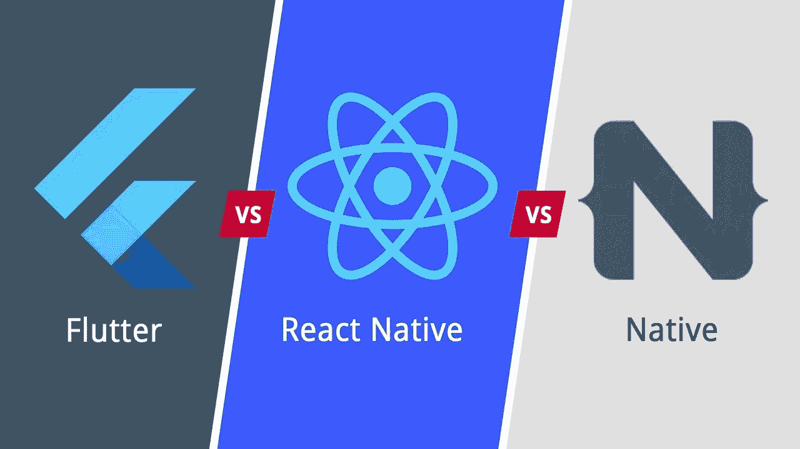
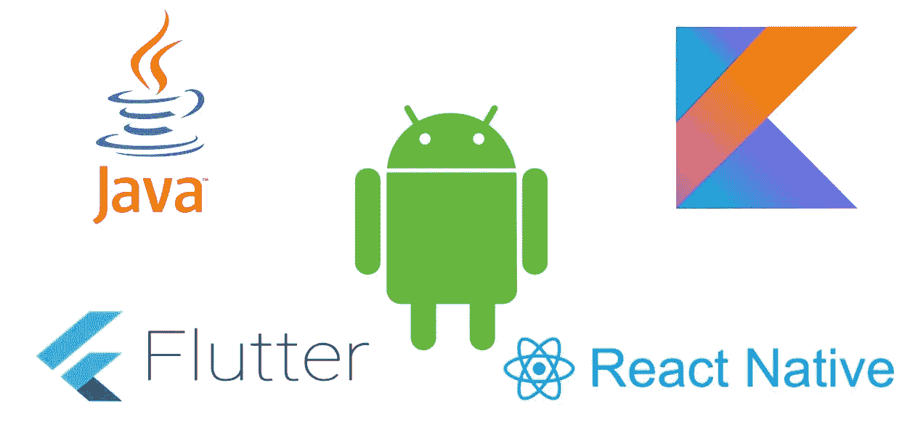

# React Native、Flutter 和 Native Android 移动框架的比较

> 原文：<https://medium.com/swlh/comparison-of-react-native-flutter-and-native-android-mobile-frameworks-148b96ae270f>

如果我告诉你，有一些移动框架可以让你只写一次代码，就可以跨多个平台运行，比如 iOS 和 Android，会怎么样？想象一下，如果您使用一个代码库将应用发布到多个应用商店，那该有多好。一个大问题随之而来: ***我如何决定哪种技术最适合手头的工作？***

这一切始于 2018 年夏天，当时我领导调查和研究，就我的公司可以使用哪个移动框架为我们的客户开发移动应用程序提出建议。我使用这些技术分析和开发了原型应用程序，以了解有助于形成我们决策的几个关键因素。

在这篇文章中，我将讨论流行的移动框架，如脸书的 React Native，谷歌的 Flutter 和 Android 框架。我将对这些框架进行比较，以帮助您和您的公司决定哪种技术可能最适合您试图解决的业务问题。到最后，我还会透露我们决定采用哪个移动框架。

Source: [Comparison of Flutter, React Native and Native Android](https://www.youtube.com/watch?v=cR8sHoyKRNA)

# **公司**

React Native 是一个由脸书支持的开源框架。

Flutter 是谷歌支持的移动应用 SDK(软件开发工具包)。

原生 Android SDK 有谷歌做后盾。

# **语言堆栈**

React Native 让你只使用 **JavaScript** 就能构建移动应用。它在运行时将动态 JavaScript 代码编译到本机视图。其余的代码运行在一个额外的虚拟机中，该虚拟机封装在应用程序本身中。

Flutter 允许你使用一种通用编程语言来构建移动应用，这种语言叫做 **Dart** ，是谷歌在 2011 年开发的。

原生 Android 应用可以使用 Java 和静态类型编程语言来构建。然而，谷歌的 Android 团队鼓励使用 Kotlin 进行原生 Android 开发。

# **性能**

React Native 在其架构中包括两个部分:JS 语言和本机组件。通过 React Native 构建的应用程序使用 JavaScript，但是要与原生组件(如 OEM 小部件、音频和 GPS)交互，需要一个 JavaScript 桥。它用于将 JavaScript 变量转换为本地变量。这种转换产生了一个额外的任务，降低了 React Native 的速度，从而潜在地影响了性能。

Flutter 的架构使我们能够构建快速运行的、看起来像本地的应用程序。因为 Flutter 不需要桥，所以可以快很多。Dart 被“提前”(AOT)编译成多平台的本机代码。这允许 Flutter 与平台进行通信，而不需要通过 JavaScript 桥进行上下文切换。应用程序的整体速度显著提高，从而提供良好的性能。

在原生 Android 应用程序中，应用程序与平台对话以创建小部件或访问相机等服务。小部件呈现在屏幕画布上，事件传递回小部件。这是一个简单的架构，但是你几乎必须为每个平台创建单独的应用程序，因为小部件是不同的，更不用说本地编程语言了。

# **用户界面(UI/UX)**

React Native 使用第三方库，因为 React Native 没有自己的 UI 组件库。React Native Elements、React Native Material Design 和 NativeBase 是可供开发人员使用的一些 UI 库。

Flutter 有自己的 UI 组件、材料设计、适应性强的小部件集和一个引擎，可以在 Android 和 iOS 平台上呈现它们。Flutter 伴随着内置的漂亮材料设计和 Cupertino，如 iOS 风格的小部件，丰富的运动 API，流畅的自然滚动和平台意识。

原生 Android 有一个单独的布局和 Java/Kotlin 文件，我们需要获得视图的引用，然后在后端文件中修改它们。原生 Android SDK 也有自己的一套布局、组件和视图。

# **文档**

React Native 确实提供了通用文档，但是，要学习 React Native，需要依赖外部开发工具包，并且应该搜索每个工具包的文档。

Flutter 团队理解易懂和详细文档的重要性。该文档提供了大量的工作示例，帮助您快速熟悉该框架。Flutter SDK 还附带了许多可安装的应用程序和源代码，开发者可以体验一下这个框架。

原生 Android 有大量例子支持的详细文档，可以开始构建原生 Android 应用程序。

# **单元测试**

当谈到 React Native 时，开发人员可以在单元级别测试所有的 JavaScript 框架。然而，当涉及到 UI 和自动化测试时，情况就不那么明朗了。虽然有许多第三方库可用，但没有清晰的图片。

Flutter 使用 Dart，它提供了一个可以利用的优秀的单元测试框架，Flutter 为您提供了一个在无头运行时以单元测试速度测试小部件的绝佳选择。

原生 Android SDK 还提供了一个单元测试框架，可用于编写小型、中型和大型测试。

# **开发时间**

与 Android Studio 和 XCode 中真正的原生应用程序重新编译相比，Flutter 和 React 原生支持状态热重新加载，速度非常快。如果您的应用程序遇到错误，您通常可以修复错误，然后继续运行，就好像错误从未发生过一样。您可以在 Flutter 应用程序运行时对其进行更改，它会重新加载已更改的应用程序代码，并让它从您停止的地方继续运行。

在开发原生 Android 应用程序时，应用程序的梯度构建时间相当长，阻碍了快速开发周期。随着时间的推移，Android Studio 已经减少了 Gradle 的构建时间，Instant Run 等功能当然很有帮助，但 Flutter 和 React 提供的热重新加载功能优于 native times。

此外，Flutter & React Native 允许 Android + iOS 应用程序来自同一个代码库，从而减少了单独开发的需要，而原生 Android 只允许您为 Android 平台构建应用程序。

Source: [Comparing APK Sizes](https://android.jlelse.eu/comparing-apk-sizes-a0eb37bb36f)

# **配置&设置**

与 React Native 相比，Flutter 的设置过程要简单得多。Flutter 提供了对系统问题的自动检查，例如，运行 flutter doctor 命令可以告诉您您的 Android 工具链是否已经正确设置，所需的 Flutter/Dart 插件是否已经正确安装和配置，为您提供已连接设备的列表，等等。这在很大程度上反映了本土的缺失。

Android Studio 是本地 Android 软件开发的首选 IDE，并附带 Android SDK，因此简化了设置过程。

React 原生安装是单调乏味的，并且需要非常注意移动部件。

> 查看关于 React 本机安装的**我的** [**文章**](/swlh/how-to-setup-your-development-environment-using-react-native-on-windows-768a14ff8aec) ，其中我讨论了在开发工作区设置期间所涉及的步骤和我所面临的挑战。

# 我们选了什么？

希望这篇文章指出了你在决定使用哪个移动框架进行个人或专业应用开发时需要考虑的关键因素。关于这一点，在考虑了上面讨论的因素以及与软件开发总监和软件架构师的讨论之后，我们决定使用 **Google 的 Flutter** 移动框架，因为它满足了我们试图解决的业务问题的所有需求。

# 进一步阅读

*   *如何在 Windows 上使用 React Native 设置开发环境？:*[https://medium . com/swlh/how-to-setup-your-development-environment-using-react-native-on-windows-768 a 14 ff 8 AEC](/swlh/how-to-setup-your-development-environment-using-react-native-on-windows-768a14ff8aec)

如果你喜欢读这篇文章，请留下你的评论或点击下面的拍手图标以示感谢。如果你想让其他人从这篇文章中受益并帮助传播，请在你最喜欢的社交媒体平台上分享。谢谢你的时间。

# 关于我

Amrut 是一名全栈软件工程师，他对技术、网络和移动应用充满热情。他喜欢写关于编码、投资、交易、金融和经济的文章。他也喜欢观看和讨论美式足球。

## 这篇文章发表在 [The Startup](https://medium.com/swlh) 上，这是 Medium 最大的创业刊物，拥有+438，678 名读者。

## 订阅接收[我们的头条新闻](https://growthsupply.com/the-startup-newsletter/)。

