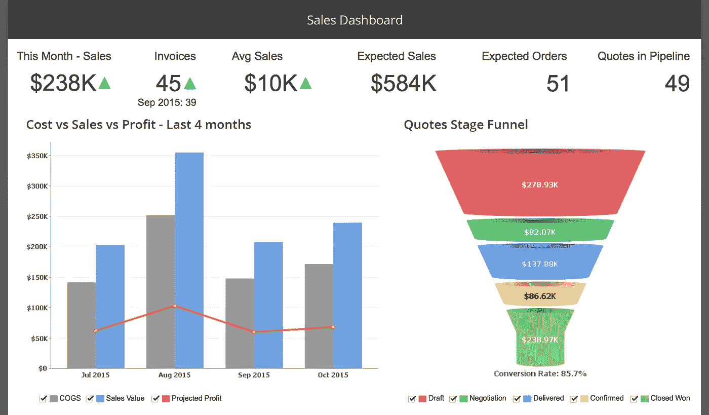
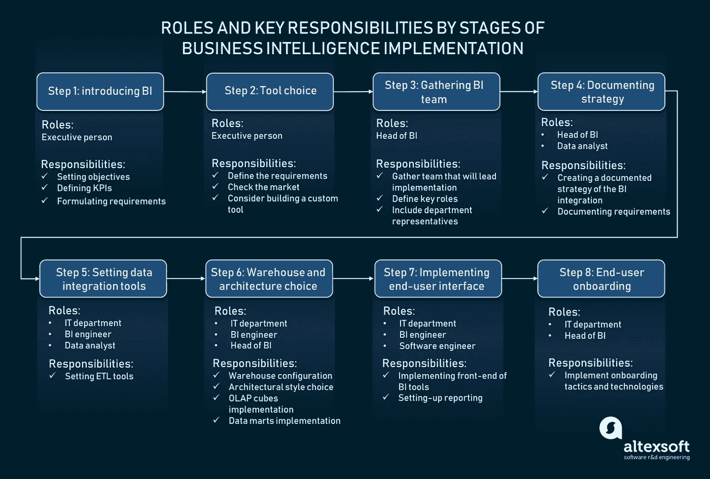
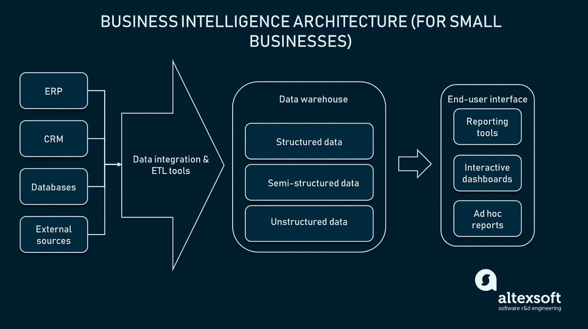
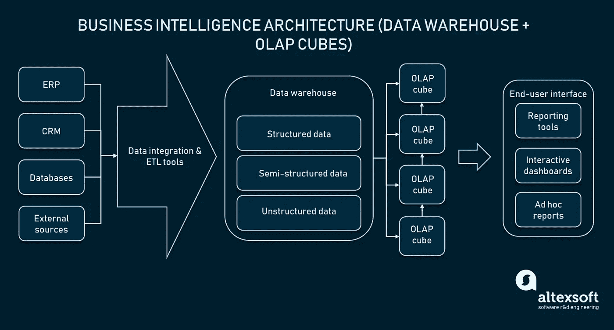
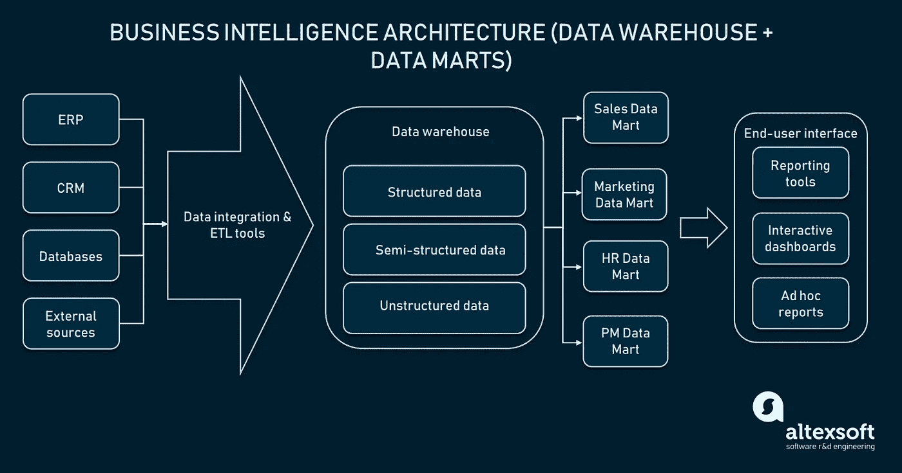
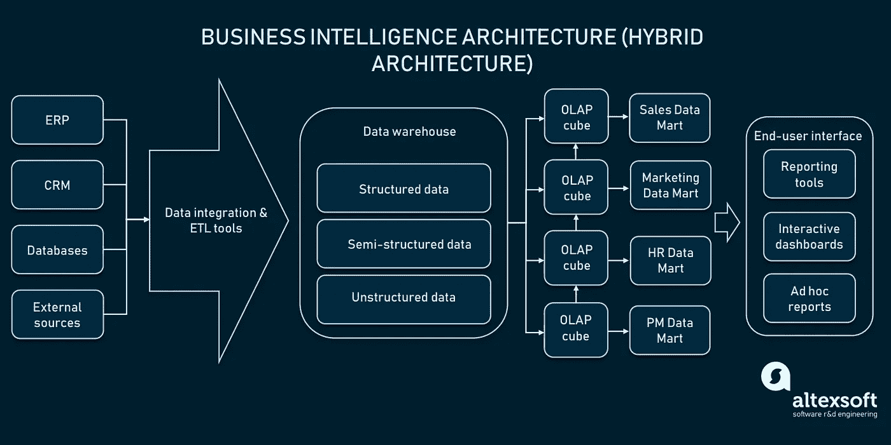

# 商业智能和分析完整指南:策略、步骤、流程和工具

> 原文：<https://medium.com/swlh/complete-guide-to-business-intelligence-and-analytics-strategy-steps-processes-and-tools-3b3f068b8a67>

所有业务都与数据相关，数据是从公司的许多内部和外部来源生成的信息。这些数据渠道就像高管的一双眼睛，为他们提供有关业务和市场动态的分析信息。因此，任何误解、不准确或缺乏信息都可能导致对市场形势和内部运作的扭曲看法，进而做出错误的决策。

做出数据驱动的决策需要对业务的所有方面有一个 360 度的了解，甚至包括那些你没有想到的方面。但是如何把非结构化的数据块变成有用的东西呢？答案是商业智能。

我们已经讨论过[机器学习策略](https://www.altexsoft.com/blog/datascience/machine-learning-strategy-7-steps/?utm_source=MediumCom&utm_medium=referral)。在本文中，我们将讨论将商业智能引入现有企业基础设施的实际步骤。您将学习如何建立商业智能策略并将工具集成到您公司的工作流程中。

# 什么是商业智能？

让我们从定义开始:**商业智能**或 **BI** 是一套收集、构建、分析原始数据并将其转化为可操作的商业见解的实践。BI 考虑转换非结构化数据集的方法和工具，将它们编译成易于理解的报告或信息仪表板。BI 的主要目的是提供可操作的业务洞察，并支持数据驱动的决策制定。

*An example of an interactive dashboard for a sales department.* *Source:* [*Skydesk.jp*](https://www.skydesk.jp/en/apps/reports/)

商业智能的整个过程可以分为四个阶段:

*   数据采集
*   数据清理/标准化
*   分析
*   报告

BI 实现的最大部分是使用执行数据处理的实际工具。不同的工具和技术构成了商业智能基础设施。最常见的是，基础架构包括以下涵盖数据存储、处理和报告的技术:

*   数据源
*   ETL(提取、转换、加载)或数据集成工具
*   数据仓库
*   联机分析处理多维数据集
*   数据集市
*   报告(BI)工具

商业智能是一个技术驱动的过程，严重依赖于输入。BI 中用于转换非结构化或半结构化数据的技术也可用于[数据挖掘](https://www.altexsoft.com/whitepapers/machine-learning-bridging-between-business-and-data-science/?utm_source=MediumCom&utm_medium=referral)，以及作为前端工具处理[大数据](https://www.altexsoft.com/big-data-consulting/?utm_source=MediumCom&utm_medium=referral)。

## 商业智能和预测分析

商业智能的定义经常令人困惑，因为它与其他知识领域交叉，特别是*预测分析*。最大的错误之一是互换使用商业智能和预测分析术语。

基本上，**商业智能**是一种数据分析方法，回答问题*发生了什么？*和*发生了什么？*。这种类型的数据处理也被称为**描述分析**。在描述性分析的帮助下，企业可以研究他们所在行业的市场状况，以及他们的内部流程。历史数据概述有助于发现业务的难点和机会。

**预测分析**与*基于过去事件的数据处理进行预测*有关。[预测分析](https://www.altexsoft.com/machine-learning-solutions/?utm_source=MediumCom&utm_medium=referral)不是对历史事件进行概述，而是对未来的商业趋势进行预测。那些预测是基于对过去事件的分析。因此，BI 和预测分析可以使用相同的技术来处理数据。在某种程度上，预测分析可以被视为商业智能的下一个阶段。

这两种分析方法都涉及三种主要类型的数据管理:

1.  描述性分析
2.  预测分析
3.  规定性分析

**规范分析**是第三种类型，旨在找到商业问题的解决方案，并提出解决这些问题的行动建议。目前，通过高级 BI 工具可以获得说明性分析，但是整个领域还没有发展到一个可靠的水平。

因此，当我们开始讨论将 BI 工具实际集成到您的组织中时，这就是重点。整个过程可以分解为向公司员工介绍商业智能的概念，以及工具和应用程序的实际集成。在接下来的部分中，我们将介绍将 BI 集成到您的公司中的关键点，并涵盖一些陷阱。

*A scheme of business intelligence implementation by roles and stages*

# 步骤 1:向你的员工和利益相关者介绍商业智能

让我们从基础开始。要开始在您的组织中利用商业智能，首先要向您的所有利益相关者解释 BI 的含义。根据您组织的规模，期限框架可能会有所不同。相互理解在这里是至关重要的，因为不同部门的雇员将参与数据处理。因此，确保每个人都在同一页上，不要混淆商业智能和预测分析。

此阶段的另一个目的是向将参与数据管理的关键人员推销 BI 的概念。您必须定义您想要解决的实际问题，设置 KPI，并组织所需的专家来启动您的商业智能计划。

值得一提的是，在这个阶段，从技术上讲，您将对数据的来源和控制数据流的标准做出假设。您将能够在稍后阶段验证您的假设并指定您的数据工作流。这就是为什么你必须准备好改变你的数据来源渠道和你的团队阵容。

## 设定目标、KPI 和要求

调整愿景后的第一个重要步骤是定义您将在商业智能的帮助下解决什么问题或一组问题。设定目标将帮助您进一步确定 BI 的高级参数，例如:

*   将使用哪些数据来源？(CRM、ERP、网站分析、外部资源等。)
*   我们需要什么类型的数据来源？(销售数字、报告、网站流量等。)
*   谁需要访问这些数据？(高层管理人员、市场分析师、其他角色)
*   我们需要什么类型的报告，它们必须如何呈现？(电子表格、图表、临时报告或交互式仪表板)
*   如何衡量进展？

除了目标之外，在这个阶段，您还必须考虑可能的 KPI 和评估指标，以了解任务是如何完成的。这些可以是财务限制(应用于开发的预算)或性能指标，如查询速度或报告错误率。

在这个阶段结束时，您必须能够配置未来产品的初始需求。这可以是由用户故事组成的产品 backlog 中的特性列表，或者是这个[需求文档](https://www.altexsoft.com/blog/business/technical-documentation-in-software-development-types-best-practices-and-tools/?utm_source=MediumCom&utm_medium=referral)的更简化版本。这里的要点是，根据需求，您应该能够理解您希望从您的 BI 软件/硬件中获得什么样的架构类型、特性和功能。

# 步骤 2:选择工具或考虑定制解决方案

为您的商业智能系统编写需求文档是了解您需要什么工具的关键点。对于大型企业来说，出于以下几个原因，可以考虑构建自己的定制 BI 生态系统:

1.  企业级组织可能不会将其有价值的数据委托给第三方。
2.  BI 工具主要通过服务于某些特定行业的需求来区分。市场上可能没有为您的行业提供服务的供应商。
3.  最后一个原因是，处理大量信息或处理大数据可能是启动定制 BI 开发的好理由，而不是寻找供应商，因为在选择云基础架构提供商方面，您可能有更高的灵活性。

对于较小的公司，BI 市场提供了大量的工具，既有嵌入式版本，也有基于云(软件即服务)的技术。有可能找到覆盖几乎任何种类的行业特定数据分析的灵活的可能性。

根据需求、您的行业类型、规模和业务需求，您将能够了解您是否准备好投资定制 BI 工具。否则，您可以选择一个将为您承担实施和集成负担的供应商。

# 步骤 3:组建一个商业智能团队

下一步是召集公司不同部门的一群人来研究你的商业智能策略。为什么您甚至需要创建这样一个组呢？答案很简单。BI 团队帮助召集不同部门的代表来简化沟通，并获得特定部门对所需数据及其来源的见解。因此，您的 BI 团队的阵容应该包括两类主要人员:

## 不同部门的领域代表

这些人将负责为团队提供对数据源的访问。他们还将贡献自己的领域知识来选择和解释不同的数据类型。例如，营销专家可以定义您的网站流量、跳出率或简讯订阅数是否是有价值的数据类型。而您的销售代表可以提供与客户进行有意义互动的见解。最重要的是，你将能够通过一个人访问营销或销售信息。

## 双特定角色

您希望团队中的第二类人是 BI-specific 成员，他们将领导开发过程并做出架构、技术和战略决策。因此，作为必需的标准，您需要确定以下角色:

**毕头**。这个人必须具备理论、实践和技术知识，以支持您的战略和实际工具的实施。这可以是一个具有商业智能知识和访问数据源的主管。BI 的负责人将做出推动实施的决策。

BI 工程师是您团队中的一名技术人员，专门负责构建、实施和设置 BI 系统。通常 BI 工程师都有软件开发和数据库配置背景。他们还必须精通数据集成方法和技术。BI 工程师可能会带领您的 IT 部门实施您的 BI 工具集。在我们的专题文章中了解更多关于[数据专家及其角色](https://www.altexsoft.com/blog/datascience/how-to-structure-data-science-team-key-models-and-roles/?utm_source=MediumCom&utm_medium=referral)的信息。

**数据分析师**也应该成为 BI 团队的一部分，为团队提供数据验证、处理和数据可视化方面的专业知识。

# 步骤 4:记录您的商务智能战略

一旦你有了一个团队，并且考虑了你的具体问题所需的数据源，你就可以开始开发一个 BI 策略。您可以使用传统的战略文档来记录您的战略，例如[产品路线图](https://www.altexsoft.com/blog/business/product-roadmap-key-features-common-types-and-roadmap-building-tips/?utm_source=MediumCom&utm_medium=referral)。商业智能策略可能包括各种组件，具体取决于您所在的行业、公司规模、竞争和商业模式。但是，推荐的组件有:

## 数据源

这是您选择的数据源通道的文档。这些应该包括任何类型的渠道，无论是利益相关者、一般行业分析，还是来自你的员工和部门的信息。这种渠道的例子可能是谷歌分析，客户关系管理，企业资源规划等。

## 行业/自定义 KPI

记录你所在行业的标准 KPI 以及你的具体 KPI 可能会让你对你的业务增长和亏损有一个全面的了解。最终，BI 工具被创建来跟踪这些 KPI，用额外的数据支持它们。

## 报告标准

在这个阶段，定义你需要什么样的报告来方便地提取有价值的信息。在定制 BI 系统的情况下，您可以考虑视觉或文本表示。如果您已经选择了供应商，您可能会在报告标准方面受到限制，因为供应商会设置他们自己的标准。这一部分可能还包括您想要处理的数据类型。

## 报告流程类型和最终用户

最终用户是通过报告工具的界面观察数据的人。根据最终用户，您还可以考虑报告类型流程:

**传统匕**。传统上，BI 只为高管设计。由于用户数量和数据类型有限，因此不需要完全自动化。因此，传统的 BI 流程类型需要技术人员作为报告工具和最终用户之间的中介。如果最终用户想要提取一些数据，他或她必须提出请求，技术人员将根据所需的数据生成报告。在这种情况下，您的 IT 部门充当了一个*超级用户*，一个可以访问数据并影响其转换的用户。

传统方法提供了更加安全和可控的数据流。但是，在处理大量数据(尤其是大数据)的情况下，依赖 IT 部门可能会导致灵活性和速度的滞后。如果您希望获得更多的报告控制和报告的精确性，可以组建一个专门的 IT 团队来处理查询和报告的形成。

**自助毕**。如今，现代公司和解决方案提供商利用自助 BI。这种方法允许业务用户和管理人员获得由系统自动生成的报告。自动化报告不需要 IT 部门的高级用户(管理员)来处理对数据仓库的每个请求；然而，仍然需要技术人员来设置该系统。

自动化可能会降低最终报告的质量及其灵活性，因为它将受到报告设计方式的限制。但是，作为一个好处，自助服务方法不需要实际的技术人员一直在系统中操作。不精通技术的用户将能够为自己提供报告或访问数据存储的专用部分。

# 步骤 5:设置数据集成工具

实际工具的集成阶段将需要您的 IT 部门花费大量的时间和精力。如果您想为自己的业务创建一个定制的解决方案，那么您必须开发 BI 架构的各种结构元素。在其他情况下，您总是可以自由地从市场上选择一个供应商来为您进行实现和数据结构化。

任何 BI 架构的核心元素之一是数据仓库。仓库是一个数据库，它以预定义的格式保存您的信息，通常经过结构化、分类和清除错误。如果您的数据未经预处理，您的 BI 工具或 IT 部门将无法查询它。由于这个原因，您不能将您的数据仓库与您的信息源直接连接起来。而是必须使用 **ETL(提取、转换、加载)**工具或者**数据集成工具**。他们将对来自初始源的原始数据进行预处理，并分三个连续步骤将其发送到仓库:

1.  **数据提取**。ETL 工具从包括 ERP、CRM、分析和电子表格在内的数据源中检索数据。
2.  **数据转换**。一旦提取出来，ETL 工具就开始数据处理。对所有提取的数据进行分析，删除重复数据，然后进行标准化、排序、过滤和验证。
3.  **数据加载**。在这个阶段，转换后的数据被上传到仓库中。

通常，ETL 工具是随供应商的 BI 工具一起提供的。(我们将在下面介绍最受欢迎的几款)。要了解更多关于[清理和准备数据](https://www.altexsoft.com/blog/datascience/preparing-your-dataset-for-machine-learning-8-basic-techniques-that-make-your-data-better/?utm_source=MediumCom&utm_medium=referral)的信息，请查看我们的文章。

# 步骤 6:配置数据仓库并选择架构方法

## 数据仓库

一旦您配置了来自所选数据源的数据传输，现在您必须设置一个仓库。在商业智能中，数据仓库是特定类型的数据库，通常以 SQL 格式存储历史信息。仓库一端与数据源和 ETL 系统相连，另一端与报告工具或仪表板接口相连。这允许通过单一界面呈现来自不同系统的数据。

但是仓库通常包含大量的信息(100GB 以上)，这使得响应查询相当慢。在某些情况下，数据可能以非结构化或半结构化的方式存储，这导致在解析数据以生成报告时出错率很高。分析可能需要将特定类型的数据分组到一个存储空间中，以便于使用。这就是为什么企业使用额外的技术来提供对更小、更有主题的信息块的更快访问。

有各种类型的解决方案用于向分析师呈现仓库的较小部分。其中最常用的是*在线分析处理*和*数据集市*。这些技术提供了更快的报告和对所需数据的方便访问。

**建议**:如果您没有大量数据，利用一个简单的 SQL 仓库就足够了。像数据集市这样的额外的结构元素会让你付出很大的代价，却没有提供任何价值。此选项适用于运行相对少量数据的小型企业或行业。

*As a data warehouse is small, end-user reporting tools can query it directly without a lag*

## 数据仓库+在线分析处理多维数据集

存储在仓库中的数据有两个维度，因为它通常以电子表格格式描述(表和行)。因此，仓库存储数据的方式也被称为关系数据库。一个数据库中可能包含数千种数据类型，因此查询数据仓库需要大量时间。为了满足分析人员快速访问数据、从不同维度分析数据以及在需要时进行分组的需求，使用了 OLAP 立方体。

**OLAP** 或**在线分析处理**是一种处理数据并同时从多个维度访问数据的技术。将数据组织成多维数据集有助于克服数据仓库的局限性。

*OLAP cube model, representation of multidimensional data* *Source: Busitelce.com*

OLAP 立方体是一个数据结构优化快速数据分析从 SQL 数据库(仓库)。多维数据集来源于数据仓库，是数据仓库的一个较小的表示。然而，数据的结构假设有 2 个以上的维度(电子表格的行和列格式)。维度是构成报告的关键元素，例如，对于销售部门，维度可能是:

多维数据集形成了一个多维信息数据库，可以采用不同的方式对其进行分组，并更快地创建报告。OLAP 数据库中不同数据主题的 OLAP 立方体。仓库和 OLAP 一起使用，因为多维数据集存储的数据量相对较小，并且便于处理。

**推荐**:数据仓库+ OLAP 立方体架构可以算是比较典型的一种。需要数据存储和复杂的多维信息分析的各种规模的公司都可以使用它。如果您不想用查询轰炸您的仓库，可以考虑 OLAP 架构方法。

*OLAP cubes define specific data dimensions for querying data and reducing the load on the main warehouse*

## 数据仓库+数据集市技术

仓库是商业智能架构的第一个也是最大的元素。仓库数据集的一个较小的表示是一个数据集市。数据集市是仓库中面向主题的部分，它收集特定部门的熟悉主题的信息。在数据集市的帮助下，不同的部门可以访问所需的数据，因为数据集市提供了专门针对单个业务领域的见解。这意味着您的开发人员可以避免为最终用户设置基于权限的查询。

**推荐**:数据仓库+数据集市是第二种最流行的架构风格，它利用数据集市将所需的信息分发给各个部门。这种方法可用于建立持续的报告或轻松访问信息，而无需向最终用户提供权限。

*Data mart are smaller representations of the warehouse dedicated to specific data domains*

## 混合架构

企业业务可能需要多种数据管理选项。数据集市和多维数据集是不同的技术，但它们都用来表示来自仓库的较小的信息块。数据集市代表数据仓库中特定于问题的子集，但是它可以以不同的方式实现。实现选项包括关系数据库(仓库或任何其他 SQL 数据库)和多维数据库，多维数据库基本上是 OLAP 立方体。因此，您可以使用这两种技术来管理您的数据，并在组织的各个部门之间进行分发。

**建议**:您可以利用这两种技术，因为它们支持相同的想法，但服务于不同的目的。为了安全性、数据聚合或可访问性，数据集市可以作为数据仓库的一部分来实现。或者您可以使用数据集市作为 OLAP 立方体的几个维度的表示。但是，请记住，数据集市和 OLAP 立方体都需要单独的数据库设置。

*Combined version with OLAP cubes and data marts*

# 步骤 7:实现最终用户界面:报告工具和仪表板

在在线分析处理立方体或数据集市中形成可消化的、主题相关的信息块，数据最终通过 BI 工具的用户界面呈现。这就是描述性分析为最终用户带来价值的地方。

现代 BI 工具提供了几种呈现所需数据的方式。过去，商业智能只能基于未来和过去的事件生成静态报告。如今，BI 能够生成包含可定制信息部分的交互式仪表盘。但是模板化报告仍然是最流行的数据表示方法。

呈现信息的最有价值的方式被认为是临时报告。即席报告允许用户通过利用任何种类的数据进行单次使用来更深入地了解标准报告。这种类型的报告用于每日或每周报告，作为更完整的版本，因为用户会在查看报告时从仓库(多维数据集或数据集市)中提取数据。这保证了通过查询数据库中的每一条信息来呈现最新的信息。因此，基本上，即席报告是一种可定制的实时报告，用于找到特定业务问题的答案。

# 步骤 8:对最终用户进行培训

为了让您的员工顺利入职，我们强烈建议开展培训课程。这些会议可能有不同的形式:如果您在 CRM 或 ERP 中使用嵌入式分析工具，您可以使用视频提示或交互式 onboarding 工具等 onboarding 实践来引导用户完成步骤。

如果您没有预算来自动化培训，您仍然需要负责由经理或 BI 团队成员提供的培训。

## 市场上的关键商业智能工具

值得一提的是，BI 工具提供商通常为用户提供数据集成、ETL、报告工具(仪表板)以及仓储服务。这意味着，通常情况下，您会将整个 BI 架构集成到您的系统中。这里有一些商业智能工具提供商的例子。

## 西森斯

Sisense 是商业智能市场上最知名的公司之一。他们的产品为不同技术水平的用户提供了对数据分析系统的后端和前端访问。Sisense 还提供数据存储服务，使其成为一站式解决方案。定价模式是按年订阅，但费用可能会根据用户数量、数据量和项目类型而有所不同。

## Zoho 分析

商业智能行业的另一个大腕是 [Zoho Analytics](https://www.zoho.com/analytics/) 。Zoho 为小型和大型企业提供了一个完整的基础设施和一个可扩展的接口。在有用的功能中，它提供了开放的 RESTFUL APIs 来连接您所需的所有 CRS 和 ERP 系统，以及与您的员工或利益相关者共享的协作工作区。

## （舞台上由人扮的）静态画面

[Tableau](https://www.tableau.com/) 是一个基于云的商业智能解决方案，开创了报表工具的拖放界面。Tableau 软件还具有协作功能:可以为您的分析师创建一个单一登录页面，以访问仪表板并共享信息。您可以查询要发送到移动设备的数据。一个专门的 Tableau 应用程序可以修改报告并保存你手机上的修改。

## 精力

SAP 是一家提供许多技术解决方案的跨国公司，包括 SAP[Business Objects Business Intelligence suite](https://www.sap.com/uk/products/bi-platform.html)和 [Cloud Analytics](https://www.sap.com/uk/products/cloud-analytics.html) 产品。第一个产品是所有企业规模的基本解决方案。该平台提供智能查询和即席报告。此外，可用的仪表板报告以基于角色的格式工作，这意味着任何用户都可以根据用户的角色设置分析仪表板。最重要的是 SAP 产品可以很容易地与 Microsoft Office 产品集成。

## 商业 q

最后但并非最不重要的一点是， [BusinessQ](https://businessq-software.com/) 推出了专为中小型企业量身定制的商务智能解决方案。BusinessQ 既提供独立的 web 应用程序，也提供嵌入到您自己的应用程序中的嵌入式版本。

## 多莫

[Domo](https://www.domo.com/) BI 平台是云优先的解决方案，面向各种规模的企业。这项服务是可扩展的，允许它处理大数据或小型企业数据库。Domo 提供对实时仪表板的访问，使用在 OLAP 立方体上实现的数据集市，允许各部门进行多维分析和数据奉献。

## Qlik

[Qlik](https://www.qlik.com/us/) 是一家商业智能提供商，提供各种数据可视化、交互式仪表板和自助报告产品。基础架构可以在云中或内部实施。此外，Qlik 还提供对公共数据集列表的访问，以便从中获取信息。

# 一锤定音

商业智能工具已经存在了 20 多年。然而，“标准”BI 工具的外观和基本功能已经发生了很大变化，例如 [Tableau BI 工具](https://www.altexsoft.com/blog/tableau-bi-tools-overview/?utm_source=MediumCom&utm_medium=referral&utm_campaign=shared)。现在，每个供应商都提供了临时报告或交互式仪表板，供分析师协作，而不仅仅是静态报告。此外，自助式 BI 成为普通业务任务的标准，使企业家能够更经济高效地进行分析。遵循一般技术趋势，BI 中引入的最新功能是基于云的平台和移动 BI 报告。

因此，了解行业的总体趋势和使用的技术，您将能够构建自己的定制 BI 系统或选择现有的系统来提供易于掌握的报告，以支持您的决策。商业智能不再是高管的特权；今天，它是整个组织的协作工具。确保您选择了正确的供应商，并包含所有必要的功能来帮助您的员工获得这些见解。

*最初发表于 AltexSoft tech 博客"* [*商业智能和分析完整指南:策略、步骤、流程和工具*](https://www.altexsoft.com/blog/business/complete-guide-to-business-intelligence-and-analytics-strategy-steps-processes-and-tools/?utm_source=MediumCom&utm_medium=referral)