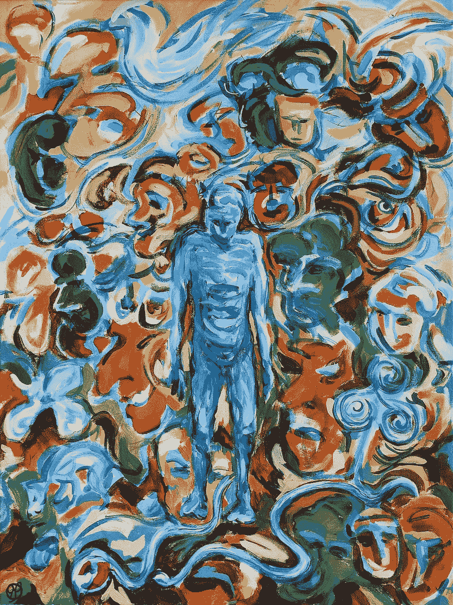

# 复杂创伤&美国的医疗保健危机

> 原文：<https://medium.com/swlh/complex-trauma-the-healthcare-crisis-fa50f0994959>

[Jetiveri (pixabay.com)](https://www.needpix.com/photo/download/1203757/lewy-body-dementia-dementia-hallucinations-brain-disease-mental-illness-isolation-symbolism-christian-symbols-helligandsdue)

> “人是一个流动的过程，不是一个固定不变的静态实体；一条流动的变化之河，而不是一块固体材料；一个不断变化的潜力星座，而不是固定数量的特征。”
> ***~***[***卡尔·罗杰斯***](https://www.goodreads.com/author/quotes/102062.Carl_R_Rogers)*(*[***论成为一个人:治疗师对心理治疗的看法***](https://www.goodreads.com/book/show/19105559-on-becoming-a-person) *)*

作为一名创伤幸存者和创伤治疗师，我的个人和职业经历让我…