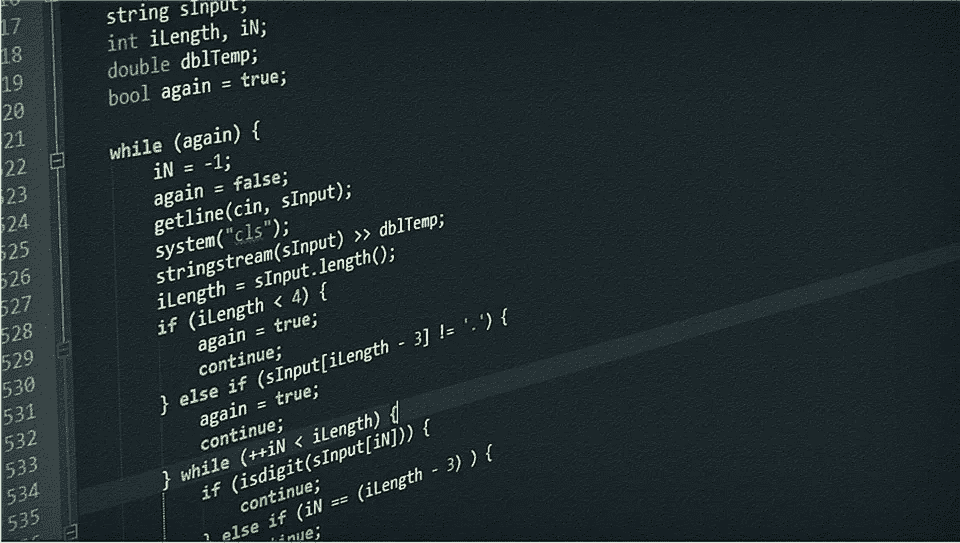

# 条件句— If-Else vs 三元运算符 vs Switch-Case

> 原文：<https://medium.com/swlh/conditionals-if-else-vs-ternary-operator-vs-switch-case-b4f3ed08e1e3>

条件是每种编程语言基础的一部分。条件句是计算结果为真或假的表达式。它们主要用于确定*程序流程。*通常情况下，如果一个语句的计算结果为真，那么您需要执行一个特定的操作，如果一个语句的计算结果为假，那么您需要执行另一个操作。为了完成这些动作，我们使用条件句。