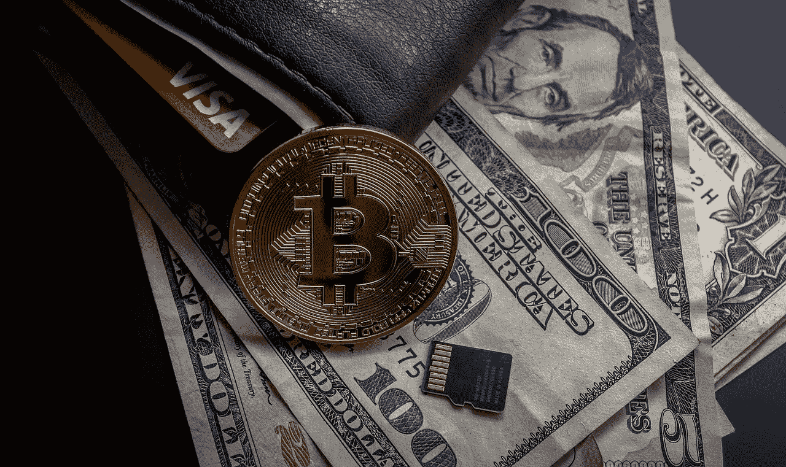

# 一名比特币交易员的自白

> 原文：<https://medium.com/swlh/confessions-of-a-bitcoin-trader-96654ef142ca>

## 在过去的两年里，我在交易比特币和其他加密货币中学到了什么

大约两年前，我开始痴迷于比特币及其被称为“替代币”的同类产品。当时，我甚至不记得听说过比特币，我只是在六个月前才开始投资股市。是一个新同事让我喜欢上了…