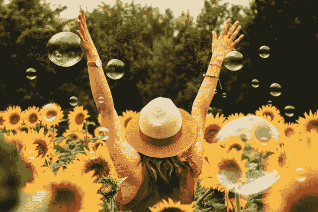

# 一个前忧虑者的自白

> 原文：<https://medium.com/swlh/confessions-of-a-former-worry-wart-e2b3455e70f6>

我不再担心了。你也可以。

现在是高中毕业季！如果你已经毕业或即将毕业，你知道这是一个充满感激、希望和庆祝的激动人心的时刻。

还有恐惧。

对于许多父母来说，这是一年中最可怕的一天。因为很多地方的毕业夜都意味着毕业派对。大型毕业派对。我们落基山脉的小镇也不例外。我们的高中生跑到树林里，举行盛大的、全力以赴的、喧闹的聚会来庆祝毕业生。他们在手机范围之外，有物质参与，他们生一堆大篝火，他们都在树林里过夜。你可以想象这个场景。

当我和另一位母亲谈论这件事的时候，她告诉我她是多么害怕这个聚会。她的儿子和我的儿子都是 17 岁，他们计划去那里，她似乎真的被可能发生的事情吓坏了。她已经在计划一个悲惨的不眠之夜。

当我们交谈时，真正打动我的不是她如此担心，这似乎是很正常的，而是我对自己一点也不担心感到惊讶。我是说真的，真的一点也不。

对于任何五年或更久以前认识我的人来说，这将是完全令人震惊的。这毫无意义。我是忧虑女王。我生长在一个完全担心的家庭。我不知道还有其他选择，所以我就这么做了。我做得非常非常好。我可以让自己担心任何事情。大事，小事，以及介于两者之间的一切。烦恼只是我生活的背景音乐。我不知道没有它我的世界会是什么样子。

但现在我知道了。这就是上周六晚上让我印象深刻的地方。师**何着急配乐刚停。它可能偶尔会在这里或那里播放一些小曲，但它不再日夜重复地大声播放。**原因很简单，通过理解生命由内而外的本质，我与自身经历的关系发生了巨大变化。

我现在知道我们的思想创造了我们的现实。一整天，我们都有想法，这些想法创造了我们的生活体验。这就是思想的本质。关于人类思维，很酷但也很有挑战性的一点是，我们有时间旅行的能力。不像其他物种，他们完全活在当下，我们可以思考过去和未来，这为我们创造了做很多很多很酷的事情的机会。比如写关于 2099 年世界的历史书或未来小说。或者提前计划将人类送上火星。酷毙了。

不幸的是，人类思维的这种酷把戏也给我们制造了受苦的机会。当我们想起过去时，我们可能会有温暖、模糊的怀旧感觉。然而，更多的时候，回想过去会导致后悔、羞愧、愤怒或怨恨。当我们思考未来时，我们可能会有希望和兴奋的感觉。但更多的时候，我们对可能发生在我们或我们所爱的人身上的坏事感到恐惧。换句话说，我们担心。

当我意识到担心只是对未来可能发生的坏事的想法，而未来甚至还没有到来，意味着未来甚至不是真实的，我开始改变了。我开始注意到我是多么频繁地陷入对未来不必要的恐惧中。

我丈夫会在一个下雪的晚上出差开车回家，我会想到他开车掉下悬崖，然后被撞死。这个想法是如此的可怕，以至于我会感到完全被抓住了，简直被这个想法迷住了，直到他安全到家。而这只是冰山一角。我对可能发生在我孩子身上的事情的担心是难以置信的。我真的可以在这一类中做得更好。我相信很多父母都有同感。在我看来我没有其他选择。母亲总是说，母亲的工作就是担心。我相信了。

直到我没有。

看清思想的本质的强大之处在于，有一天你会意识到，所有的恐惧和担忧都是关于不真实的事情。它们是编造的，而我就是编造它们的人。看到这一点会让那些想法失去力量。

这就像一个孩子以为床下有怪物，被它吓坏了。你不需要为了减轻孩子的恐惧而与怪物搏斗，你只需要帮助孩子，久而久之，相信怪物其实并不存在。

烦恼的想法正是如此。随着时间的推移，当你开始理解思想的本质，以及它是如何创造你此刻的感受和体验时，担忧的想法看起来就不再那么可怕了。拥有它们不是问题。你只是不必相信他们，掉进恐惧的兔子洞。当你不再相信它们时，它们对你的影响就没那么大了。最终，你只会更频繁地避开他们，给予他们更少的关注。当你给予他们的关注越来越少，当你没有通过关注他们来给他们注入活力时，你最终会拥有越来越少的他们。

我和忧虑的关系就是这样改变的。渐渐地，一次一个担忧的思想风暴，我经历了越来越少的担忧，直到几天前我发现自己在考虑我十几岁的儿子在森林里度过一夜的前景，在一个物质浸泡的高中聚会上，甚至没有任何担忧的想法。

正如我的一位导师最近所说，这就像从自己身上找到了自由。真是如释重负。

因为我们社会中有太多人担心太多，所以担心看起来很正常。看起来不是可选的。这就是你要做的。只不过它**不是**。

正常不代表自然。真正自然的是活在当下，充分享受生活带给你的一切。有时它会带来快乐和爱。在其他时候，它可能会带来无尽的悲伤、痛苦和损失。

所以，花时间去生活当下不存在的东西有什么意义呢？我们不知道未来会发生什么，所以为什么要把当下的礼物花在担心上，尤其是当担心对我们没有任何帮助的时候。

**我曾经生活在忧虑的监狱里。这是我自己制造的监狱。挣脱束缚就像选择不再相信我自己的想法一样简单。如果未来会有挑战性的事情发生，当它来临时，我会尽可能优雅和有弹性地去面对，即使它真的会很痛。同时，我享受眼前的一切。**

> “时间一点也不宝贵，因为它是一种幻觉。你认为珍贵的不是时间，而是一个超出时间的点:现在。那确实是珍贵的。你越关注时间——过去和未来——你就越会错过最珍贵的现在。”~艾克哈特·托尔

## 我的每月时事通讯是精心策划的，如果你愿意的话，可以帮助你获得自由。它充满了文章、书籍创意、诗歌、免费视频和在线资源。[点击这里](https://mailchi.mp/8d7cf42c08e5/bluedotcoaching)报名。