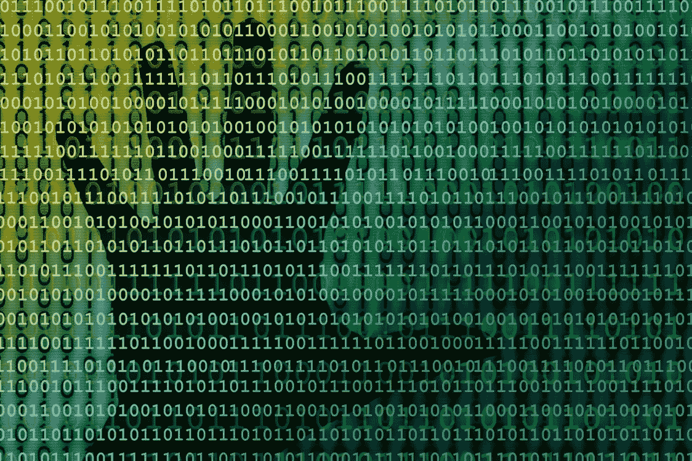

# 国会应该保护美国敏感的医疗数据不被私人牟取暴利

> 原文：<https://medium.com/swlh/congress-should-protect-americas-sensitive-medical-data-from-private-profiteering-a7187d1a97f5>

geralt at [Pixabay](https://medium.com/u/a640208c527a?source=post_page-----a7187d1a97f5--------------------------------)

## 现在是选举季节，随之而来的是竭力将公众注意力从真正的东西上转移开的奉承法案

2019 年 6 月 24 日，参议员马克·华纳(D-Va .)和乔希·霍利(R-Mo。)向国会提出法案，建议任何用户…