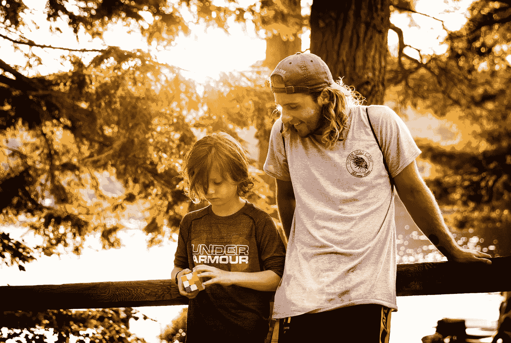

# 内容之前的联系:教师的新箴言

> 原文：<https://medium.com/swlh/connection-before-content-a-new-mantra-for-teachers-e04c767ab4d7>

Photo by [Liam Macleod](https://unsplash.com/photos/D6GYkl7pvO4?utm_source=unsplash&utm_medium=referral&utm_content=creditCopyText) on [Unsplash](https://unsplash.com/search/photos/teacher?utm_source=unsplash&utm_medium=referral&utm_content=creditCopyText)

## 基本的社交和情感技能必须融入课堂。

学生在学校一天的活动就像一列火车在铁轨上飞驰。不要在火车站停下来下车停留一会儿。没有机会在列车车厢之间移动探索。学生必须…