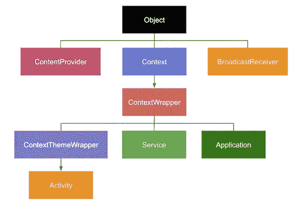
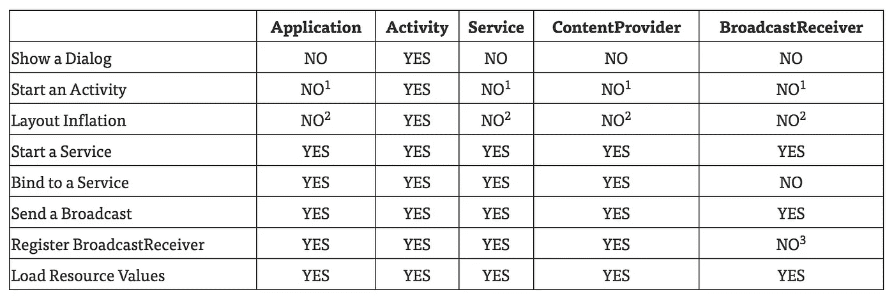

# Android 中的上下文和内存泄漏

> 原文：<https://medium.com/swlh/context-and-memory-leaks-in-android-82a39ed33002>

## 管理上下文和避免内存泄漏


迟早每个 Android 开发者都必须面对**上下文**的概念。*吐司、适配器、意图、膨胀器、共享优先权、系统服务*是经常与*上下文*相关联的术语。显示一个 *Toast* ，打开一个新的屏幕，创建一个视图或者在首选项中保存数据都需要使用*上下文*作为参数。

有时候解决方案很简单(比如如果我们在一个*活动*中就使用`**this**`，但是其他时候我们不确定我们在做什么，我们会感到疑惑……

# 语境是什么？

应用程序环境的接口。


## 嗯…好吧…但是那是什么意思…

这个定义试图告诉我们的是，*上下文*是一个具有访问应用程序资源和系统服务的方法的类。

为了得到*上下文，*我们通常使用*活动，*写单词 **this** ，为此，我们可以推断一个*活动*是一个*上下文*。

的确，*活动*、*服务*或*应用*都是*上下文*抽象类的具体实现。在一个应用程序内部，可以有一些*活动*，一些*服务*，因此，有多个*上下文*，但是只有一个*应用程序*，因此，只有一个**应用程序上下文**。



Complete inheritance tree

# 上下文是什么？

我们需要使用*上下文*的最常见场景是在使用视图( *Toasts* 、 *Adapters* 、 *Inflaters* )、启动*活动* ( *Intents* )或访问系统服务( *SharedPreferences* 、 *ContentProviders* )时。如果我们寻找一个更正式的分类，有四种情况:

*   聚集应用**资源** : *资源*，*资产*，*内部存储*
*   **沟通**活动之间:*意图*
*   访问**系统**服务:*系统服务*
*   获取**应用信息** : *应用信息*

## 我从哪里得到上下文？

返回一个 *Context* 的方法有三个，分别在视图、活动和 *ContextWrapper* 类中，每一个都有它的功能。

## 在一种观点看来

*视图*类有`getContext**()**`方法来获取包含它的*活动*的*上下文*。作为一个*活动上下文*而不是一个*应用上下文*，它可以包含关于特定主题的信息，这些主题改变了特定活动的美感。因此，当管理视图、展开布局、启动活动、显示对话框或使用短期课程时，**活动上下文**是必不可少的。

> *理解*【短期班】*为:* `classLifespan **<=** activityLifespan`

## 在一次活动中

*活动*类**是**的一个*上下文*被继承。这是前面提到的*活动上下文*，我们可以用这个来访问它。但是你可能已经知道了。

您可以用来获得不同的*上下文*的方法是`getApplicationContext**()**`，顾名思义，它返回**应用程序的上下文**，而不是活动的上下文。这是活动运行的流程的*上下文*，它用在超过*活动*生命周期的类中，如后台任务或数据访问。

## 在上下文包装中

这是继承树中的一个中间类，提供了`getBaseContext**()**`方法。在大多数情况下，不建议使用**。**

## **总结…**

****

**How to use every type of Context**

**在这个表中，我们有动作和上下文类型的组合。启动*活动*时，务必指出*应用*和*服务*栏中的**号**。这是因为调用栈丢失 *(1)* 。在展开布局时使用它也不好，因为它们的主题被应用来匹配*活动*的特定视觉风格，它们在*【2】*中。**

**学习正确管理*上下文*是一项将我们从意外问题中拯救出来的技能，它与内存泄漏密切相关。**

# **内存泄漏**

****

**这篇文章的主要目的是帮助你防止*内存泄漏*。这就是:**不再需要时不释放 RAM** 资源。如果多次执行此操作，分配给应用程序的内存部分可能会超出限制，导致系统终止执行，用户会遇到应用程序崩溃。**

**内存泄漏的常见原因是静态变量、*单例*模式、后台任务和*匿名内部类*。让我们看一些如何检测和修复它们的例子。**

## **静态变量**

**在新示例中，静态变量`vista`引用了活动的上下文:**

**如果应用程序在*活动*被销毁后继续运行，它正在使用的内存不会被释放，因为`vista`变量引用了该活动的上下文。**

**一种解决方案是在`onDestroy**()**`方法中取消对变量的引用。**

**如果在使用*单例*时，它正在保存**活动上下文**，也会发生同样的问题。在这种情况下，最好的解决方案通常是使用应用程序上下文，因为我们应该有一个合适的 MVC 架构，所以不需要直接访问视图，也不需要活动上下文。**

## **内部类**

**可怕的*内部类*是在另一个类或方法中创建的。例如，如果我们在一个*活动*中这样做，内部类将保存一个对该活动上下文的引用:**

**和之前是一样的问题，真的，`innerClass`变量是静态的。如果是动态的，问题就消失了(再见**静态的**):**

```
**Object** innerClass;
```

## **后台任务**

**异步任务可以访问活动，并在活动完成后继续在后台运行。例如，在这段代码中，在活动内部创建了一个 *AsyncTask* :**

**问题是，我们正在创建一个匿名类。如果我们将相同的代码放入继承 AsyncTask 的类中，问题就解决了。要运行 *MiAsyncTask* :**

```
**new** MiAsyncTask**.**execute**();**
```

**一个 ***线程*** 会导致同样的错误，但是这次我们可以在活动被破坏时中断线程:**

## **事件处理**

**另一个可能导致内存泄漏的微妙情况是，当一个活动注册为*监听器*来处理系统服务的事件时。传感器的一个例子是:**

**解决办法很简单，取消注册:**

## **内存泄漏检测**

****

**Leak Canary logo**

**有时候，工具是检测内存泄漏的最快方法，特别是当我们正在处理一个已经编写了大量代码的大型项目时。**

**两个基本工具是**内存分析器**和**泄漏检测器**:**

*   ****内存分析器**:这个工具是 Android Studio 的一部分，它是生成垃圾收集和显示内存消耗信息的文件的最快方式。**
*   ****泄密金丝雀**:安卓系统的矿工金丝雀。在我们的应用程序中安装这个库，我们可以看到导致设备内存泄漏的所有引用的踪迹。**

# **参考**

*   **深入讲解**背景**:【https://possiblemobile.com/2013/06/context/】T4**
*   **关于**内存泄漏的文章**:[https://android . JL else . eu/9-避免 Android 内存泄漏的方法-b6d81648e35e](https://android.jlelse.eu/9-ways-to-avoid-memory-leaks-in-android-b6d81648e35e)**
*   **一些关于内存泄漏的可能**原因**和**解决方案**:[https://www.youtube.com/watch?v=DikbJw2D5RY](https://www.youtube.com/watch?v=DikbJw2D5RY)**
*   ****内存分析器**官方文档:[https://developer . Android . com/studio/profile/Memory-Profiler？hl=es-419](https://developer.android.com/studio/profile/memory-profiler?hl=es-419)**
*   ****泄密的金丝雀【https://github.com/square/leakcanary 图书馆:[T21](https://github.com/square/leakcanary)****