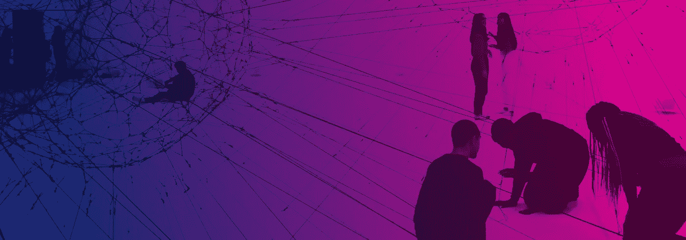

# 连续连接

> 原文：<https://medium.com/swlh/continuous-connection-a94af5901b43>

## 在**持续连接时代重塑用户体验和业务流程**

Original picture by [Alina Grubnyak](https://unsplash.com/@alinnnaaaa)

*物联网*的兴起改变了我们与周围物体互动的方式。汽车、恒温器和洗衣机等设备不再是独立的设备，而是变成了相互连接的物体。他们感知世界，他们在网络中交换信息，他们**总是保持联系**。

哈佛商业评论最近的一篇文章将物联网的发展描述为持续连接的时代。由于频繁的数字互动、更少的摩擦和对用户行为的持续监控，接受这种演变的公司与客户建立了牢固的关系。

在互联时代之前，公司很难与客户保持联系，市场研究提供的工具和技术有限，无法从用户的操作中获得洞察力。策略和反馈之间的时间间隔太长，在产品发布后，没有简单的方法来了解用户如何交互和使用产品。

持续的联系开启了新的机遇，技术改变了公司从市场获得反馈的方式。营销部门不再需要在产品发布六个月后等待焦点小组的反馈，今天公司可以通过持续的用户研究和大数据了解人们的行为。这个场景为更深入地理解用户需求和预测未来的发展带来了巨大的机遇。

# 连续反馈

由于智能物体、社交网络和云系统等数字产品和服务，公司可以在整个用户旅程中监控人们和消费者的活动，消费者可以不断收到品牌的刺激。以洗碗机这样的智能家电为例:10 年前，顾客购买后就不再与公司联系。他们无法给出反馈，公司也无法理解用户的行为；客户满意度报告中的几个问题不足以改善产品和服务。

持续联系中的挑战不是如何使用技术，而是如何找到一种方法**发展和管理与客户的持续关系**。

像*物联网*这样的技术帮助我们创造智能设备，跟踪人们的行为、行动、惯例，机器学习帮助我们理解模式和预测行动。

在持续连接时代，人们对品牌有很强的参与度。Z 世代被描述为永远在线的一代人。他们有频繁的数字互动，虽然他们允许公司使用他们的数据，但他们要求定制的体验，因为他们知道他们的数据有巨大的价值，他们希望有所回报。公司必须了解如何基于个人数据创建定制体验。

微软从 2013 年就预见到了这一趋势，重新定义了游戏[控制台](https://www.engadget.com/2018/06/10/xbox-one-reveal-always-on-online-sony-ps4-e3/?guccounter=1&guce_referrer=aHR0cHM6Ly93d3cuZ29vZ2xlLmNvbS8&guce_referrer_sig=AQAAALi36Ye58Txu8UNWvwv49HaV3wjLpnIZ1ypGTCYek1YgtmjSKKWXu5k7FwmKvjSR78sx-xPBQBRRyOtHokAEr1AWQpoVYx-wXzxxl8THS6quJFtnyaaVJuEJJiWK9as0I9BJ8sqZK-NQFlQkncSIMcY5Dm2jB5tnVR_Ag18Z-pp2))的整个阵容，而其他制造商则创造了能够实现完全互联的[生活](https://www.technative.io/the-future-of-connected-living-and-working-is-powered-by-wireless-charging/)的硬件。

# 关联策略

公司需要一种策略来编排数据、反馈和见解，以便了解和满足消费者的需求。

具有清晰互联战略的公司可以显著改善用户体验，并与客户建立更深层次的关系。然而，关联战略不仅是关于频繁的互动和数据分析，而且本质上是关于快速适应市场变化的**。**

技术帮助公司建立联系，但只有少数公司知道如何获取洞察力和执行良好的运营。

Nike 通过智能设备监控用户，并提供健身教练服务建议。亚马逊了解人们的行为，但也提供了一种减少摩擦购买的解决方案，如一键按钮或 Alexa 语音购买。

# 持续学习

了解联系价值的公司正在制定一项战略，专注于与客户进行更深层次的互动。他们认识到早期用户的需求，并迅速做出反应，但大多数公司都创建了一个持续学习的系统，以了解行为是如何演变的。

在持续连接时代，客户要求**快速交付、精确执行、最小摩擦和灵活性**。访问个人数据意味着创造专注于独特客户**满意度的定制体验**。

这个时代意味着思维模式的改变，不再有分散的品牌体验，取而代之的是个人和私人关系。广告牌和电视广告已经失去了在顾客和公司之间发展个人联系的有效性。

公司需要迅速反思与客户互动的方式以及执行内部运营的方式。**互联世界刚刚开始**一切都需要适应。