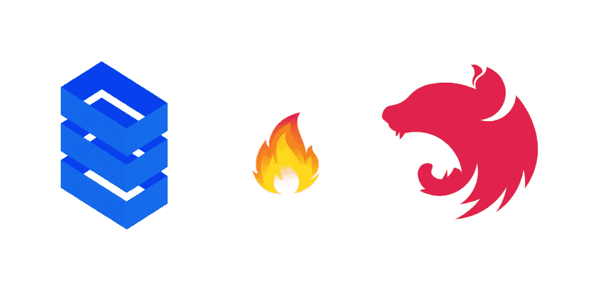
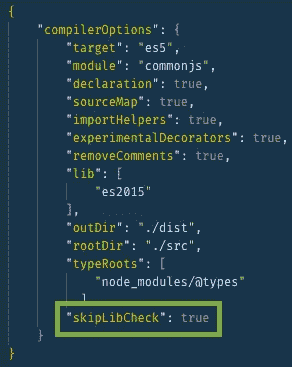
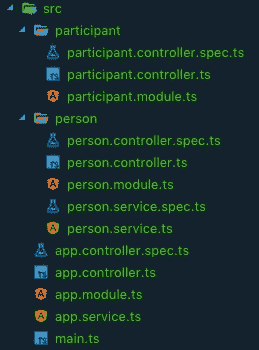
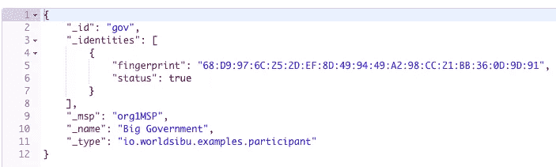
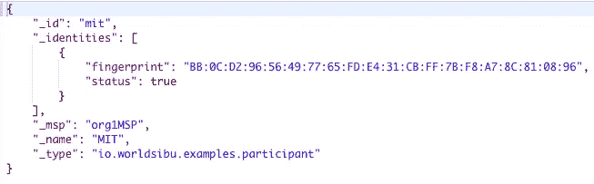

# 带 NestJS 的对流器🤯

> 原文：<https://medium.com/swlh/convector-with-nestjs-7e660322d927>

这些天我一直在玩 [Convector](https://www.worldsibu.tech/convector/) ，这是一个开发智能合同和区块链的 javascript 框架。老实说，感谢 WoldSibu 为 javascript 世界带来了如此伟大的工具。

> 我不会过多地探究 convector 是如何工作的，但是我强烈建议你在这里[查看一下](https://www.worldsibu.tech/convector/convector-smart-contracts/)😉。

Convector 在他们的网站上有一套教程，给你演示如何使用这个框架。我注意到其中之一是创建一个定制的后端来公开使用 NodeJS 的 API，特别是使用 Express。

我想知道我是否可以使用不同的 NodeJS 框架来代替 Express？？可能吗？？🤔答案是肯定的！只是 Javascript 而已。所以我们将在本教程中使用 [NestJS](https://nestjs.com/) 。

但是 NestJS 是什么？在他们的网站上，它被定义为“一个渐进的 Node.js 框架，用于构建高效、可靠和可伸缩的服务器端应用程序。”其中一件很酷的事情是，它与 [Angular](https://angular.io/) 非常相似，遵循相同的模式，并具有类似的特性，如提供者、管道、模块。

# 📝开始之前

*   安装节点 8(文档推荐的版本)
*   安装 docker
*   继续之前，请阅读 convector 网站上的[智能合同教程](https://docs.worldsibu.com/article/89-tutorial)。

# ⏰说得太多了，伙计，伙计！

我们将使用[后端](https://docs.worldsibu.com/article/95-tutorial-back-end)教程中提供的示例作为我们的基础项目，然后将 Express 应用程序迁移到 NestJS。将回购[叉到这里](http://sibu/convector-example-people-attributes)。

# 🛠设置

请执行以下命令，否则，您可能会遇到一些奇怪的错误:

1.  安装 [Hurley](https://worldsibu.tech/convector/hurley-development-environment/) 帮助我们建立测试网络
    
2.  运行`rm -rf ./packages/server`删除 Express App
3.  运行`npm install -g @nestjs/cli`安装 [NestJS](https://nestjs.com) CLI
4.  移动到`package`文件夹运行`nest new server`。这将为你搭建一个 NestJS 项目。
5.  访问服务器文件夹`cd server`
6.  安装`dotenv`用于处理环境变量
    `npm i dotenv --save-dev`
7.  **回到项目的根目录**，安装 NestJS
    `npx lerna add participant-cc --scope server --no-bootstrap
    npx lerna add person-cc --scope server --no-bootstrap`将要使用的智能合约包
8.  为了避免键入冲突，在**根**和**服务器** `tsconfig`文件中添加`skipLibCheck`标志。(NestJS 用的 Jest 和 Convector 用的 Mocha 之间有问题)

root/tsconfig.json

9.最后是`npm install`

> 如果 npx 不起作用，请更新 NPM 版本，或者通过运行 npm install -g lerna 并运行不带 npx 的相同命令来全局安装 lerna

# 👷🏻‍♂️我们要建造什么？

我们将重用在[智能合约教程](https://docs.worldsibu.com/article/89-tutorial)中创建的两个智能合约，并使用 NestJS 通过端点公开它们。

以下是智能合约教程中对它的简要说明:

1.  区块链中有三种数据结构:**网络参与者、属性和人。**
2.  每个数据结构被定义为:

*   **网络参与者:**这些是网络中发布属性的公司。它们对它们向用户陈述的内容负责，并且在网络中是可识别的。
*   **属性:**是**网络参与者**为**人**做证明的声明。
*   这些是网络中的人物代表。它们被分配了属性，并且可以根据需要在第三方面前简单地查询它们以进行认证。

3.商业规则

*   创造一个 ***人*** 应该只是一个组织的责任——政府。
*   每个组织( ***网络参与者*** )应该能够发布或证明属性。
*   每个组织( ***网络参与者*** )应该能够检查/查询一个人的属性。
*   单个 ID 应该足以查询一个人及其属性的所有相关信息。
*   只有认证属性的组织才能编辑它。

流程应该是这样的:

*   政府可以“招收”一个新人。
*   政府可以默认给那个人加一些属性。
*   然后，其他机构就可以开始发放属性(职业、保险状态、工作经验)。
*   发布的属性中的每一个变化都将是明显的。只有最初发布属性的组织才能对属性进行更改。

> 定义和业务规则摘自[教程](https://docs.worldsibu.com/article/89-tutorial)

让我们看一下下面的例子，以便更好地理解:

假设一个 ***网络参与者*** 是政府，一个 ***人*** 是你，一个 ***属性*** 是你的出生证明。政府负责登记你的生日，并颁发出生证明，你会存储。但是因为某些原因，你的名字有个错别字(对不起你😂)在证明里也只有县法院(另一个 ***网络参与者*** 那个不是政府)可以帮你。县法院可以修正你的名字，但不能创造另一个 ***人*** 。

# 👨🏻‍💻代码代码

我们已经启动了 NestJS 项目，下一步是为每个智能合约创建一个模块、一个控制器和一个服务。

先说`participant`逻辑。要生成模块运行:

> `nest generate module participant`

该命令将创建`participant`模块，并自动将其注册到 app 模块中。

> 使用 Nest CLI 运行的每个命令都会自动将功能(提供程序、模块、管道等)注册到作用域模块(如果存在),否则它将被添加到应用程序模块。

要创建控制器:

> `nest generate controller participant`

让我们对`person`做同样的事情，但是这次我们将为这个模块创建一个服务:

> `*nest generate module* person`
> 
> `*nest generate controller* person`
> 
> `*nest generate service* person`

并在`src`文件夹中创建两个文件:`env.ts`和`convector.ts`:

src/server/env.ts

packages/server/src/convector.ts

您的 src 文件夹应该如下所示

NestJS source folder

现在，我们需要做的是开始迁移逻辑。所有与 convector 通信相关的代码以及任何其他对我们的服务和控制器的繁重计算都将负责暴露端点并将数据传递给服务。

复制并粘贴到相应的文件

**参与者控制器**

**个人服务**

**个人控制器**

# ⚙️运行对流器和测试

让我们运行后端教程中使用的相同命令:

1.  确保 Docker 正在运行。
2.  转到根目录并运行:

3.测试端点

[http://localhost:3000/participant/gov](http://localhost:3000/participant/gov)

[http://localhost:3000/participant/mit](http://localhost:3000/participant/mit)

4.做几笔交易

结果:

# 结论

Convector 是一个使用 javascript 创建智能合同的伟大工具，它是 web 开发人员的又一个选择。我觉得它不拘泥于 NodeJS 框架很棒。另一方面，NestJS 是一个受 Angular 启发的非常健壮的框架，允许前端开发人员轻松地迁移到后端。

点击查看完整示例

我是一名 Web 开发人员，一名 javascript 爱好者🤓，还有好吃的🍕，仍在了解区块链。任何建议都会受到欢迎。跟我来:

 [## 马里亚诺·Á·阿尔瓦雷斯(@malvarezcr) |推特

### (@malvarezcr)。|🤖高级网页开发|👨🏻‍💻网络实践负责人|♥️·吴，🎮,🍕…

twitter.com](https://twitter.com/malvarezcr)  [## 马里亚诺·阿尔瓦雷斯-中等

### 高级网页开发员-协办单位 Angular 哥斯达黎加

medium.com](/@mahcr/)