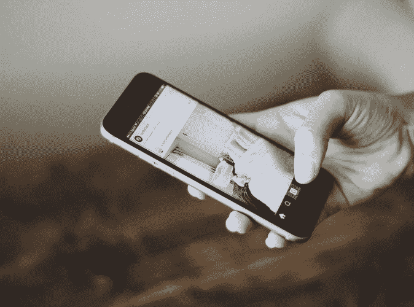

# 将网站转换为移动应用:关键考虑因素

> 原文：<https://medium.com/swlh/converting-a-website-to-a-mobile-app-key-considerations-c3b5c9af3683>

拥有一个设计合理、功能齐全的网站无疑是建立你在网上优势地位的关键部分。

不过现在是 2019 年。移动应用已经登上舞台。他们通过一场风暴做到了。仔细研究这些数字可以发现，这有很多优点。

数据监测资源 [*Statista* 显示](https://www.statista.com/statistics/695104/worldwide-mobile-app-consumer-spend-by-region/)仅美国的消费者预计到 2022 年将在移动应用上花费超过 340 亿*美元*。谁不想分一杯羹呢？

但是有很多要考虑的。虽然拥有一个移动应用程序肯定可以增加你的营销武库，但选择合适的时间也很重要。更重要的是，确定你是否需要它是至关重要的。

假设你拥有一个网站——一个设计良好、运行完美的网站，它带给你的比你要求的更多。然而，你脑海中有一个小小的声音说，移动应用可能是一个更好的选择。

这是许多企业主，尤其是初创企业主面临的问题。因此，我们冒昧地概述了一些关键的考虑因素，以及从网站过渡到移动应用的潜在优势。

# 目标受众:你真的需要一个手机 App 吗？

也许不同的公司，尤其是创业公司，选择在网络和手机上建立业务的最主要原因是为了吸引更多的客户。换句话说，他们害怕错过潜在的付费客户。

这有很多优点。还记得上面的 Statista 图表吗？

然而，对于创业公司来说尤其如此，将决策建立在确凿的、有信息支持的事实基础上是绝对重要的。打这个电话时以数据为导向是最重要的。

请记住，移动应用程序可在各种设备上使用，因此您必须对它们的功能有一个完美的理解，以便做好适当的准备。

你可以从各种工具中收集所有必要的信息，比如谷歌分析。您将看到有多少用户来自移动设备，他们来自哪里，他们来自什么设备，他们在您的网站上停留多长时间，等等。

如果需要的话，这还将有助于您优先部署您的应用程序——无论您是想在 iOS、Android 还是两者上开始。

# 对当前网络体验的评估

马上，如果你已经打了电话并且准备好了，你需要评估你现有的网络体验。

这意味着你应该花足够的时间来分析对你的网站或网络应用有用和无用的东西。这将决定向移动应用程序过渡时的进一步行动。

让我们看一个例子。社交媒体大亨脸书是我们想要考察的人。这一切都始于一个网站，后来过渡到一个 web 应用程序，然后才建立一个原生应用程序。

后者提供了一个有点光滑的界面，它包括该公司围绕其建立的核心社交网络功能。脸书所做的是，他们没有给移动应用添加很多额外的功能——他们调整了现有的功能，并提供了相当相似的用户体验。

这是用户想要的。按照这种思路，提供与你的观众习惯的体验相似的体验是绝对必要的。你不想让你的用户震惊。当你构建你的移动应用程序时，考虑重要的[移动 UX 设计原则](https://fireart.studio/blog/7-best-mobile-ux-design-principles-and-best-practices/)是很重要的，这样可以最大限度地减少潜在的混乱。

# 用例:这都是关于用例的

移动应用如何适应你的服务的可用性？有意义吗？如果你提供出租车服务，手机应用显然是必不可少的。这将允许你的观众随时随地访问你的服务。此外，一个移动应用程序可以带来大量的功能，如实时路线交通，基于当前位置的费用估计等等。

然而，如果你在经营一家割草公司，移动应用可能不是最好的主意。并不是说它会有伤害，但是它值得投入精力和投资吗？

都是关于用例的。如果移动应用增加了你当前的价值主张，并合理地扩展了它，那就去做吧。如果附加价值微不足道或不存在，你可以跳过它。就这么简单。

# 拥有移动应用的好处

综上所述，我们不想听起来令人沮丧。移动应用程序有很多优点，所以为了确保这一点，我们列出了其中一些。这些包括但不限于以下内容:

*   与基本网站上的平均时间相比，移动用户在安装应用程序后花费更多的时间。
*   移动应用也提供某些离线功能，这是巨大的。
*   移动设备利用全球定位系统、联系人列表等等——所有这些都可以从中受益。
*   移动应用程序往往运行得更快，前提是它们制作得更好。
*   应用内通知比推送通知更有效。
*   您可以允许您的用户以他们认为合适的方式设置界面(当然，在一定程度上)。

虽然有很多好处，但也有一些需要注意的事项。例如，将您的网站转换为移动应用程序只是该过程的一个步骤。当然，这是一个巨大的进步，但仍然是一个。

你必须考虑用不同的方式营销它，因为它不再是一个网站了。成功的预发布应用营销策略有很多[步骤可供你利用，但它们都需要额外的努力和金钱。](https://swagsoft.com.sg/blog/7-steps-to-a-winning-pre-launch-app-marketing-strategy/)

这并不总是一种权衡，但当它发生时，你必须做出正确的选择。因此，在你决定将你的网站转换为移动应用程序时，应该适当权衡上述所有因素。

## 这篇文章发表在[《创业](https://medium.com/swlh)》上，这是 Medium 最大的创业刊物，有+441，678 人关注。

## 订阅接收[我们的头条新闻](https://growthsupply.com/the-startup-newsletter/)。

