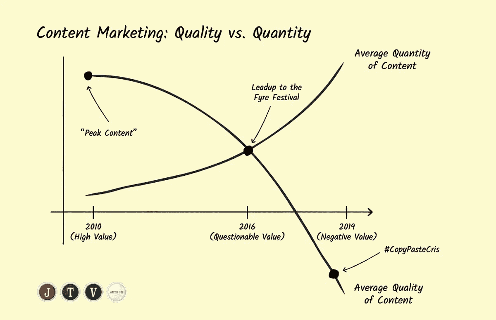

# #CopyPasteCris 和停止写作的斗争正在转向内容营销

> 原文：<https://medium.com/swlh/copypastecris-and-the-fight-to-stop-writing-from-devolving-into-content-marketing-f5318f7229a3>

诺拉·罗伯茨:“[不是咆哮，而是承诺](http://fallintothestory.com/not-a-rant-but-a-promise/)”博客文章，于 2019 年 2 月 23 日发布(并迅速传播):

> *我正在接受一场关于病态、贪婪、投机取巧的文化的地狱式教育，这种文化与亚马逊荒谬的虚弱系统相博弈。我学到的一切都让我愤怒。*
> 
> *有黑帽队，一起工作，谁* …