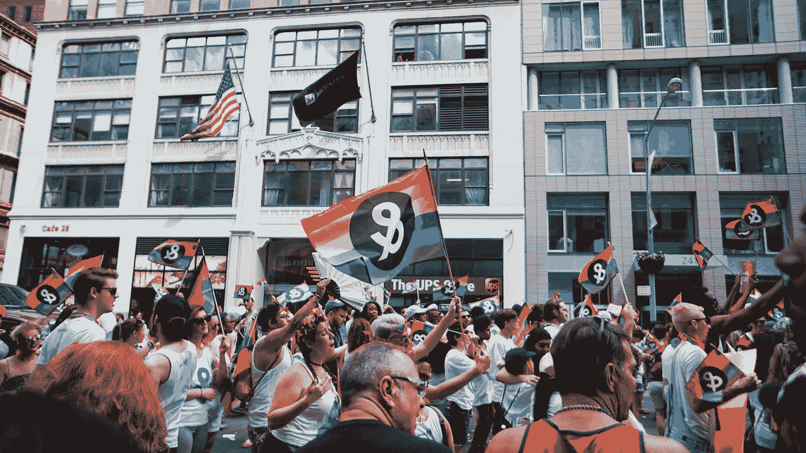
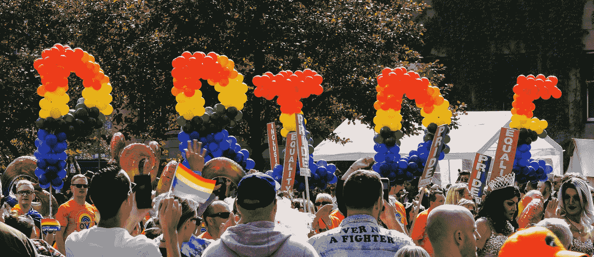

# 企业自豪感模糊了行动主义和营销之间的界限

> 原文：<https://medium.com/swlh/corporate-pride-blurs-the-lines-between-activism-and-marketing-f749367d5ed5>

在什么情况下，我们国家对 LGBTQA+的庆祝活动失去了尊重行动主义的最初目的，变成了品牌利用同性恋文化的机会？随着骄傲月让这个国家充斥着游行、狂欢和对同性恋的认识，许多企业抓住了这个营销机会，就像霍尔马克公司给情人节带来了所有的铃铛和哨子一样。

最初被认为是 1969 年曼哈顿石墙暴动后的纪念日，第一次骄傲游行于 1970 年 6 月 28 日在纽约举行。从那时起，它就被扭曲成一个庆祝的奇观，今年在纽约市聚集了大约 450 万人。越来越受欢迎意味着，在否认同性恋悲惨的过去和当前的斗争的同时，认可同性恋是一种时尚。

Photo by [Erin Song](https://unsplash.com/@erindesong?utm_source=unsplash&utm_medium=referral&utm_content=creditCopyText) on [Unsplash](https://unsplash.com/search/photos/lgbtqa?utm_source=unsplash&utm_medium=referral&utm_content=creditCopyText)

2015 年，LGBTQA+社区的购买力预计将达到 9170 亿美元，这让零售商有充分的理由来策划 Pride 产品。今年，马德威尔、H&M、香蕉共和国、快递、匡威、耐克、阿迪达斯、J Crew 和 Gap 都发布了骄傲礼品，一些公司向 GLAAD 和联合国自由与平等运动等慈善机构捐款。讽刺的是。所有这些服装品牌在中国都有主要供应商，中国仍然拒绝承认同性婚姻或民事结合。

这些企业吹嘘他们至少支付最低工资，如果不是更多的话，但是当最低工资在中国从[184 美元/月](https://www.china-briefing.com/news/complete-guide-2017-minimum-wage-levels-across-china/)到[369 美元/月](https://www.china-briefing.com/news/shanghais-minimum-wage-increase-april-1-2019/)美元不等时，这没有什么值得骄傲的。市中心外一居室公寓的平均租金估计为每月 295 美元，这是美国 13.4%的人生活在贫困线以下的一个关键因素。

Photo by [Toni Reed](https://unsplash.com/@trfotos?utm_source=unsplash&utm_medium=referral&utm_content=creditCopyText) on [Unsplash](https://unsplash.com/search/photos/gay-parade?utm_source=unsplash&utm_medium=referral&utm_content=creditCopyText)

通过“骄傲装备”资助的大部分捐款都捐给了[人权运动](https://www.hrc.org/hrc-story/about-us)，这是美国最大的民权组织，在全国雇佣了 300 多万人。虽然人权委员会在全球范围内开展活动，但他们的大部分活动仍在美国，尽管[同性恋在 73 个国家被定为犯罪，在沙特、苏丹、伊朗、也门以及索马里和尼日利亚的部分地区可被判处死刑](https://www.weforum.org/agenda/2018/06/lgbti-rights-around-the-world-in-2018/)。在毛里塔尼亚、卡塔尔、阿富汗、巴基斯坦和阿拉伯联合酋长国，法律允许将死刑作为对同性恋的惩罚，但是这些法律并没有付诸实施。

这并不是唯一一个容易市场化的社会问题——女权主义是公司积极使用的另一个工具，以摆出慈善的面孔。从来自波特兰但中国制造的“狂野女权主义者”默克，到假定每个被认为是女性的人都有阴道的粉红色猫帽，有争议的炫耀你的特权的方式伴随着道德问题。

川普如此大胆，以至于发布了一件[彩虹 MAGA t 恤](https://shop.donaldjtrump.com/products/make-america-great-again-pride-tee)和[卡玛拉·哈里斯](https://store.kamalaharris.org/pride-for-the-people/)自己做了一些别针、手提包、补丁、帽子等，以庆祝今年的骄傲。他们中有谁给任何 LGBTQA+激进组织捐过款吗？当然不是。

显然，购买骄傲商品是出于好意，我不是来给任何人泼冷水的。然而，如果你是异性恋，认为在亚马逊上花 20 美元买一件印有“盟友”的 t 恤，然后去游行就足够了，那你就错了。如果你是同性恋(或同性恋或无性或任何非异性恋)，并认为仅仅因为你为自己被接受的斗争结束了，重新考虑世界上那些不被允许行使我们被允许的自由的人。不要忘记是谁制造了你的骄傲装备，以及他们每天被迫面对的现实。不要让公司宣称你的身份是一种营销工具。不要让骄傲从一个纪念激进主义的日子变成一个精英主义者、企业驱动的特权象征。