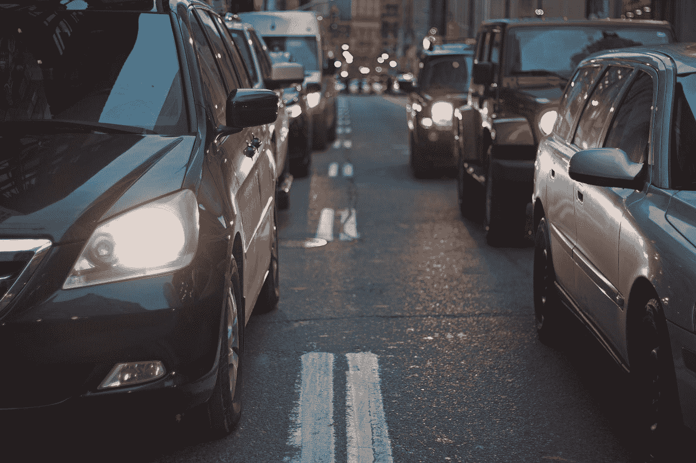

# 对于城市来说，自动驾驶汽车会比普通汽车更糟糕吗？

> 原文：<https://medium.com/swlh/could-autonomous-vehicles-be-worse-for-cities-than-regular-cars-b68620e01bce>

对于城市来说，自动驾驶汽车会比汽车更糟糕吗？似乎很少有人这么认为。但我们长期以来未能预见到移动革命的负面影响。

Photo by [Nabeel Syed](https://unsplash.com/@nabeelsyed?utm_source=medium&utm_medium=referral) on [Unsplash](https://unsplash.com?utm_source=medium&utm_medium=referral)

倡导自主交通的人提出的大多数场景都描绘了空荡荡的街道、更清洁的空气以及更少的伤亡。见证这张图…