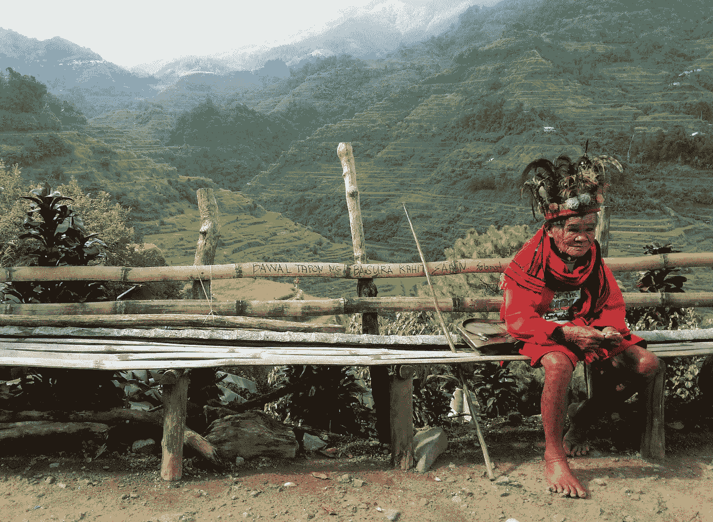
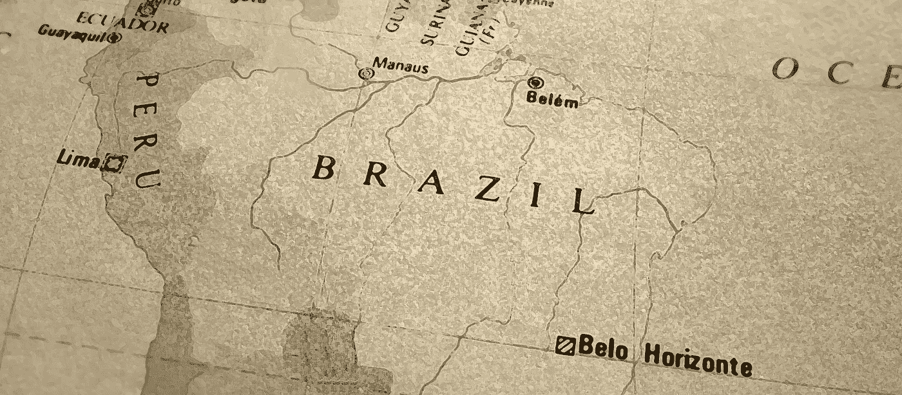
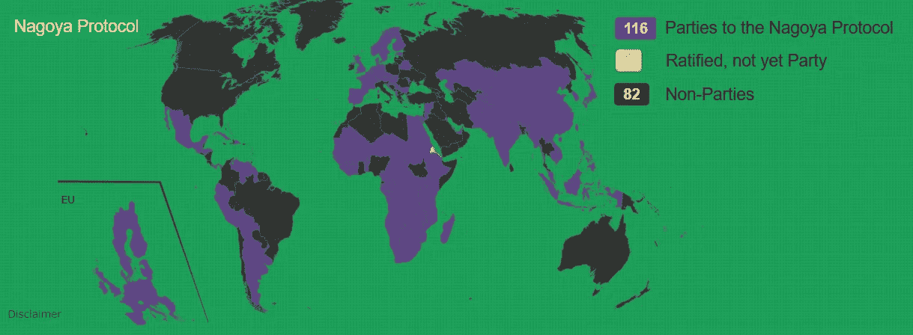
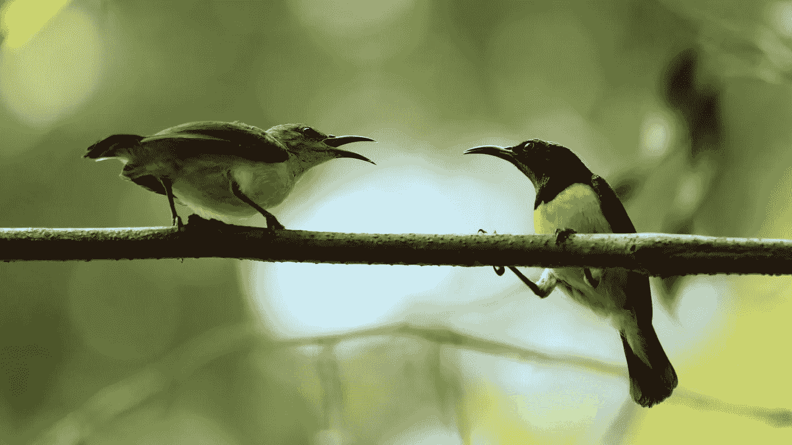

# 区块链技术能阻止生物剽窃并拯救雨林吗？

> 原文：<https://medium.com/swlh/could-blockchain-technology-stop-biopiracy-and-save-the-rainforests-1983c9829c9c>

“生物盗窃者”不是用钩子和炮弹，而是在大城市的办公室里利用专利律师窃取生物财富，同时破坏世界上的雨林。

在这篇文章中，我将解释区块链技术——负责比特币的技术——如何阻止生物盗版并拯救世界雨林。但首先，理解什么是生物剽窃，以及它如何对地球上最珍贵的自然资源造成无情的破坏是很重要的。

## “生物海盗”与雨林开发的历史

生物剽窃是现代版的荷兰殖民者，1626 年，[用价值 24 美元的珠子和小饰品获得了曼哈顿岛](http://mentalfloss.com/article/12657/was-manhattan-really-bought-24)的权利。达成这项协议的土著美国人认为，他们放弃了狩猎权，共享了他们的岛屿。相反，他们失去了一切。

“生物勘探者”——他们在价值数十亿美元的制药公司的董事会议上被称为——做着类似的事情。他们在世界最偏远的地方寻找新的药物、植物和具有特殊性质的分子化合物。他们采访当地农民、草药医生和药剂师，以获取有关草药和化学混合物的古老信息。然后，他们窃取这些宝贵的财富，为自己的利润和收益。

Image by [stardust19855](https://pixabay.com/users/stardust19855-2484178/?utm_source=link-attribution&utm_medium=referral&utm_campaign=image&utm_content=1475542) from [Pixabay](https://pixabay.com/?utm_source=link-attribution&utm_medium=referral&utm_campaign=image&utm_content=1475542)

生物保护者的任务是从土著社区获取资源，并对其进行专利保护和控制。这使得他们能够赚到足以让洛克菲勒家族汗颜的钱。

这些珍贵资源的古代看护者得到了什么？他们看到企业伐木工和牧民包围并摧毁他们古老的家园。由于土地所有者无法通过许可使用他们的生物资源来赚取特许权使用费，他们不得不将他们原本毫无价值的雨林财产卖给出价最高的人:开发商，他们最终为了伐木和放牧而砍伐雨林。

令人难过的是，如果“生物海盗”为他们榨取的财富提供合理的补偿，这片土地对其所有者来说会有多有价值——远比牧场更有价值。

## 一个 19 世纪的生物入侵者如何单枪匹马摧毁了巴西的橡胶工业

去年，《经济学人》发表了一段[视频](https://www.youtube.com/watch?v=nSY1pHXM69Y)，解释生物盗版如何破坏环境(以及区块链科技如何阻止它们)。在视频中，我们被警告“偷种子”的亨利·韦翰爵士，他从 19 世纪的巴西橡胶农民身上赚了一大笔赎金。

Brazil (Image by [Paula Paulinha](https://pixabay.com/users/PaulavFeijo-5062170/?utm_source=link-attribution&utm_medium=referral&utm_campaign=image&utm_content=3868086) from [Pixabay](https://pixabay.com/?utm_source=link-attribution&utm_medium=referral&utm_campaign=image&utm_content=3868086))

在巴西橡胶业的鼎盛时期，亨利·威克姆爵士看到了从亚马逊出口橡胶树种子并在东南亚种植的机会。通过发展大规模种植园，韦翰把自己变成了“世界末日的小偷”，摧毁了巴西的橡胶工业。

通过盗窃自然资源，现代[生物盗窃者](http://www.isca.in/IJENS/Archive/v4/i9/15.ISCA-IRJEvS-2015-145.pdf)阻止雨林财富的真正所有者(土著社区、土地所有者和发展中国家的政府)赚取收入。这就消除了当地社区保护自然环境的巨大经济动力。

## 为什么很难阻止生物盗版

自威克姆时代起，成群结队的生物海盗就开始无情地掠夺世界各地雨林中的自然资源。为了阻止这种滥用，2010 年，100 个国家在 T4 签署了名古屋议定书。从那以后，参与者的数量增长到了 [116](https://www.openplant.org/blog/2017/6/23/understanding-the-nagoya-protocol-your-role-in-protecting-the-worlds-biodiversity) 。

如果你想知道，美国不是名古屋议定书的成员。然而，根据 2013 年《伯克利国际法杂志》的报道，美国即将批准该协议:

> “奥巴马总统对寻求批准《公约》或签署《名古屋议定书》基本上仍未做出承诺。然而，有迹象表明，奥巴马政府可能会在奥巴马总统第二任期结束前推动批准该条约，正如奥巴马政府在最高法院对遗传资源案件的立场所表明的那样。

《名古屋议定书》生效已近十年，美国仍未加入。

Nations participating in the Nagoya Protocol as of May 17, 2019 (from [Openplant.org](https://absch.cbd.int/))

名古屋与会者一致认为，原产国必须从其生物资源产生的利润中获得公平份额。问题是,《名古屋议定书》很难执行。生物盗版者很容易进入偏远地区，提取未被发现的样本，并将其作为自己的专利。没人知道这些资产来自哪里；没人知道它们是如何被使用的，也没人知道赚了多少钱。在区块链技术出现之前，跟踪雨林资产几乎是不可能的。

## 区块链技术如何让追踪雨林资产变得更容易

识别和编目雨林资产是追踪它们的第一步。这就是区块链技术——加密货币比特币背后的技术——的用武之地。

Visualization of a blockchain (Image by [Pete Linforth](https://pixabay.com/users/TheDigitalArtist-202249/?utm_source=link-attribution&utm_medium=referral&utm_campaign=image&utm_content=3448502) from [Pixabay](https://pixabay.com/?utm_source=link-attribution&utm_medium=referral&utm_campaign=image&utm_content=3448502))

让比特币网络成为可能的区块链技术，创造了一个谁拥有多少比特币的不可更改的记录。不受黑客影响的账本为用户提供了深深的安全感:他们永远不必担心腐败分子通过侵入系统并更改记录来窃取资产。

有了类似的不变的区块链分类账，我们可以对雨林中发现的生物财富的遗传起源进行编目。这样，资产的来源将被公开，生物盗版者就无法介入并声称发明了它们。

基于区块链的生物资源记录将合法地授权当地文化从许可中赚取版税。这可能会产生一个巨大的财政激励，反对将雨林土地卖给牧场主和伐木工。

有希望的最终结果:土地所有者将努力 ***保护*** 雨林土地作为财富的来源，而不是破坏它。

## 地球生物基因组计划和亚马逊代码库

三个组织——[亚马逊代码库](https://www.earthbankofcodes.org/)、[地球生物基因组项目](https://www.earthbiogenome.org/)和全球经济论坛——在一项重要的区块链任务中合作，在未来十年内对亚马逊地区每一个生命的 DNA 签名进行排序。他们计划将这些信息记录在一个不变的区块链账本上。

An amazing presentation about the Earth Biogenome Project

如果它是一种动物、植物或矿物——如青蛙 DNA、蛇毒、稀有草药、热带真菌或外来化合物——亚马逊代码银行将把它放在一个目录中，该目录(1)识别土著所有者；以及(2)允许所有者通过将这些资源许可给科学家和企业来赚钱。

最终，亚马逊代码银行将被纳入一项名为地球代码银行的全球计划。当有人使用在代码库中找到的资产时，合法的所有者将获得使用权的公平补偿。

没有区块链·莱杰技术，亚马逊密码银行就不可能存在。现在，各国可以在区块链记录其生物资产的独特 DNA 签名。无论将来有人以何种方式或在何处使用这些资产，其合法所有者都将为人所知。

## 这一拯救雨林的区块链议程可能奏效吗？

Image by [Ambady Sasi](https://pixabay.com/users/ambadysasi-7055506/?utm_source=link-attribution&utm_medium=referral&utm_campaign=image&utm_content=3197691) from [Pixabay](https://pixabay.com/?utm_source=link-attribution&utm_medium=referral&utm_campaign=image&utm_content=3197691)

亚马逊代码银行和地球代码银行可以创造一种新的经济，超过砍伐雨林用于伐木和养牛所获得的利润。

你认为这足以让生物海盗走上跳板吗？地球密码银行能提供足够的激励来拯救雨林吗？或者，像许多善意的想法一样，它只是创造了开发土著文化和雨林土地的新方法？