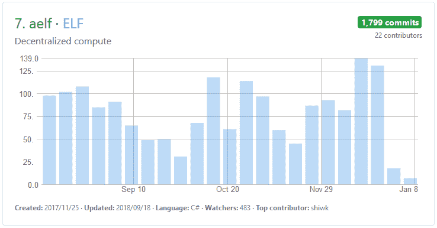
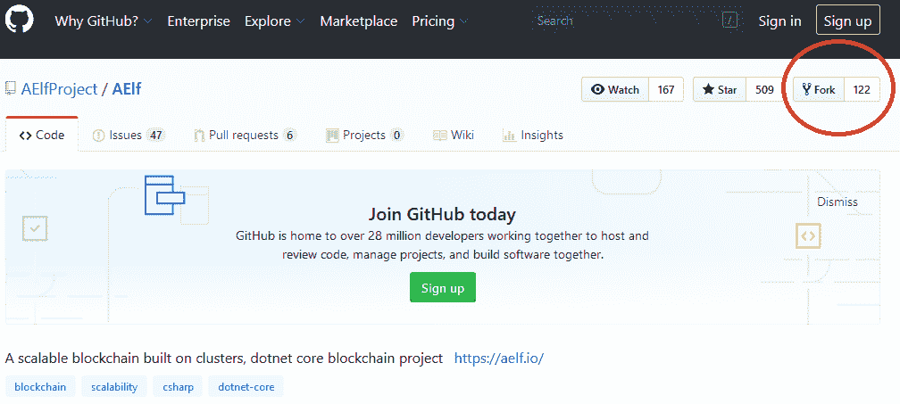

# 作为一个稳定的项目，这可能是完整的解决方案吗？

> 原文：<https://medium.com/swlh/could-this-be-the-complete-solution-as-a-stable-project-74f0b1302074>

## Aelf 的区块链项目可以说是表现最稳定的项目之一。考虑到 2017 年底比特币区块链热潮期间经历的疯狂和相应的重大垮台。


[Markus Spiske](https://unsplash.com/@markusspiske?utm_source=medium&utm_medium=referral) | [Unsplash](https://unsplash.com?utm_source=medium&utm_medium=referral)

它的公式保证了有用性，并且在各种交易所上市期间价格保持可靠。这并不是说它没有经历过任何挑战，Aelf 已经经历了相当一部分挑战，但由于项目的执行及其背后的团队，它已经能够克服否则会使其效率低下的挑战。

# **区块链热潮**

在过去的一年里，在比特币取得成功后，投资者和区块链爱好者都很兴奋，在寻找区块链领域的下一个大事件。就像网络时代一样，人们在寻找能迅速带来利润的项目。许多项目以几乎不可持续的速度发布，这让投资者有机会筛选许多创新想法，并坚持那些似乎有可能在未来几年取得成功的想法。驱使投资者投资区块链项目的另一个因素是世界正在经历的不确定的经济时期。如今，有替代收入流和投资策略来防范不可预见的金融环境变得越来越有必要。

许多投资者相信各种区块链公司，希望他们有机会成功。由于其安全性和透明性，区块链被誉为接管全球网络和系统管理方式的平台。然而，正如许多新行业所经历的那样，大部分项目都失败了。有些失败是因为想法过于雄心勃勃或过于基本；其他的失败仅仅是因为管理和执行不力。一些项目从一开始就是欺诈性的，而另一些项目则决定关闭以防止进一步的损失。

# **价格下跌**

对于各种真实世界场景的区块链的接受和开发对于技术的增长至关重要，特别是在物联网和 5G 方面。但是，此时仍在看到的问题是出现了相似甚至相同的项目。社交媒体和金融科技可以说拥有最多的区块链项目。截至 2018 年 5 月， [92%的区块链项目失败](https://bitcoinist.com/92-blockchain-projects-already-failed-average-lifespan-1-22-years/)，这包括那些被证明是骗局的项目。这在区块链油田的现有和潜在投资者中造成了恐惧。新投资者参与即将到来的、新的和未经证实的项目的可能性越来越小。

在全球范围内，对 ico 和区块链项目的监管也在增加，这使得这些公司更难实现利润，甚至更难实现根据路线图设定的目标。像中国这样的国家正在对 ico 和区块链相关公司执行严格的法律，这是过去经历过的骗局的结果。消息来源如[](http://www.theedgemarkets.com/article/tech-end-cryptocurrencies)*边缘市场甚至预测未来几个月将有更多项目失败，称已经失败的项目和日益增加的监管是导致区块链相关投资减少的部分因素。*

*这一因素和其他因素也影响了以太坊和比特币等强劲的数字货币，这些货币近几个月来一直不在最佳状态。投资者还受到了长期剧烈熊市的打击，导致他们开始在区块链领域寻求其他替代选择。大多数投资者一直在寻求的选择是稳定的债券，它们具有缓冲价格波动的属性。它帮助投资者根据数字货币不断变化的价格做出相应调整。除了稳定的资本，投资者也在追溯他们投资并取得成功的一些原始项目。对他们来说，再投资这些项目可能比投资新项目更有利可图。*

# ***可靠项目***

*有一些好的项目经受住了时间的考验，经受住了各种风暴，克服了前进道路上的障碍。Aelf 在这一类别中并不孤单；然而，它可能被证明是现在和将来最有价值的项目之一。这些是投资者在一个已建立的项目中寻找的一些特征，*

## *➡️A 是区块链世界中独一无二的项目*

*Aelf 决心成为任何对区块链技术及其相关应用感兴趣的人的首选操作系统。目前，大多数项目都在处理分散的应用程序，通过区块链技术运行他们的现实世界的解决方案。然而，这些应用程序是为 Android 和 iOS 等集中式平台设计的。因此，这违背了分权的逻辑，也可能是投资者回避它们的原因之一。*

*成为一个用于分散式应用的专用系统，只要分散式应用还在进行，就能保持自身的相关性。因此，通过这种方式，一个人将能够度过一路上可能出现的任何挑战。这可能会吸引投资者，因为其他独特的项目有坚实的基础和愿景，这将使它们比大多数区块链项目寿命更长。此外，作为一个区块链专用操作系统，它还涵盖了区块链的采矿方面，从而使采矿流程对那些使用 Aelf 操作系统的人来说更加简化。*

## *➡️Differentiating 特色*

*兼顾速度和效率是 Aelf 在其平台上使用的多链方法。它们的核心操作系统由主链和侧链组成，侧链根据手头的操作补充或补充主链的活动。此外，在 aelf 的白皮书中第一次提到的集群节点和并行处理已经产生了许多项目。这一趋势证实了 aelf 引领区块链创新的方向。除此之外，还有一个索引系统，用于区分操作系统中的各个链。*

## *➡️Progressing 平台*

*大多数已经为其路线图设定了目标的平台甚至还没有达到设定的最简单的目标，然而 Aelf 已经通过这个过程超越了获奖。最近，Aelf 赢得了“最有价值的分散平台”奖，这表明它确实在朝着正确的方向前进。他们在 ***“区块链洞察 2019”期间获得了这个奖项。投资者会为与这些壮举联系在一起而感到自豪。****

*A great start to the year after being awarded the ‘MVDP’ award | [Source](https://twitter.com/aelfblockchain/status/1081097992638087168)*

*Aelf 精心打造了其平台，以满足大众市场的需求，同时仍提供安全性和透明度元素，这使区块链从集中式平台中脱颖而出。他们既不急于采用或发布项目，也不关注其象征性的价格。*

*新的，他们在 Github 的所有区块链项目中排名第 7，因为他们的高水平的活动和提交。在过去的 6 个月里，总共有 **1，800 次提交**，平均每天不到 **10 次提交。***

**

*aelf’s github has shown consistent developments even throughout a sustained bear market- all the hallmark’s of a truly reliable project | [Source](https://github.com/AElfProject/AElf)*

*上周，星球日报研究院与多节点超级孵化器 *The Blockchainer、*和[合作发布了一份报告](https://www.openpr.com/news/1517631/2019-Cryptocurrency-and-Blockchain-Market-Report-Including-Top-Key-Players-Like-Qtum-TRON-Intel-Corporation-Microsoft-Corporation-NVIDIA-Corporation-BitFury-Group-Limited-Aelf-Veridium-Caspian-Devery-MediBloc.html)，比较了 16 个区块链 3.0 项目的开发进度更新及其路线图。Aelf 的进度排在前 4 位，因为它在路线图里程碑计时方面拥有 **100%的成功率**。*

*事实上，该代码如此受欢迎，以至于产生了 **122 个分支**，表明许多开发人员正在使用该代码创建他们自己的较小项目。*

**

*A large number of forks shows the industry standard of aelf’s code and the keenness of other projects to use it as their platform | Source*

*除了在区块链社区获得这样一个声望很高的奖项，Aelf 还建立了战略合作伙伴关系，这将使其健康发展。Aelf 最近与分散的双链生态系统超交换合作。此次合作的成果将于 2019 年 1 月 9 日开始显现，届时 HX 连锁店将支持 ELF pledge mining。这些举措鼓励了平台的扩张，并吸引了对公司的积极关注，这可能会转化为 ELF 在数字交易市场的更高价值，从而吸引更多的投资者。*

*这三个因素对于 aelf 来说也都是复选框。满足这些和其他因素的其他平台也可以吸引投资者，尤其是那些希望通过已建立的平台留在区块链领域的投资者。Aelf 是一个优秀的例子，说明了一个可靠的、不断进步的平台应该代表什么。*

*要了解更多关于的信息，请使用此链接。*

****# aelf # DPoS #区块链#stablecoin****

```
****Disclaimer:*** *Please only take this information as my* ***OWN*** *opinion and should not be regarded as financial advice in any situation. Please remember to* ***DYOR*** *before making any decisions.**
```

*♂️你好，我叫萨尔。*如果你觉得这篇文章有用，并想查看我的其他作品，请务必鼓掌并关注我的* [*中型*](/@salmanmiah) *和* [*LinkedIn！*T34*😎*](https://linkedin.com/in/salman-miah-57aa90a0/)*

*[](https://medium.com/swlh)*

## *这篇文章发表在 [The Startup](https://medium.com/swlh) 上，这是 Medium 最大的创业刊物，拥有+414，678 名读者。*

## *在这里订阅接收[我们的头条新闻](http://growthsupply.com/the-startup-newsletter/)。*

*[](https://medium.com/swlh)*