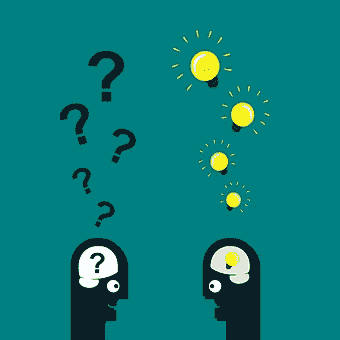

# 可能和应该——两个差劲的搭档

> 原文：<https://medium.com/swlh/couldve-should-ve-2-shitty-partners-ccfad1a4b125>

Question Questions Man from Pixabay

为什么你不值得成功，也不会成功。

他们会让你陷入拖延和半途而废的努力中。

犹豫和优柔寡断绝对是蹩脚的跟班。我已经雇佣了那两个杀死灵魂，压抑精神的笨蛋太多次了。但现在不是了。