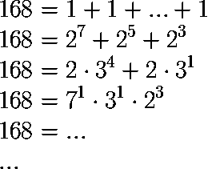

# 编译时计数:高阶函数

> 原文：<https://medium.com/swlh/counting-at-compile-time-higher-order-functions-8bfb73f0018d>

## 算术抽象

Counting every which way

这篇博客文章将在编译时处理高阶函数的实验方法，在类型级别。这在一定程度上是受我之前关于三进制`Nat`、[在编译时计数到无穷大](/swlh/counting-to-infinity-at-compile-time-2bbdd6446329)的帖子的启发。

你不必了解`TNat`(或者它的二进制表亲`BNat`)的细节，只要知道他们是…