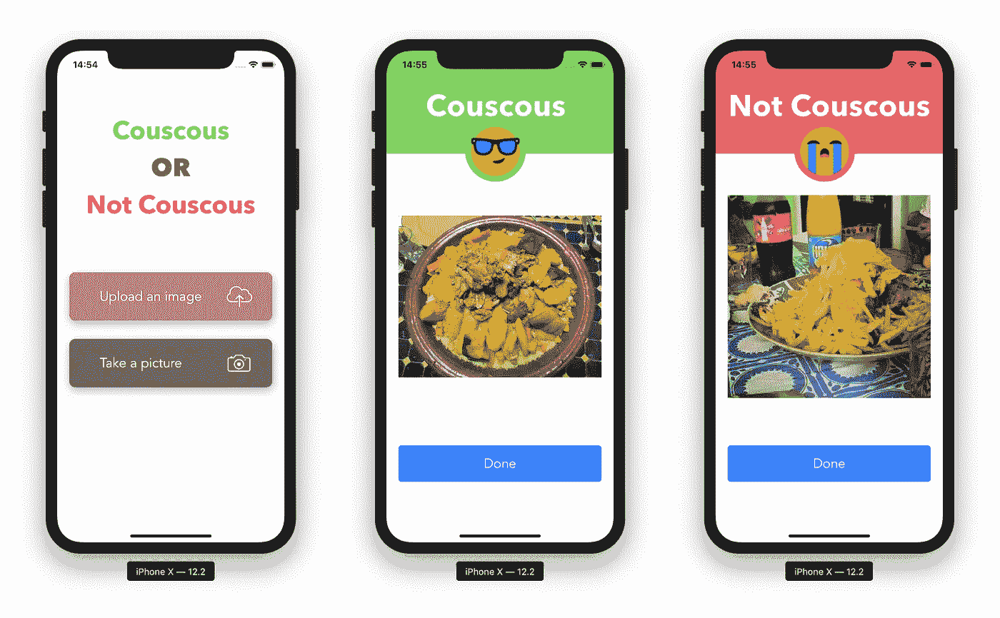

# 蒸粗麦粉还是不蒸粗麦粉——让 CoreML 决定吧

> 原文：<https://medium.com/swlh/couscous-or-not-couscous-let-coreml-decide-ios-application-512845bc79b8>

## 在 iOS 应用程序中训练模型

Final result of the application

是的，没错。我建立了一个 iOS 应用程序，它看着一张图片，决定它是不是古斯古斯。

# 先说 App 布局

我们需要创建一个带有单视图应用程序的 iOS 项目: