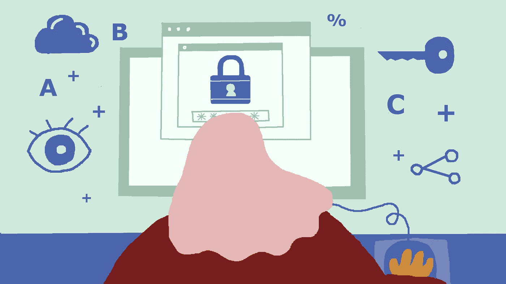

# 破解密码:密码学简史

> 原文：<https://medium.com/swlh/cracking-the-code-brief-history-of-cryptography-d6b7ee35cd42>

illustration @ekatsuta

随着越来越多的日常活动变得数字化，从购物到管理银行账户再到发送信息，保护用户的个人数据和设备变得越来越重要。因此，软件开发人员应该优先考虑和实施数据安全，以防止第三方的欺诈活动，更不用说保护人们的思想自由和…