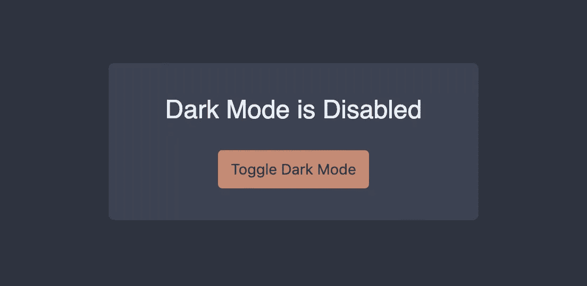

# 使用样式组件创建应用程序的黑暗模式

> 原文：<https://medium.com/swlh/create-a-dark-mode-of-your-app-using-styled-components-a44bc5a59330>


许多应用程序和软件包已经开始提供可选的*黑暗模式*，用户可以启用该模式作为默认较亮模式的替代。除了审美差异，还有许多其他提到的好处，从减少设备的电池消耗到实际改善你的健康。

虽然在本文中我们实际上不会讨论使用黑暗模式的其他好处，但是我们将使用 React 和 Styled 组件来实现它！

# 我们将要建造的

该应用程序将由一些基本的，风格化的元素组成，包括一个按钮，允许用户在亮暗模式之间切换。除了切换模式之外，它还将保存用户的偏好，以便他们返回时记住他们的选择。

我们将使用一些工具来帮助我们构建应用程序:

1.  [创建 React 应用](https://facebook.github.io/create-react-app/docs/getting-started)(引导应用)
2.  [样式组件](https://www.styled-components.com/)(主题化)
3.  [本地存储](https://developer.mozilla.org/en-US/docs/Web/API/Window/localStorage)(保存用户的选择)

你可以点击查看已完成项目[的演示。](https://tsnolan23.github.io/dark-mode-toggle/)

# 第 1 部分:引导应用程序

如上所述，我们将利用 Create React App 来启动和运行我们的应用程序。如果您尚未安装 Create React 应用程序，您可以使用以下软件进行安装:

```
npm install -g create-react-app
```

要初始化我们的新应用程序运行:

```
create-react-app dark-mode-toggle
```

转到我们的新项目目录:

```
cd dark-mode-toggle
```

最后，让我们安装我们将需要的唯一附加依赖项—样式化组件:

```
npm install styled-components --save
```

# 第 2 部分:用轻松的主题构建应用程序

我们最初将构建没有黑暗模式的应用程序，所以从删除项目当前`src`目录中的所有文件开始。那我们准备文件吧:

1.  在`src`目录中创建两个新文件夹— `components`和`themes`
2.  在`src/components`目录下，创建一个`App.js`、`Button.js`、`Card.js`和`Container.js`文件
3.  在`src/themes`目录中，创建一个`light.js`文件
4.  在`src`目录下，创建一个`index.js`和`style.css`文件

完成上述操作后，您的文件夹结构应该类似于:

```
.
└── src
    ├── index.js
    ├── style.css
    ├── themes
    |   └── light.js
    └── components
        ├── App.js
        ├── Button.js
        ├── Card.js
        └── Container.js
```

现在，让我们开始编写一些实际的代码！我们将从`src/themes/light.js`文件开始，该文件将包含灯光模式所需的所有颜色。

在实际的应用程序中，您会希望避免将特定组件以 1:1 配对的命名约定，并使它们更加通用，但是，为了这个应用程序，我将颜色命名为它们的用例。

转到我们的`src/index.js`文件来初始化 React 应用程序:

在`src/index.js`文件中，我们导入`src/style.css`文件。需要澄清的是，这个样式表不包含任何主题的样式，但是有一个规则只是删除了`body`元素上的默认边距:

我们要关注的下一个组件最初将只提供我们上面创建的灯光主题，但是我们将在本文稍后添加切换黑暗主题的逻辑时再次访问它。因此，在`src/components/App.js`中，我们将:

1.  导入我们上面创建的灯光主题
2.  使用样式组件的`ThemeProvider`提供我们的主题
3.  导入并呈现我们的应用程序包含的组件

在我们刚刚创建的`src/components/App.js`文件中，我们引用了剩下的三个组件— `Container`、`Card`和`Button`。

*   `Container`负责使我们的内容在视窗中居中
*   `Card`负责在视觉上将我们的内容与页面的其余部分分开
*   `Button`组件将在本文后面用于切换黑暗模式

当我们在下面构建这些组件时，我们将引用在`src/components/App.js`文件的`ThemeProvider`中提供的主题。你可以在这里阅读更多关于主题如何与样式组件一起工作的内容。

出于我们的目的，每当我们引用一种颜色时，我们将使用`${props => props.theme.colors.ourColorProperty}:`从我们的主题对象中提取它

此时，您应该有一个类似于以下内容的应用程序:


# 第 3 部分:提供黑暗主题

既然我们有一个消费一个主题的基础 app，那就来添加一个新的主题吧！在`src/themes`目录中创建一个名为`dark.js`的新文件。

在该文件中，我们将复制粘贴来自`src/themes/light.js`的对象，并更改十六进制代码:

为了测试我们的新主题是否工作正常，让我们将它导入到我们的`src/components/App.js`文件中，并将其交换到我们的主题提供程序中:

完成上述更改后，您应该会看到应用程序的黑色版本:



这个难题的最后一部分是提供在这两种模式之间切换的能力。我们将通过以下方式做到这一点:

1.  利用`useState`钩子进入`useDarkMode`状态
2.  基于`useDarkMode`状态有条件地将主题传递到`ThemeProvider`
3.  点击按钮时切换`useDarkMode`状态
4.  将`useDarkMode`状态保存到本地存储器中，以便在返回时记住用户的偏好

一旦所有这些都连接起来，点击按钮应该切换主题模式，并将其保存到本地存储。您可以通过启用黑暗模式和刷新来测试这一点，您应该仍然可以看到黑暗模式！

# 最后的想法

*   一个`button`并不是切换主题的最好的 UX 模式，所以在一个生产应用程序中，你可能想要考虑一些更合适的东西，比如复选框！
*   虽然本文关注的是黑暗模式，但是您可以提供的主题数量没有限制，因此您可以将布尔值替换为某种选择，为最终用户提供更多的选项
*   如前所述，主题中使用的命名约定对于较大的应用程序来说并不理想，所以通常应该在名称上花更多的心思
*   本应用中使用的颜色来自[北部颜色主题](https://www.nordtheme.com/docs/colors-and-palettes)