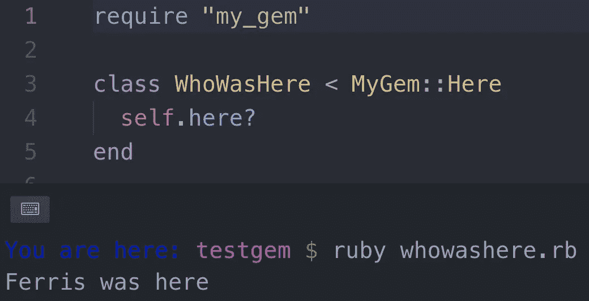
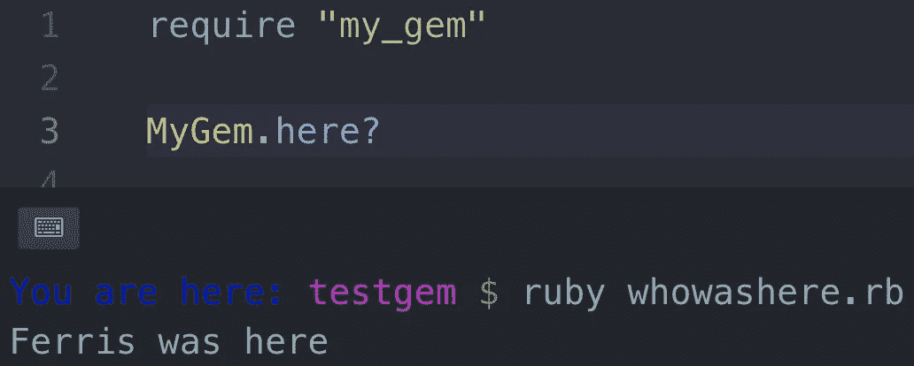

# 制作一个简单的红宝石

> 原文：<https://medium.com/swlh/create-a-simple-ruby-gem-1b470c4145bd>


It’s a ruby

## **制作基本文件夹**

每个 gem 至少需要一个根文件夹和一个 lib 文件夹。在终端中，输入以下内容:

```
$ mkdir my_gem
$ cd my_gem
$ mkdir lib
```

或者复制粘贴:`mkdir my_gem && cd my_gem && mkdir lib`

## **创建第一个宝石代码**

使文件名与 gem 的名称相同。这个文件是唯一负责建立你的宝石。你仍然可以把你的代码分成不同的文件，但是要确保你的主 gem 文件可以通过添加`require '<path to file>'`来访问它。

```
$ cd lib
$ > my_gem.rb
```

或者复制粘贴:`cd lib && > my_gem.rb`

`>`只是`touch`的一个快捷方式

## **增加一些功能**

```
# ./lib/my_gem.rbmodule MyGem
  class Here
    def self.here?
      puts "Ferris was here"
    end
  end
end
```

您不必将它放在模块中:

```
# ./lib/my_gem.rbclass MyGem
  def self.here?
    puts "Ferris was here"
  end
end
```

## **在根目录下创建 gemspec 文件**

`$ > my_gem.gemspec`

gemspec 文件包含有关宝石的信息。

有 5 个必填字段:

*   **名称** —您的宝石名称
*   **版本** —您的宝石的当前版本
*   **总结**——总结你的宝石做了什么
*   **作者**——谁写的宝石
*   **文件**——使你的 gem 发挥作用所需的文件(没有列出文件，你的 gem 仍然可以构建，但不能工作)

如果不存在，有两个字段将填充警告:

*   **主页** —你的宝石网站
*   许可——让用户知道他们被允许使用你的 gem 的内容和方式

几个推荐字段:

*   **描述** —对你的宝石的描述
*   **电子邮件** —您的联系电子邮件

```
# ./my_gem.gemspecGem::Specification.new do |s| 
### REQUIRED ###
  s.name        = 'my_gem'
  s.version     = '0.0.0'
  s.summary     = "This is My_Gem"
  s.authors     = ["Ferris Boran"]
  s.files       = ["lib/my_gem.rb"] 
### WARNING ###
  s.homepage    = '[https://mygem.com'](http://ferryrules.com')
  s.license     = 'OML' 
### RECOMMENDED ###
  s.description = "A simple test gem" # nice to have 
  s.email       = 'ferris@email.com # nice to have
end
```

## **构建并安装**

`$ gem build my_gem`

如果一切顺利，您应该会在终端中看到类似这样的内容

```
$ Successfully built RubyGem
  Name: my_gem
  Version: 0.0.0
  File: my_gem-0.0.0.gem
```

`$ gem install my_gem-0.0.0.gem`

和以前一样，你应该得到这样的东西

```
$ Successfully installed my_gem-0.0.0
  Parsing documentation for my_gem-0.0.0
  Done installing documentation for test after 0 seconds
  1 gem installed
```

## **需要你的宝石并使用它**

将它添加到您的 gem 文件中

```
# <your app>/Gemfilegem 'my_gem'
```

在任何需要的地方都需要它

```
### If using a module ###require 'my_gem'class WhoWasHere < MyGem::Here
  self.here?
end### If using a class ###require 'my_gem'MyGem.here?
```

现在，当你运行你的应用程序时，你的 gem 会按照你的设计去做！



Module Example



Class Example

**来源**

*   ruby gems—[https://guides.rubygems.org/](https://guides.rubygems.org/make-your-own-gem/)
*   红宝石宝石许可证—[https://spdx.org/licenses/](https://spdx.org/licenses/)