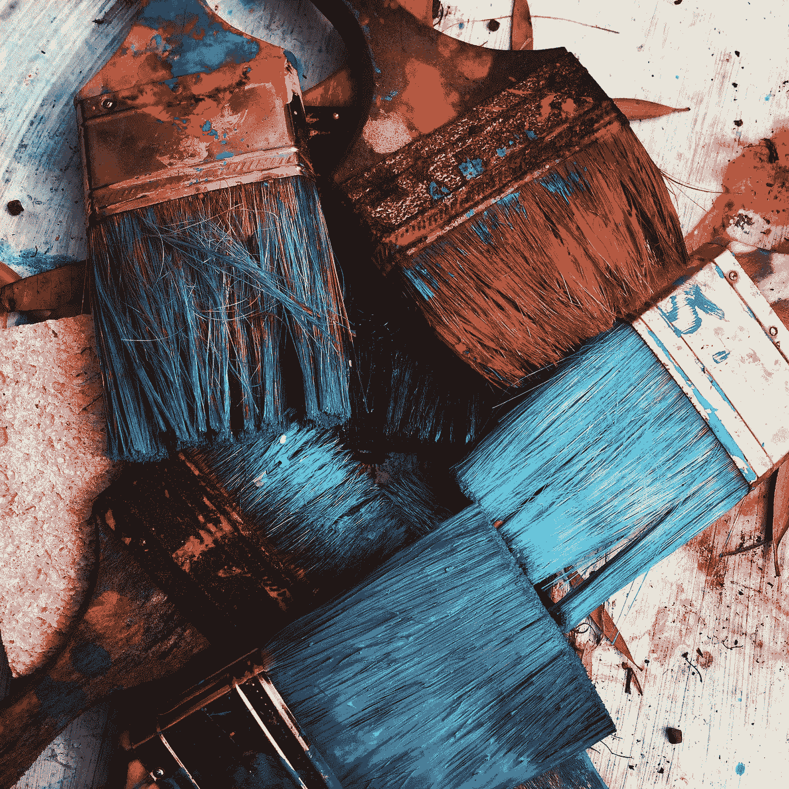

# 如何创造

> 原文：<https://medium.com/swlh/create-a52c26f041e2>

Photo by [RhondaK Native Florida Folk Artist](https://unsplash.com/@rhondak?utm_source=medium&utm_medium=referral) on [Unsplash](https://unsplash.com?utm_source=medium&utm_medium=referral)

## 日常生活

## 长跑运动员的视角

艺术界的一个重要问题是创作灵感从何而来。创意从何而来？

我不是艺术家，但作为一名摄影师，我经常探索创造性的想法，也开始思考这个问题。听起来很奇怪，创造的行为让我想起了《异地恋》…