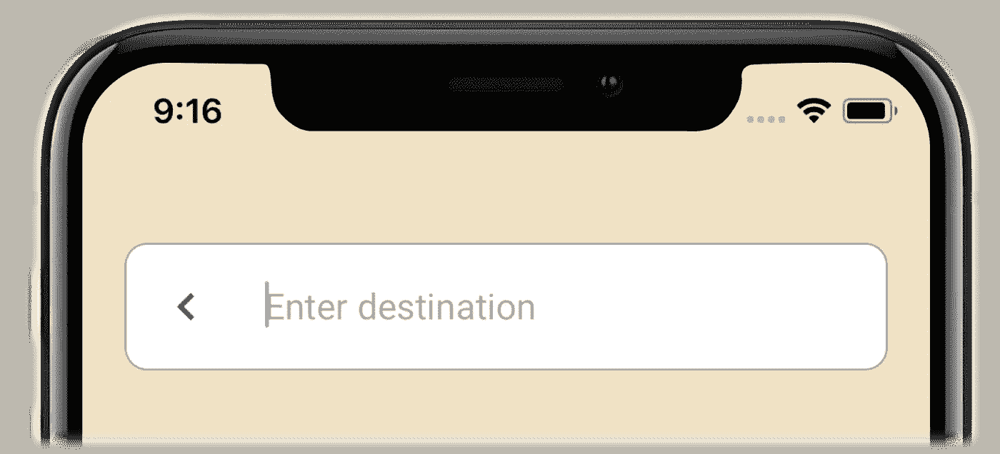

# 在 iOS 中创建材料设计搜索栏—搜索 UI 第 1/3 部分

> 原文：<https://medium.com/swlh/create-material-design-search-bar-in-ios-search-ui-part-1-3-dfb905de6b01>

移动应用程序经常需要搜索功能来查询特定的数据资源。毫无疑问，一个设计良好的搜索用户界面对应用程序的用户体验非常重要。尽管苹果为这一特定用途提供了 **UISearchViewCotnroller** ，但我们仍然希望开发具有自己视觉风格的轻量级搜索 UI。这个搜索栏用户界面允许你分离它…