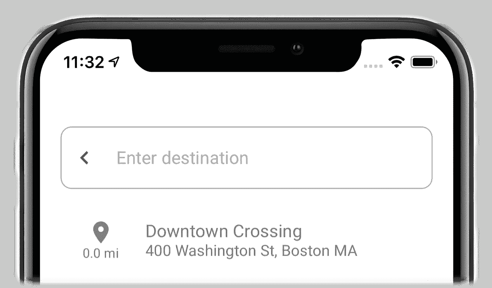

# 在 iOS 中创建材料设计搜索结果视图—搜索 UI 第 2/3 部分

> 原文：<https://medium.com/swlh/create-material-design-search-results-view-in-ios-search-ui-part-2-3-21c43f0617c>

在[第 1 部分](/swlh/create-material-design-search-bar-in-ios-search-ui-part-1-3-dfb905de6b01)中继续我们的搜索 UI 开发，我们将讨论如何创建与我们之前创建的搜索栏一起工作的材料设计搜索结果视图。搜索结果视图也是搜索 UI 的一个基本元素。因此，设计用户友好的搜索结果视图的重要性不应该被忽视。