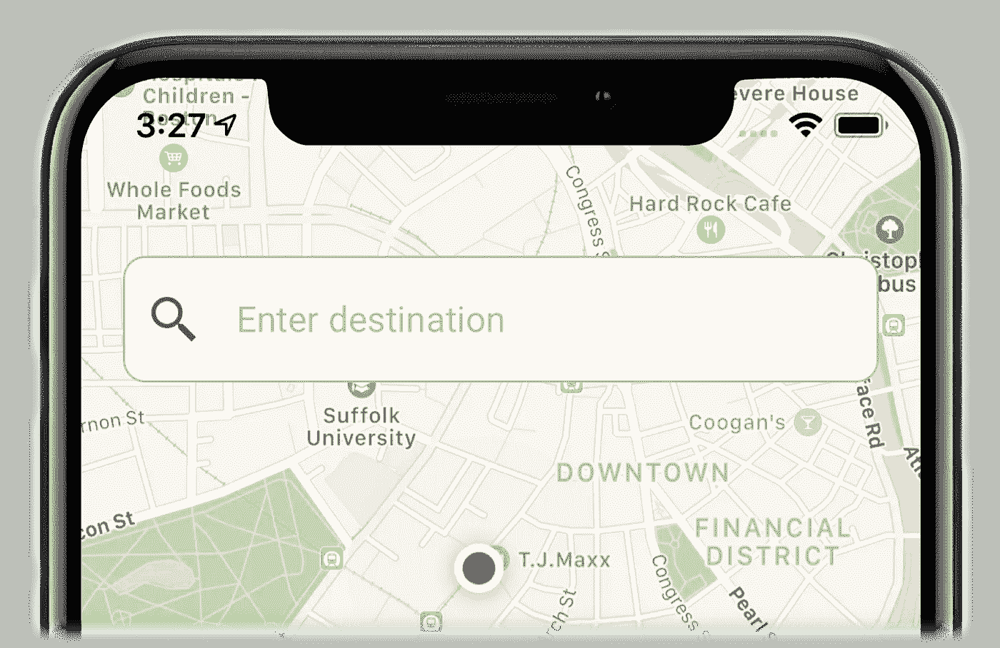

# 在 iOS 中创建材料设计搜索界面—搜索界面第 3/3 部分

> 原文：<https://medium.com/swlh/create-material-design-search-ui-in-ios-search-ui-part-3-3-a367349f5227>

你准备好开发一个具有你独特视觉风格的应用程序了吗？我们已经讨论了如何创建自己的[材料设计](https://material.io/)搜索栏和搜索结果视图，在这最后一篇文章中，我们将把这两个 UI 小部件应用到一个应用程序中——一个位置搜索应用程序。应用这些 UI 小部件，该应用程序将看起来与 **UISearchViewController** 有很大不同，尽管有类似的…