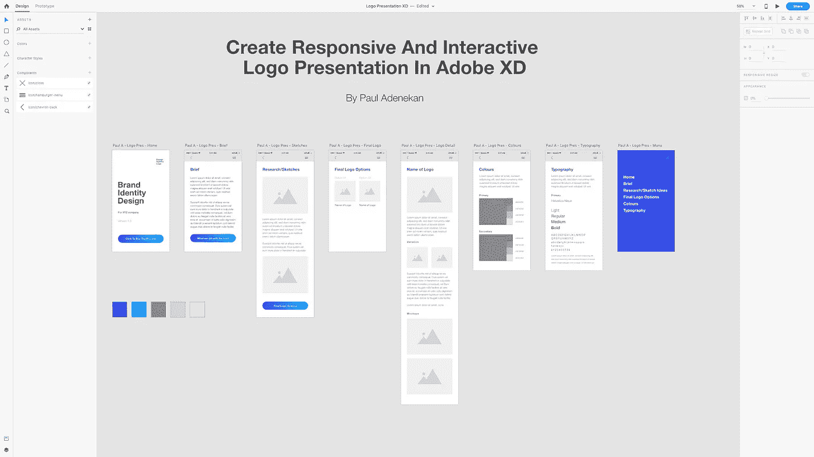

# 使用 Adobe XD 创建反应灵敏的交互式徽标演示

> 原文：<https://medium.com/swlh/create-responsive-and-interactive-logo-presentation-with-adobe-xd-f8179f7481ba>

我从研究中发现，展示标志设计是设计师们想更多了解的话题之一。我从经验中了解到，设计是一回事，展示你的设计作品是另一回事，这两者同等重要。这就是为什么今天你会看到设计师们展示他们的 logo 设计作品，并伴随着基本原理和过程…