# 用 Oauth.io 创建简单的 OAuth Vue 组件

> 原文：<https://medium.com/swlh/create-simple-oauth-vue-component-with-oauth-io-6898f29977de>


# 特色课程

Vue JS 是一个非常棒的 JavaScript 框架，用于构建前端应用程序！VueJS 混合了最好的角度+反应！

[**Nuxt.js—Vue . JS on Steroids**](https://click.linksynergy.com/link?id=qt/jYwyHv8A&offerid=507388.1523224&type=2&murl=https%3A%2F%2Fwww.udemy.com%2Fnuxtjs-vuejs-on-steroids%2F)使用 Nuxt . JS 构建极具吸引力的 Vue JS 应用程序。Nuxt 添加了简单的服务器端渲染和基于文件夹的配置方法。

谁不想专注于创建产品而不是处理代码中的 OAuth 逻辑呢？将代码中的 OAuth 占用减少到一个请求！

在这篇文章中，我们将在 Vuejs 中创建一个简单的 OAuth 组件，OAuth.io ，OAuth 市场参与者有 100 多个提供者！更容易使用 5 线

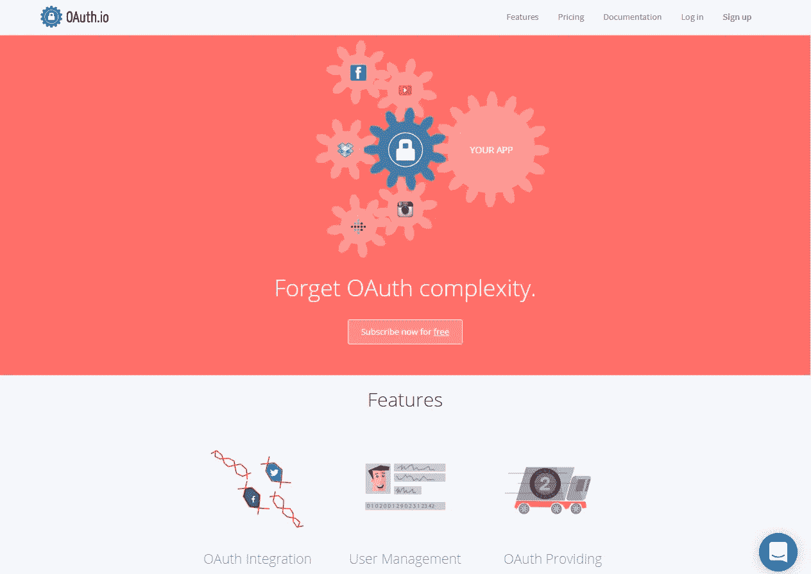

## 设置 OAuth.io 用户

在 Oauth.io 注册，免费！

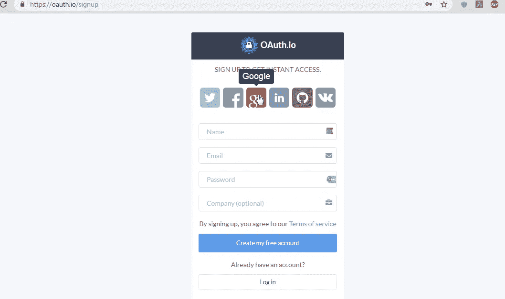

登录后，您将进入如下所示的仪表板。


您可以尝试任何集成，但首先要设置集成的 API。

# 添加 API

点击添加 API。

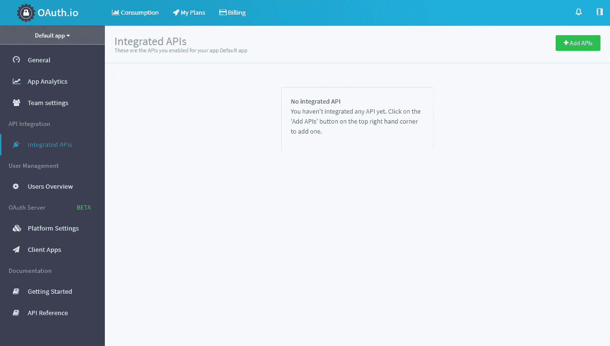

选择脸书作为应用程序的提供商。


现在，您需要 client_id 和 client_secret。因此，创建一个脸书应用程序来获取这些凭证。

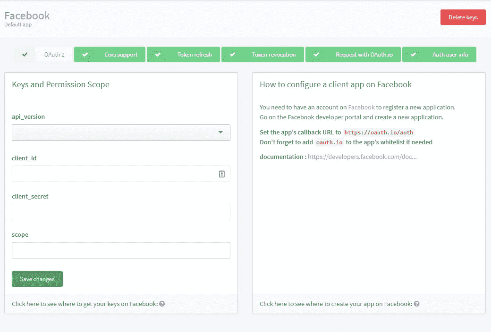

转到[https://developers.facebook.com](https://developers.facebook.com)创建一个应用并插入 oauth.io 作为应用的域。

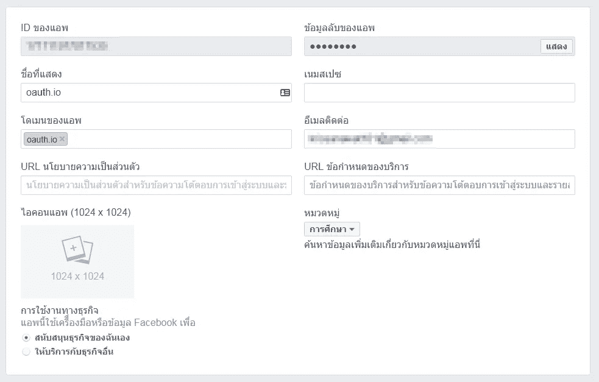

将回拨 URI 添加为 oauth.io/auth

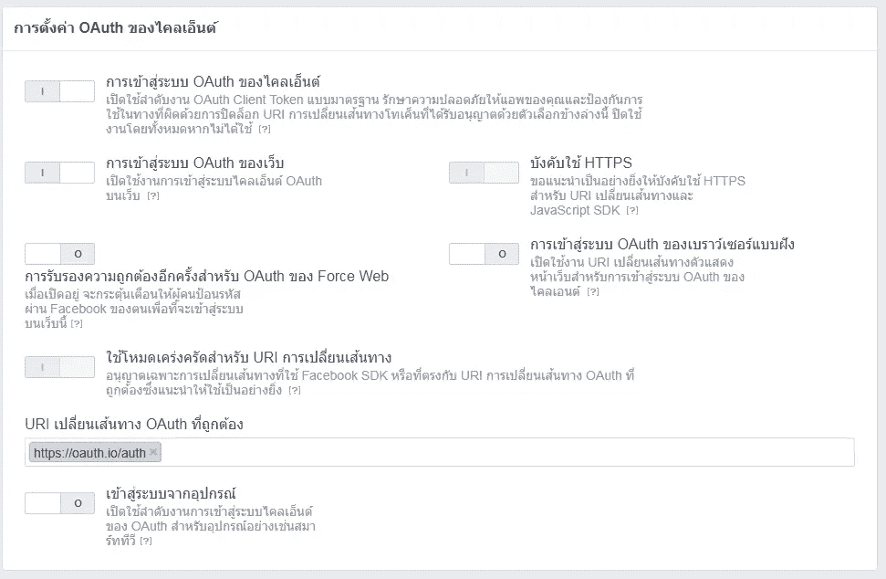

将 id 和秘密放入 OAuth.io 的表单中。

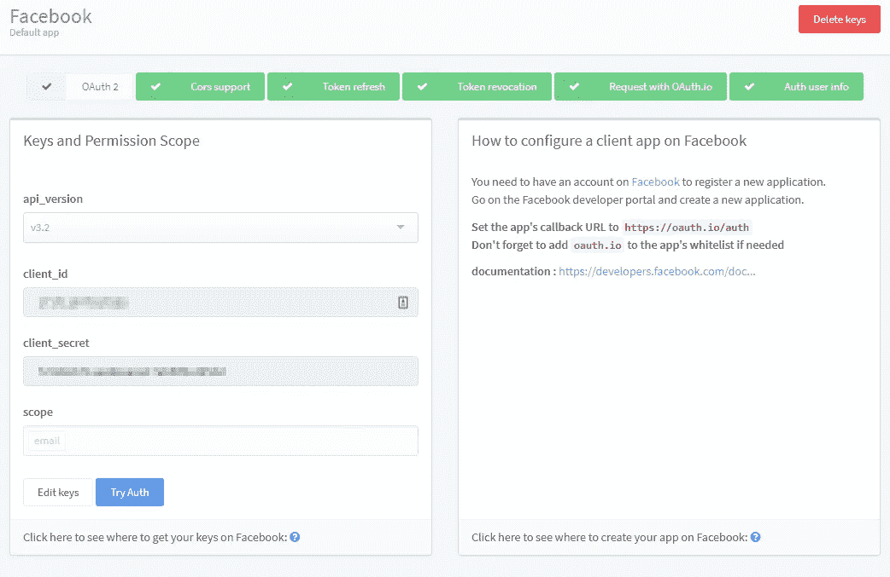

点击保存，你也可以添加更多的 API。让我们先利用脸书 API。

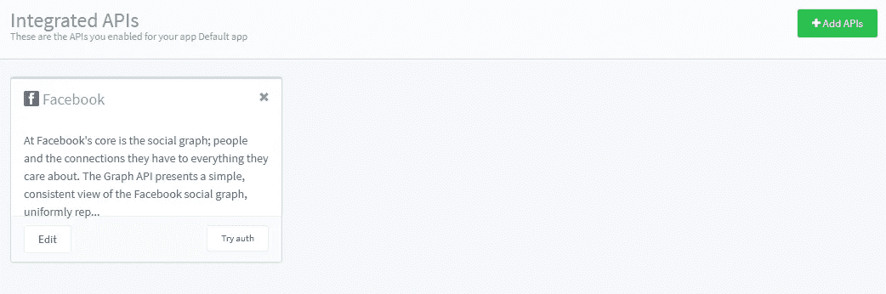

Github 的第二个服务是

转到[开发者设置](https://github.com/settings/developers)

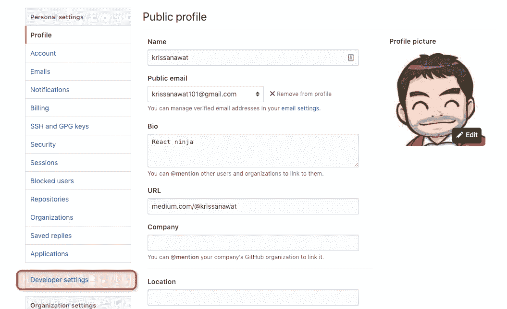

创建新应用程序

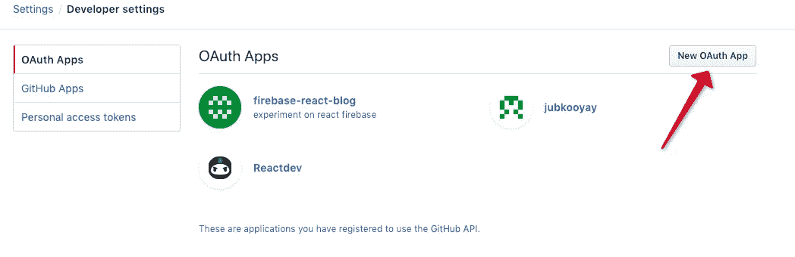

填写应用信息

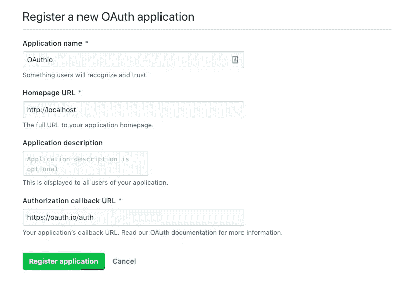

复制应用程序 id 和应用程序密码

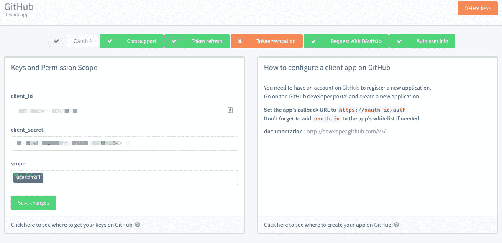

我们得到两种服务

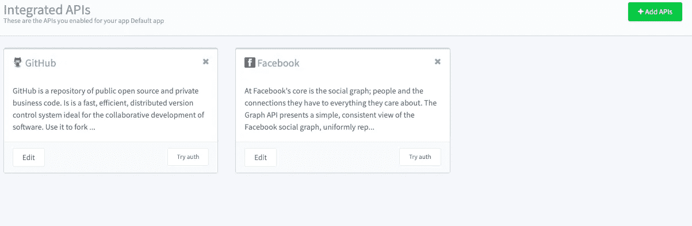

# 创建一个 Vue 组件

创建一个 Vue 组件来使用 Oauth.io SDK。oauth.io 的文档位于 [http://docs.oauth.io](http://docs.oauth.io/)

为了快速演示，我将在 VS 代码中使用 Vue CLI 准备一个小组件。


OAuth 组件结构

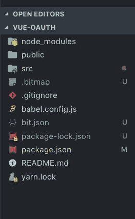

在组件文件夹中创建`OAuth.vue`,并一步一步地执行

1.  导入必要的 CSS

```
<style>@import "https://cdnjs.cloudflare.com/ajax/libs/twitter-bootstrap/3.4.0/css/bootstrap.css";
@import "https://cdnjs.cloudflare.com/ajax/libs/bootstrap-social/5.1.1/bootstrap-social.min.css";
@import "https://stackpath.bootstrapcdn.com/font-awesome/4.7.0/css/font-awesome.min.css";</style>
```

2.导入必要的类

```
<script>
import { OAuth } from "oauthio-web";
export default {};
</script>
```

3.创建 props 属性来存储与 props 一起传递的服务名

```
props: ["provider"],
```

4 .添加数据属性以连接 bootstrap-social 类和服务名

```
data() {
    return {
      class1: "fa fa-" + this.provider,
      class2: "btn btn-block btn-social btn-" + this.provider
    };
  },
```

5.用`initialize`初始化 OAuth-io SDK，并从 OAuth.io 仪表板添加 API-key

```
created() {
   OAuth.initialize("API-Key");
}
```

5.创建 OAuth 处理程序方法

```
methods: {
    Auth() {
      OAuth.popup(this.provider)
        .done(res => {
          console.log(res.access_token);
        })
        .fail(err => {
          //todo when the OAuth flow failed
        });
    }
  }
```

6.呈现登录按钮和类、事件句柄

```
<template>
  <a @click="Auth();" :class="class2">
    <span :class="class1"></span> Sign in with {{ provider }}
  </a>
</template>
```

7.最后，在 App.vue 中导入这个组件

```
<template>
  <div class="container">
    <h1>Social Login with OAuth.io</h1>
    <div class="row">
      <div class="col-sm-4 social-buttons"></div>
      <div class="col-md-4 col-md-offset-3 social-buttons">
      </div>
    </div>
  </div>
</template>

<script>
import OAuth from "./components/OAuth";

export default {
  name: "App",
  components: {
    OAuth
  }
};
</script>
```

8.通过将组件放置在某处来激活它

```
<OAuth provider="facebook" />
<OAuth provider="github" />
```

在 Codesandbox 上查看实时结果

# 包扎

本教程到此为止！

我们创建了一个 Vue OAuth 组件，它使用 [OAuth.io](https://oauth.io?utm_source=medium&utm_medium=post&utm_content=krissanawat&utm_campaign=oauthio-vuejs) 来呈现一个简单的脸书和 Github 登录选项

希望你玩得开心，随时评论和询问任何事情。鼓掌表示支持！

## 阅读更多

[使用 Vue.js](https://coderwall.com/p/-b6-ag/implement-social-login-button-for-any-oauth-provider-using-vue-js?utm_source=medium&utm_medium=post&utm_content=krissanawat&utm_campaign=oauthio-vuejs) 为任何 OAuth 提供者实现社交登录按钮

[](https://medium.com/swlh)

## 这篇文章发表在 [The Startup](https://medium.com/swlh) 上，这是 Medium 最大的创业刊物，拥有+414，678 名读者。

## 在这里订阅接收[我们的头条新闻](http://growthsupply.com/the-startup-newsletter/)。

[](https://medium.com/swlh)