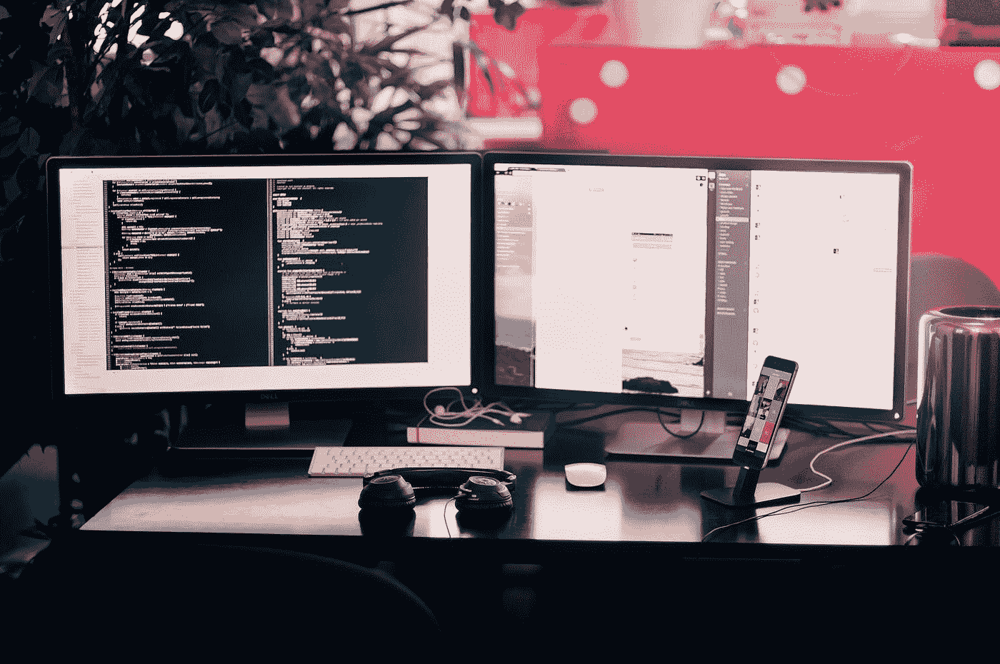

# 如何建立身体和精神空间来做好你的工作？

> 原文：<https://medium.com/swlh/create-space-to-have-space-to-create-2bf24bafeac8>

## 创造空间才有空间去创造。

Photo by [Farzad Nazifi](https://unsplash.com/@euwars?utm_source=medium&utm_medium=referral) on [Unsplash](https://unsplash.com?utm_source=medium&utm_medium=referral)

无论我们从事写作、创意艺术、项目开发还是营销解决方案，我们都需要空间来创造。

宝贵的身体和精神空间让我们尽最大努力，创作出最好的作品。它很珍贵，因为它太珍贵了。