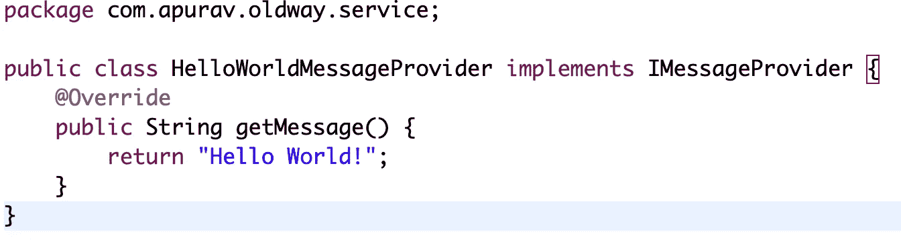
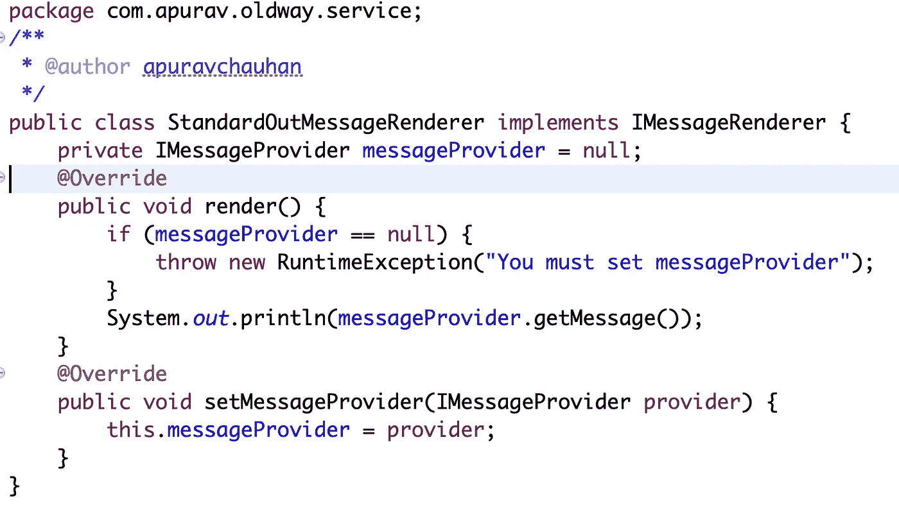
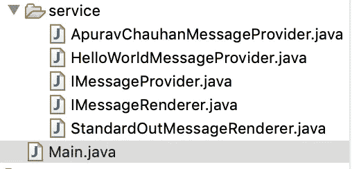
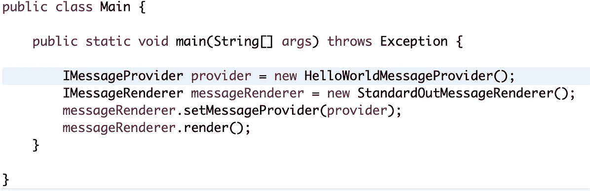
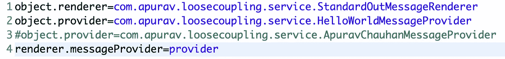
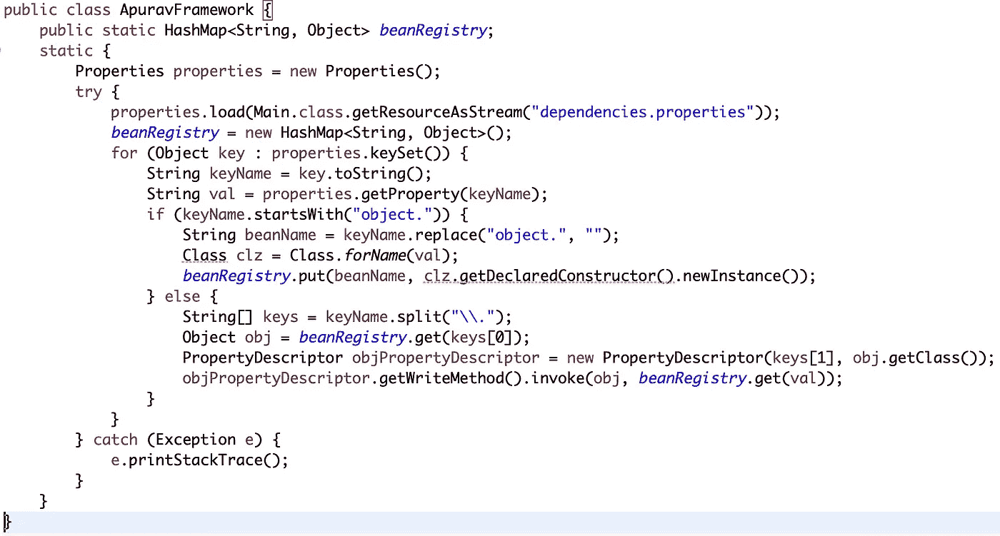
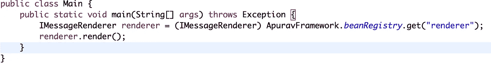
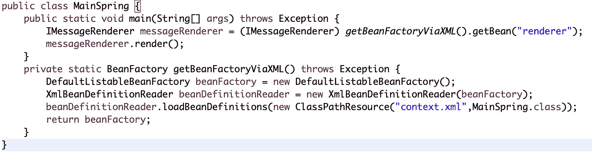
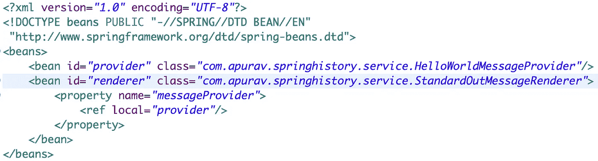

# 创建你的 Spring 框架——依赖注入+ IoC 的历史和内部

> 原文：<https://medium.com/swlh/create-your-spring-framework-history-and-internals-of-dependency-injection-ioc-a957e6ccf6cf>

## 这篇文章讲述了 Spring (Boot)框架的历史，Spring 框架是如何工作的，它的内部结构以及控制反转(IoC)和依赖注入(DI)的基础

Spring Framework Internals

我观察到现在的年轻人对使用一种技术或框架更感兴趣，而不是了解一种特定的技术或框架在幕后是如何工作的？或者甚至退一步去理解为什么这个框架在一开始就被建立起来？

作为一名工程经理，我个人在团队中看到，每个人都习惯使用像 Spring Framework 或 Spring Boot 这样的框架，但没有人有兴趣问这样的问题:

1.  我们应该在哪里使用 Spring Boot 或 Spring 框架？
2.  Spring Boot 和 Spring 框架有什么不同？
3.  Spring 框架之前的社区是如何运作的？
4.  Spring 框架是如何在幕后工作的？
5.  如果被要求这样做，我可以构建自己的框架吗？

当你的头脑开始问这样的问题时，你将开始进入一个完全不同的自我。

# 使用案例

## 版本 1

为了解释这一点，我将举一个消息呈现应用程序的简单用例。将有一个类负责提供消息，还有一个类负责接收上述消息并在控制台上打印。因此，这将是您的核心包:

HelloWorldMessageProvider- the class serving the message

StandardOutMessageRendered — Class responsible for printing the message above

App or Main Class — Glueing everything together to print our message on console

这里需要你注意的班级是 Main.java**。如果你仔细看，虽然商业逻辑似乎只与下面的线有关**

> **messageRenderer.render()**

**然而，该代码有许多粘合代码来创建对象，然后根据需要设置依赖关系。这似乎是我们可以避免的重复代码。**

**进一步假设现在我们想要添加更多的渲染器，比如带有不同消息提供者的 FileOutMessageRenderer。这意味着在创建必要的对象并再次设置它们时，您的应用程序代码将再次更改。这太糟糕了！**

**工厂设计模式可以让你保持代码的整洁，但是设置依赖关系仍然是一个问题。**

**现在问这个简单的问题:**

## **如果我们可以将创建和管理依赖关系的控制权从 Main.java 转移到其他地方，会怎么样？**

## **版本 2**

**上面的问题会让你觉得这是所有项目中非常普遍的问题。如果我们能对此推出一个解决方案，并使其松散耦合，我们将实际上创建一个框架，可以帮助节省开发人员的大量工作，并实现一个更干净和模块化的代码。所以让我们称我们的框架为**“Apurav 框架”****

**Apurav 框架的职责是读取对象定义文件以及每个对象需要满足的依赖关系。想象一个如下所示的属性文件:**

****

**Property file containing objects that need to be created and dependencies for each object**

**从上述文件创建对象的核心框架代码是:**

****

**ApuravFramework.java**

**试着理解上面的代码，它做了以下事情:**

1.  **读取属性文件**
2.  **对于每个以**开始的属性*对象。*** ，它使用 Class.forName 签名创建一个对象，并放入 Hashmap 注册表中**
3.  **对于其他每个属性，它会找到已经创建的对象，并简单地设置它的依赖关系，如文件中所述**

**创建和设置依赖关系的所有粘合代码现在已经被抽象到我们的 ApuravFramework.java 的**中，我们的 Main.java 只剩下调用业务逻辑的单一责任。****

****

**Version 2 of Main.java**

**所以现在，这个 **ApuravFramework** 实际上已经使用外部配置将管理依赖关系的控制权从 Main.java 转移到了它自己身上。我们可以称之为 IoC(控制反转)容器或阿迪(依赖注入)框架。**

**瞧啊。这是给你的弹簧芯。**

## **版本 3**

**现在最终版本实际上是为你准备的 Spring 框架。在内部，它创建对象并设置它们，就像你在 ApuravFramework.java 看到的那样。唯一的区别是在下面的例子中，它读取的是 XML 文件而不是属性文件。**

****

**Spring Framework reading an XML file for dependencies definition**

****

**context.xml file which Spring framework reads**

# **下载**

**在我的 [github](https://github.com/apuravchauhan/spring-oldskool) 上下载完整的代码库。**

# **参考**

**apress-Pro 弹簧**