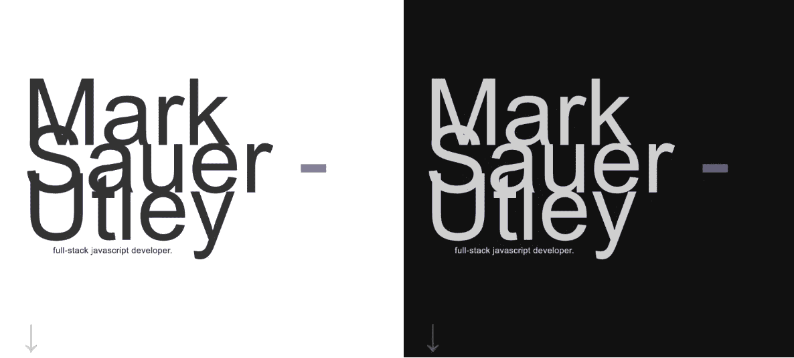

# 使用 useContext()为 React 应用程序创建黑暗模式

> 原文：<https://medium.com/swlh/creating-a-dark-mode-for-your-react-app-with-usecontext-65c408a3b8e8>

my portfolio site in light and dark mode

我是黑暗模式的超级粉丝。我的 mac 上的所有东西都有黑暗主题:VSCode、Chrome、Alfred，所有的一切。我桌面上的背景是黑色的。因此，我应该在我的作品集页面上添加一个深色模式，这看起来很自然。我很难找到一个好的指南来指导如何用**更新**我的应用的上下文，因为`useContext()`提供了一个只读值。但是过了几天…