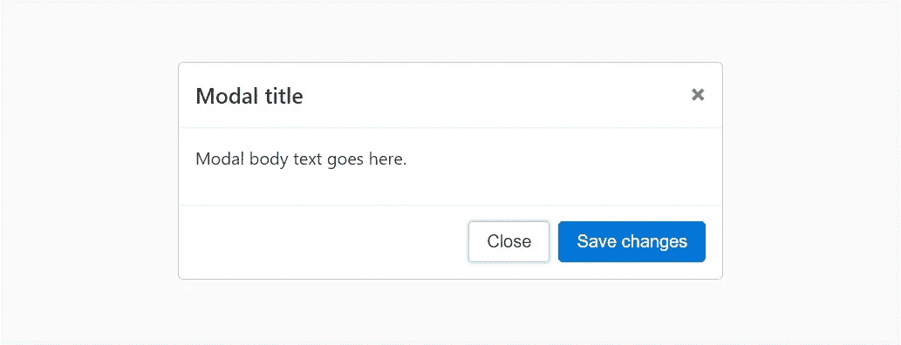

# 在 Javascript 中创建模型

> 原文：<https://medium.com/swlh/creating-a-modal-in-javascript-c7a4180b1143>

在创建我的 PetMe 项目时，我在寻找一种最简单的方法来创建一个弹出窗口，让用户知道他们输入了错误的密码或用户名。我被卡住了。我试图使用一个提醒，但我找不到一种方法来定制它。我终于去了一个聚会，一个了不起的英雄来拯救了我。她给我介绍了一个模特。