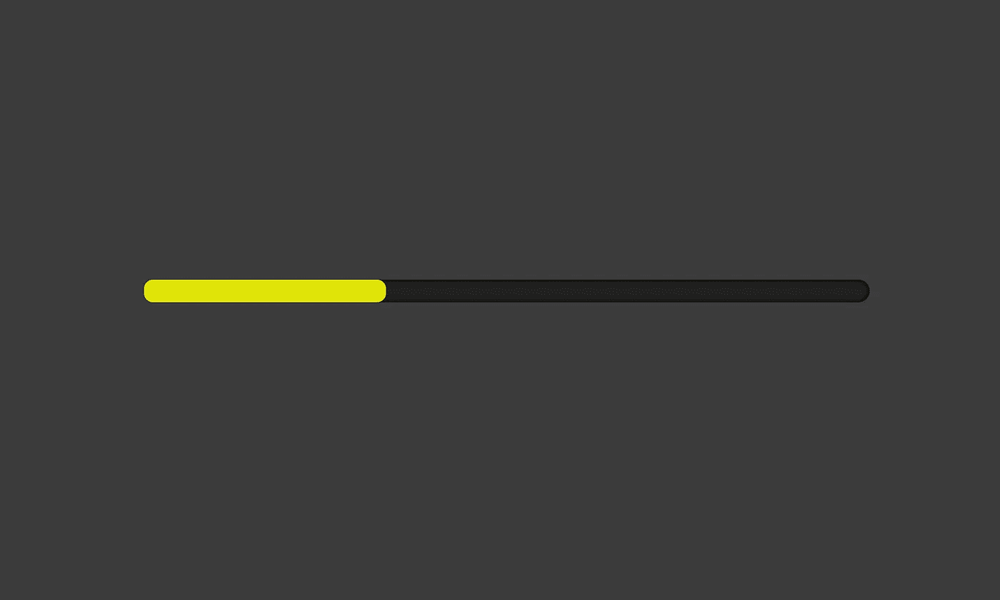

# 在 React 中创建进度条

> 原文：<https://medium.com/swlh/creating-a-progress-bar-in-react-181501bc22f1>

你是否曾经想在 React 项目中包含一个进度条，但是你找不到一个简单的资源来指引你正确的方向？嗯，今天是你的幸运日！你不需要安装一个库，你不需要剖析复杂的解释——你需要的一切都在这里。我们开始吧。

*步骤 1:创建一个新的组件文件并设置适当的导入。*