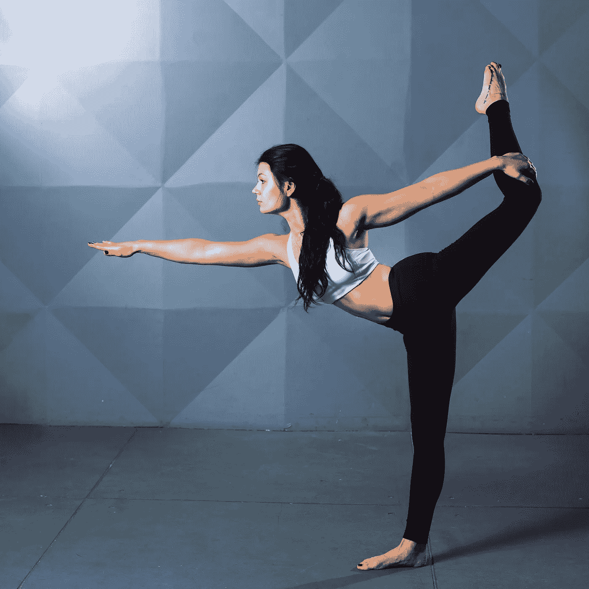

# 用改进的形创造勇气

> 原文：<https://medium.com/swlh/creating-grit-with-improvement-kata-988802a12fb7>

Photo by [Emily Sea](https://unsplash.com/@emilysea?utm_source=unsplash&utm_medium=referral&utm_content=creditCopyText) on [Unsplash](https://unsplash.com/search/photos/dance-practice?utm_source=unsplash&utm_medium=referral&utm_content=creditCopyText)

## 让变得更好成为一种习惯

我喜欢表演艺术。舞蹈，尤指现代舞，身体和谐地运动，通过动作表达情感。戏剧，在紧闭的门后发生的错综复杂的事情，以及从别人的角度来看的动态关系。现场音乐，站在成百上千的人面前…