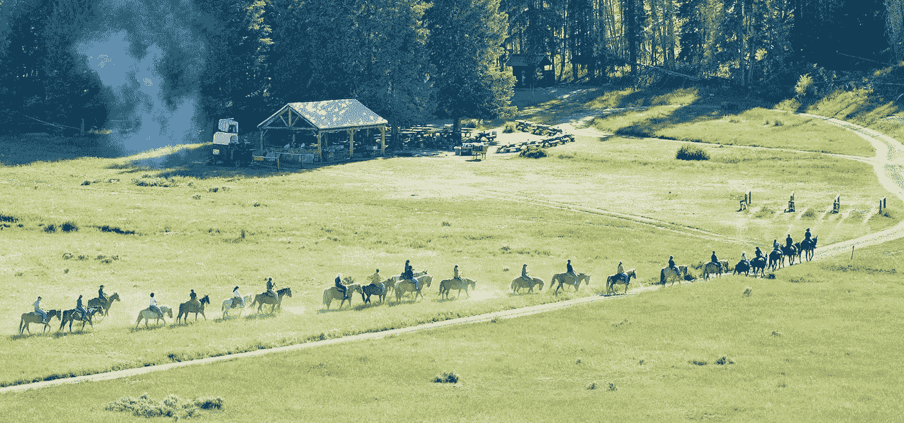

# 创造品牌与历史土地的和谐:黄石国家公园旅馆餐饮部主任访谈

> 原文：<https://medium.com/swlh/creating-harmony-between-brand-and-historic-land-an-interview-with-the-director-of-food-and-1653f096f5b7>

# 很多人谈论创造可持续的体验。卢·哈洛努力把这些话变成令人难忘的行动。