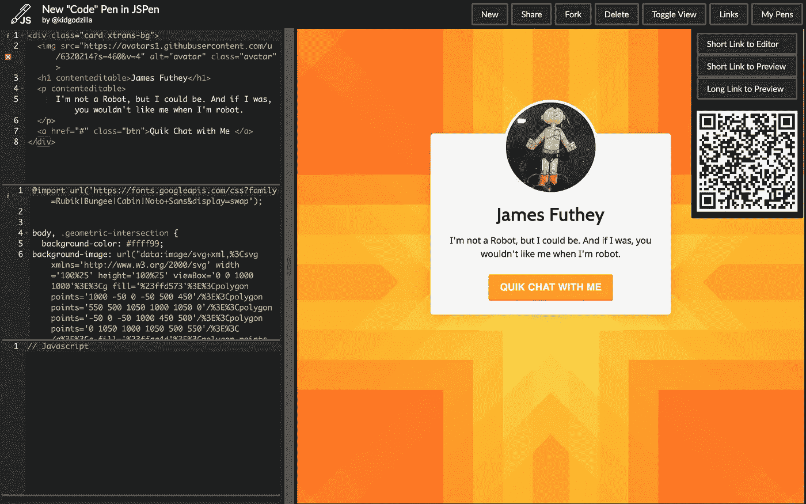
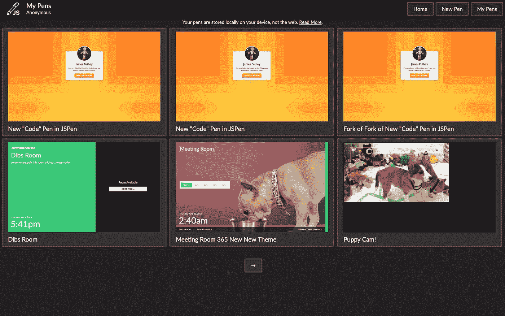
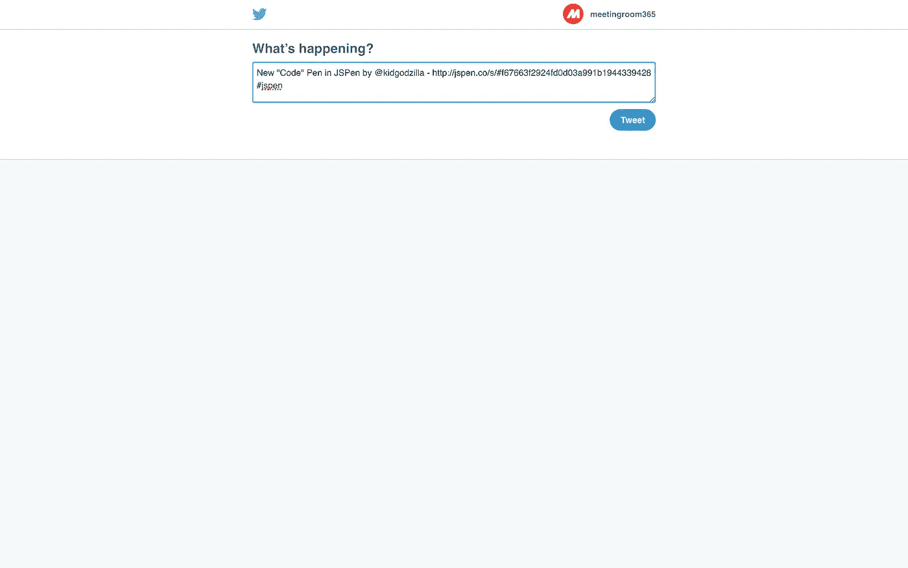
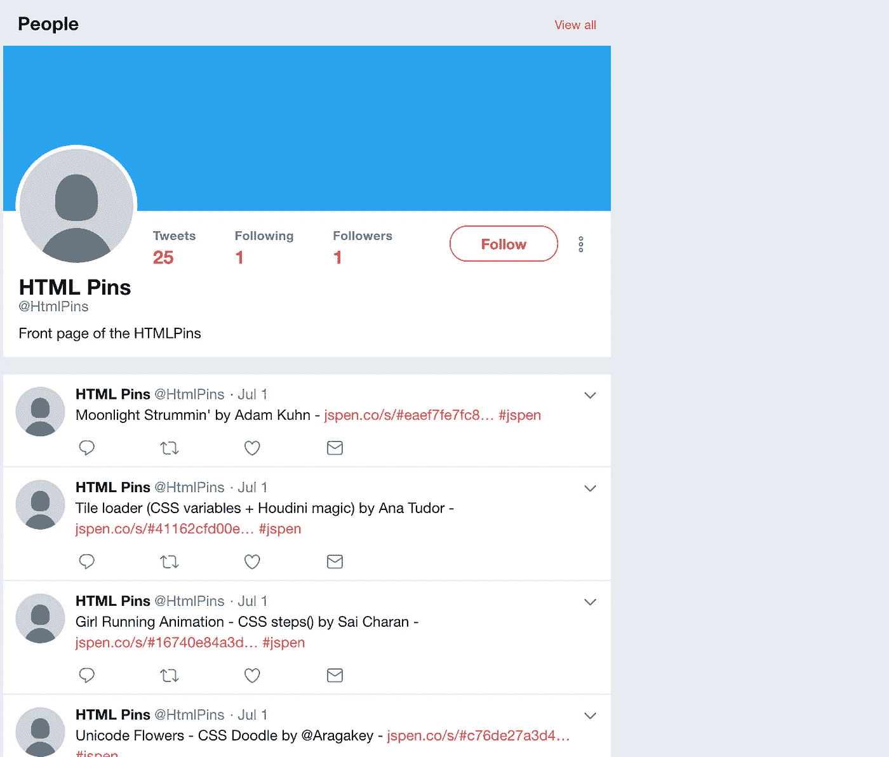
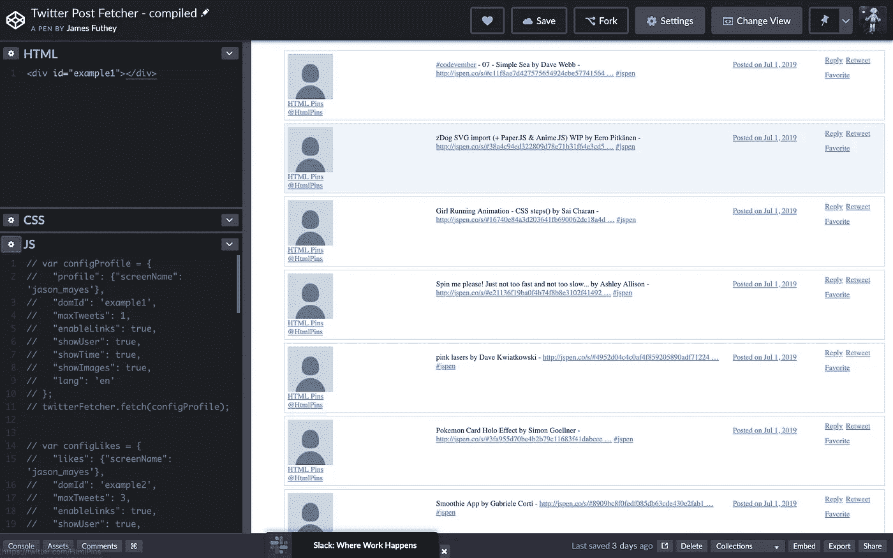
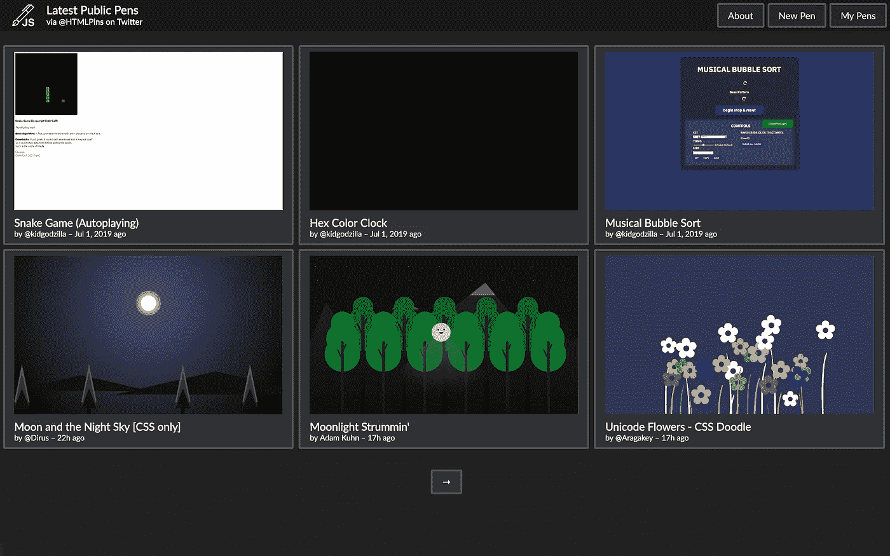
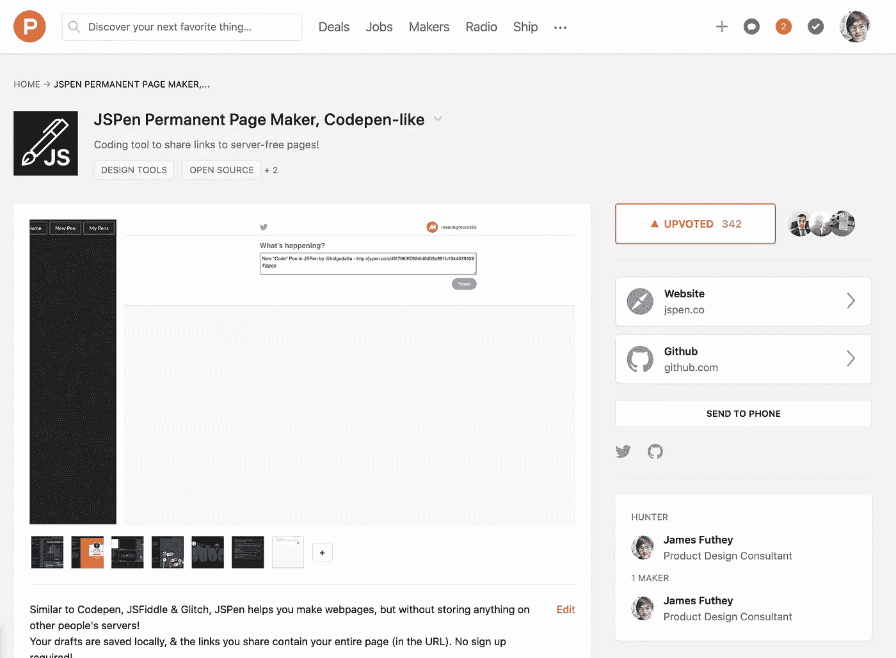
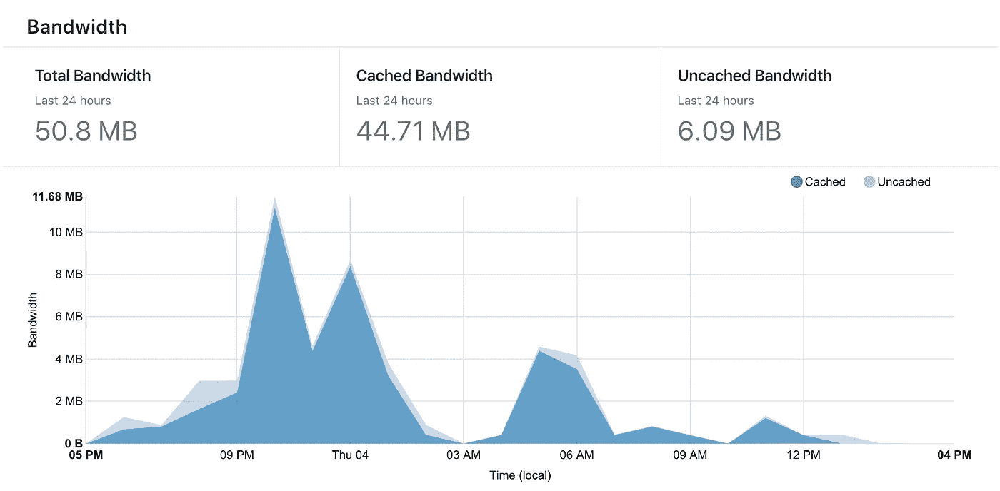
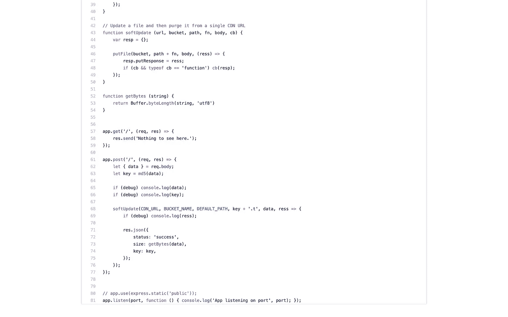

# 创建 JSPen:一个类似 codepen 的编辑器，将页面存储在 URL 中

> 原文：<https://medium.com/swlh/creating-jspen-a-codepen-like-editor-that-stores-pages-in-urls-b163934f06c8>

## 没有服务器，没有后端，没有问题！

上周日，黑客新闻发布了一个名为[展示 HN:网页完全存储在网址](https://github.com/jstrieb/urlpages)的整洁项目。这让我创建了[https://jspen.co/](https://jspen.co/):一个类似 codepen 的编辑器，用于创建完全存在于 URL 中的无服务器网页。

> 我最初认为这是一个简单、静态的 CodePen 克隆，但我觉得将页面“发布”为 URL 是一个有趣的想法。所以我决定把它的这一方面放在最前面和最中心，尽管这并不是项目开始时的重点。

我很快分叉了这个项目，并提交了一些微小的拉请求。不知道为什么，但我真的很喜欢这个概念，在接下来的两天里，我几乎把它变成了 Codepen 的表层克隆(再进一步就太雄心勃勃了)。

One quick pen I hammered out in JSPen.co

# 改进/新功能

我很快添加了一些非常基本的改进:

*   Unicode 支持(表情符号、亚洲语言等。)
*   能够包含页面标题(HTML 标题标签)以及页面作者(元作者标签)
*   将页面存储在 localStorage 中(这样您就可以将草稿保存到自己的设备上，就像在 Codepen 帐户中一样)
*   分叉和编辑现有页面的能力
*   在 Twitter 上分享页面
*   通过短网址分享(我建立了一个小网址短网址)
*   通过二维码分享
*   删除笔的能力
*   一个不错的支持 Emmet 的 Ace 编辑器
*   沙盒

# 品牌和风格

虽然没有直接从 Codepen 中窃取任何东西，但我会说，我可能会从美学中得到一些启发，即使只是在基本的层面上。没有代码被直接复制或类似的事情(他们的设计实际上比这发展得更远)，但是我可能在 Codepen 上花了几千个小时，并且不超过几分钟就可以清理页面，看起来&感觉起来就像 Codepen 几年前的样子。

# 挑选一个名字

我通过[https://tld-list.com/](https://tld-list.com/)搜索各种扩展名下的域名。

首先，我想出了几个主意，比如:

*   nocodep.in
*   htmlp.in
*   urlpag.es
*   佩尔帕格斯
*   permpag.es
*   ipag.es
*   hpag.es
*   mpag.es
*   opag.es
*   rpag.es
*   upag.es
*   wpag.es

在最终选定 jsPen.co 之前。正在打折。co 域名，这可能是推动我在这个方向上比什么都重要！

# 标志

我没有在 logo 上花太多时间。我最初认为我会跳过创建一个，直到我意识到这意味着没有网页会有一个图标。所以，我用一个自由授权的笔 SVG 和字母`JS`创建了一个最小的 logo。

# 测试这一切

接下来，我从 Codepen 拉了一堆我的笔，还有主页上的一些(当然是有作者信用的！).这让我完全填充了我的`My Pens`页面，我确信你能够在`localStorage`中存储大量的笔，并确保没有任何大的错误(我确实找到了一些)。

My First Few Pens

# 在 Twitter 上分享钢笔

我构建了一个小功能，允许用户在 Twitter 上共享笔，使用 Twitter Intents API:【http://twitter.com/intent/tweet

# 创建一个没有后台的主页

现在是真正困难的部分:我想创建一个主页，没有服务器后端！

谢天谢地，我偶然发现了 Twitter Fetcher 库。这可以从一个账户拉推，不需要后端服务器。

 [## Jason mayes/Twitter-Post-Fetcher

### 无需使用新的 twitter 1.1 API 即可获取您的 Twitter 帖子。纯 JavaScript！作者杰森·梅斯…

github.com](https://github.com/jasonmayes/Twitter-Post-Fetcher) 

我很快注册了一个新的推特账户， [@htmlpins](http://twitter.com/htmlpins) ，人们可以在上面发布他们的创作。如果我从这个账户转发它，它会出现在主页上。

概念的快速验证:

My first attempt at using the twitter-fetcher API

这就产生了这个主页(只是我的笔页面的一个变种)

# 共享网站

接下来，我花了一点时间在网上分享这个网站。

1.  [https://www . Reddit . com/r/side project/comments/c8wd7x/jspen _ free _ permanent _ web _ pages _ stored _ in _ the _ URL/](https://www.reddit.com/r/SideProject/comments/c8wd7x/jspen_free_permanent_web_pages_stored_in_the_url/)
2.  [https://www . product hunt . com/posts/jspen-permanent-page-maker-codepen-like](https://www.producthunt.com/posts/jspen-permanent-page-maker-codepen-like)
3.  黑客新闻
4.  独立黑客
5.  朋友和家人

# 改进 URL 缩写程序

最初项目的一个最大缺点是缺乏一个好的 URL 缩短器，它有一个开放的 API，可以用来缩短很长的 URL。所以，我创建了我自己的，有一个非常，非常小的后端。

我想要一个可以存储长 URL 的东西，而不是其他东西，并且几乎不需要任何操作成本。

所以，我是这样设置的:

1.  长 URL 将被存储在一个静态的 BunnyCDN 存储桶中(非常类似于 AWS S3，但是加载更便宜)。**每 GB 存储 1 美元**，每 TB 传输 5 美元**，尽管我会使用 Cloudflare 将这一数据减少到极少传输。**
2.  **纯文本文件将只包含 URL 有效负载(因此它不能作为通用的 URL 缩写，只能用于 URLPages)。**
3.  **纯文本文件将存储在其 md5 散列下，以防止重复调用(并简化存储脚本)。**
4.  **md5 散列将成为(相对)短的 URL。所以用户只要点击**jspen.co/s/#<MD5 hash 整页>** ，就会直接从 **cdn/ < md5 >的路径下载一个文件。t** (BunnyCDN 需要一个文件扩展名来启用 CORS)**
5.  **有了速率限制，我可以编写一个脚本，将文件存储在 BunnyCDN 上，只占用我的一个小型 Dokku 集群上的一小部分资源(不到 5 美元/月)**

****

**After setting up proper cache-control headers, CDNs, and creating immutable URLs, basically only the first request uses paid bandwidth, which should make this ridiculously cheap to operate.**

**这是一个私人回购，但逻辑基本上是这样的，在 Cloudflare 端有一些速率限制:**

****

## **差不多就是这样！感谢阅读！**

****

**[Meetingroom365.com](https://www.meetingroom365.com/) | [@kidgdzilla](https://twitter.com/kidgdzilla) (Twitter) | [@futhey](https://indiehackers.com/futhey) (IndieHackers) | [@kidgodzilla](https://github.com/kidgodzilla) (GitHub)**