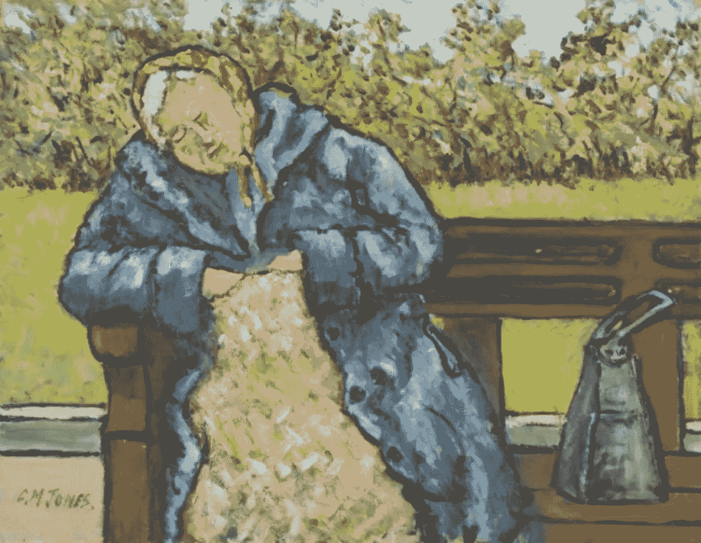

# 为错误创造空间

> 原文：<https://medium.com/swlh/creating-space-for-mistakes-336f99576a25>

一个关于脆弱、愤怒的因果报应神和成为神的过程的故事

Artwork by Charles M. Jones

又是一个大热天。佛罗里达炎热的一天，我可以补充说，如果我在某个海滩上，这是可以忍受的，甚至是令人愉快的。酪。。我没有。我坐在公园的长椅上，在树荫下的垂柳树下，尽可能快而专注地写下这些诗句，而我的孙女梅根却安静地睡在…