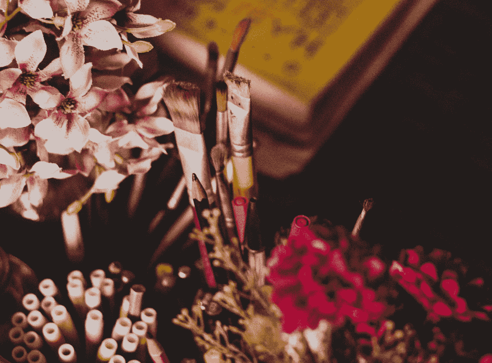

# 创造性的不连贯:采取跳跃(或者，至少尝试)

> 原文：<https://medium.com/swlh/creatively-incoherent-a1568851ee47>

Photo by [Ella Jardim](https://unsplash.com/photos/A51hrcFHT-Y?utm_source=unsplash&utm_medium=referral&utm_content=creditCopyText) on [Unsplash](https://unsplash.com/?utm_source=unsplash&utm_medium=referral&utm_content=creditCopyText)

我否认，这可能不会是一篇非常连贯的文章。

写作的欲望一直很强烈；当我考虑是否有什么值得说的话时，它每天都困扰着我。甚至我现在都在纠结。完全不知道要说什么，怎么继续写？作为一名作家，这一事实难道不意味着有好的想法，被…深深地激励着吗