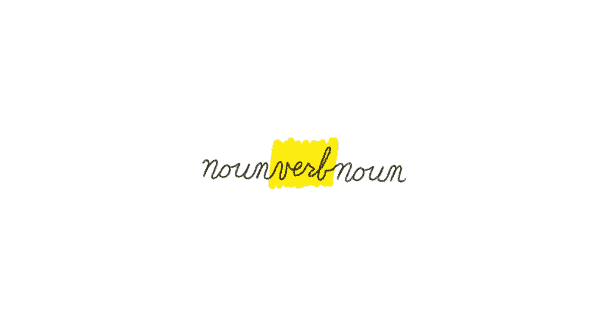

# 创造力是夹在名词中间的动词。

> 原文：<https://medium.com/swlh/creativity-is-a-verb-sandwiched-between-nouns-3963d8f58be8>

什么是创造力？它是在你的成长过程中被培养和照顾的，还是艺术父母传给他们后代的遗传特征？

创造力有时会变成一个是或否的问题，一个非黑即白的问题——你要么拥有它，要么没有。你听过这些句子出自你自己或你的朋友、同学、兄弟姐妹之口吗？